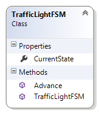
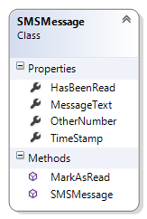

..  Copyright (C) Peter Wentworth under a Creative Commons BY-NC-SA Licence.
    See the fine print at http://creativecommons.org/licenses/by-nc-sa/3.0/ 

.. raw:: html

   

.. role:: red

    
Writing our own Classes
======================= 

A class is a *type*. Up until this point in the book we've seen many classes and objects --- Button,
Canvas, Turtle, Random, Timer, etc. are all classes that we've used, 
but we've not yet designed our own classes (other than
GUI windows).  In this chapter we'll learn to design our own (non-GUI) classes.

|NB!| It is useful to think of a class as a *factory* for 
creating many objects of the type.  

So we've been able to use a class like a factory, e.g. the Button class
gives rise to many Button instances, or we can create many Timer instances, 
or many Turtle objects:

.. sourcecode:: csharp
   :linenos:

    Turtle tess, alex;     // define two variables that can refer to type Turtle ...
    
    // and somewhere else in the code 
      tess = new Turtle(playground, 10, 10); // Ask the factory to create a turtle  
      alex = new Turtle(playground, 90, 90); // and now manufacture another turtle!
 

So breaking our programs into multiple classes (instead of doing everything in one
big class) has two really important advantages:

* It allows us to create many objects, all independent and disentangled from each other.
* It is an essential tool for managing bigger tasks with more complexity.
 

An object, as we've already seen, allows us to encapsulate, or chunk together, 
two main things: some *state* of the object, and some *functionality* for the object. 
The state can be internal to the object --- private --- or it can be 
exposed via public properties.  Think about turtles again --- each one has its own
``Heading``, its own ``BrushWidth``, and so on.  They also have functionality --- 
the things they can do.  These are the public methods, like ``Forward`` or ``Stamp``. 

.. index:: object-oriented programming

Object-oriented programming
---------------------------

In the Events chapter we animated some traffic lights. Go back to the traffic-light 
example there, and notice 
that we had three important abstractions, or "mental chunks" for the problem:  

* We used a *state machine*  to represent the *Model* (the internal mechanism or
  the "business logic"), of how traffic lights should work.
* There was a *View* of the traffic lights --- some pictures that 
  we changed in the GUI as the program ran. 
* There was a source of events --- timer tick events in this case, which was 
  a *Controller* for the system. Buttons, scrollbars, menus, etc. are common
  parts of the controller in a GUI program.

The separation of problems so that we organize them as three different parts, a
Model, a View, and a Controller, has turned out to be a really useful technique for
designing software and games.  The controller responds to the keyboard, mouse,
gamepad, touchscreen, etc.), and it drives the changes in the model. Then the 
controller gets the view to show some representation of the model and its changes.  

The way that we break up and organize programs into component 
parts is called a **software architecture**.
Model-View-Controller (also called MVC for short) is one popular architecture.  

We can get a nice overview at http://en.wikipedia.org/wiki/Model-view-controller.
   
      
.. admonition::  Our working problem

     
    Here we're going to re-implement the traffic lights, with some twists.  

    We now require three different sets of traffic lights.  Each will
    have its own controller: one can be controlled by a timer, one by
    a keypress, and one by having the user explicitly click a button. 

    We'll need three separate state machines --- internal engines for
    the model of how the lights work.  Here we'll separate the logic for
    what the state machine should do into its own separate class, and we'll create
    three instances of that class, one for each of the different sets of traffic lights.

    And finally, we'll have three different ways to visualize our traffic lights.  One 
    can use our pictures from the earlier chapter, one can just have some
    text output to say what the light is doing, and ... (we'll make up something
    when we get there...).

    
.. index:: finite state machine

Designing a class
-----------------

We'll want our own class to encapsulate (encapsulate means to enclose, as if
in a capsule) the state and the functionality for a State Machine.  
One of the popular ways of figuring out how to break a complex system into
more manageable components is to to write this information on a index card that 
is divided into three parts:

* What is the name of the class?
* What responsibilities will it (or the objects we instantiate from it) have,
* What other (types of) objects will it collaborate with?

See http://en.wikipedia.org/wiki/Class-responsibility-collaboration_card for
more detail, but this is enough to get us started. 

* Let's call our class ``TrafficLightFSM`` (FSM for finite state machine).
* Its responsibilities will be 

  * to keep track of what state the state machine is currently in,
  * to advance (or transition) from the current state to its next state.
  
* Its collaborators will be 

  * the controller logic in the GUI part of our program,
  * the viewer logic in the GUI part of our program.

One we've figured out what classes we want, (just the one in this case)
we'll decide what properties and methods we need to give our objects
so that they can fulfil their responsibilities. 

For our very simple objects, let's start with one
property --- the ``CurrentState`` that the machine is in, and two methods:
the constructor method to initialize new objects, and a method called
``AdvanceState()``.

To get a new class in our project in Visual Studio, right-click on our 
project in the Solution Explorer pane, and choose Add | Class...   You'll
be prompted for a name (enter ``TrafficLightFSM.cs``).  Visual Studio will 
now generate a new class skeleton and add it to our project.  It will open
the code, and will look something like this:

 
.. sourcecode:: csharp
   :linenos:
   
    using System;
    ...

    namespace Fragments
    {
        class TrafficLightFSM
        {
        }
    }
  
Your namespace may be different to the example above but will be the same as the namespace used
in your ``MainWindow``, and in any other classes we create later.  
(Putting all the classes in our project into
the same namespace makes it easier for us, because they can all "see" each 
other without having to add any extra ``using`` directives at the top.)   

Now we can write our methods and our property definitions or private variable definitions
inside the class.   Here's what we'll put in place of lines 6-8 now:   

.. sourcecode:: csharp
   :linenos:
   
    class TrafficLightFSM
    {
        public int CurrentState { get; private set; }

        public TrafficLightFSM()
        {
            CurrentState = 0;
        }

        public void Advance()
        {
            switch (CurrentState)
            {
                case 0:
                    CurrentState = 1;
                    break;
                case 1:
                    CurrentState = 2;
                    break;
                case 2:
                    CurrentState = 0;
                    break;
            }
        }
    }
 
Lines 5-8 define the constructor for our new class --- the code necessary 
to initialize a new object of this type to its factory settings.  The distinguishing
thing about the constructor is that it has no return type --- not even the
keyword ``void`` --- and its name must be identical to the class name.  If we do provide a
constructor, it will be automatically called whenever we instantiate a new object of this type.

Lines 10-24 provide the functionality we wanted --- 
the same logic as we saw in the "More Events Handling" chapter of this book.

.. sidebar:: Properties can do more...

    There are more complex ways of using properties that we don't cover. 
    
    They're preferred over variables.  Public variables 
    mean that an external collaborator might change them,
    so the object loses control of its own state.  
    
    But the reason why we encapsulate state in the first place is 
    so that the object itself can stay in charge.    

    
Line 3 is new: it shows that we're defining a new property of 
type ``int``.  A property is like a variable, but with finer
control over how it can be used --- this one says that the property is public --- 
it can be accessed outside the class (others can *get* its value), 
but the ``private`` modifier on ``set`` restricts the property so that 
it can only be set (assigned a new value) by methods within this class.
    
If we right-click on the class name in the Solution Explorer and choose the option
"View Class Diagram", we'll get a diagram of the class (this feature may not
be in all versions of Visual Studio):

A class diagram is a widely used notation that allows software developers
to express different aspects of their design.  Many people will tell us
that we should draw our diagram first, and write our class according to
our diagram.  In Visual Studio, because we can get the diagram
from a class it seems sometimes easier just to start with the class. 
 
Well done!  We've written our very first (non GUI) class.  Now let's
make some objects of this type, and put them to good use.

.. index:: traffic lights

Three sets of traffic lights --- The Controllers and the Views
--------------------------------------------------------------

In the kinds of programs we write the Controllers and the Views
are both intertwined in our Window class, so they're
not fantastically well separated.  We'll make a special effort
to separate them in our thinking, at least. 

Here's what the finished product will look like:

.. image:: illustrations/classes/traffic_light_gui.png  

Let's begin by just getting the first set of lights to work.
Most of the code is identical to what we saw previously
in the *More Event Handling* chapter, 
except that the logic for the state machine
is now in its own class.

.. sourcecode:: csharp
   :linenos:
   
        private BitmapImage[] thePics;
        private TrafficLightFSM model1, model2, model3;
        private System.Windows.Threading.DispatcherTimer theTimer;

        public TrafficLightsGUI()
        {
            InitializeComponent();

            model1 = new TrafficLightFSM();
            model2 = new TrafficLightFSM();
            model3 = new TrafficLightFSM();

            string inThisProject = "pack://application:,,,/";  // the magic spell ...
            thePics = new BitmapImage[] { 
                        new BitmapImage(new Uri(inThisProject + "TrafficLightGreen.png")),
                        new BitmapImage(new Uri(inThisProject + "TrafficLightAmber.png")),
                        new BitmapImage(new Uri(inThisProject + "TrafficLightRed.png")) };

            theTimer = new System.Windows.Threading.DispatcherTimer();
            theTimer.Tick += theTimer_Tick;
            theTimer.Interval = TimeSpan.FromMilliseconds(500);
            theTimer.Start();
        }

        private void theTimer_Tick(object sender, EventArgs e)
        {   // advance the model  
            model1.Advance();                                  
            // update the view
            image1.Source = thePics[model1.CurrentState];
        }

In line 2 we define variables for all three models, and at lines 9-11 we
instantiate all three.  Otherwise the code is pretty similar to what
it was before: our 
class constructor instantiates all the objects it needs,
and starts the timer.  When the timer ticks we advance our model, and
then we update the view by asking the model for its current state, 
and using that to choose the picture that is displayed by the image control.

Our second set of traffic lights is controlled by a keyboard event,
so we create an event handler for the Window's ``KeyDown`` event, and respond to
a keypress like this:

.. sourcecode:: csharp
   :linenos:
   
        private void Window_KeyDown(object sender, KeyEventArgs e)
        {
            switch (e.Key)
            {
                // Controller for light set 2 - press the N key for Next
                case Key.N:                 
                    model2.Advance();
                    switch (model2.CurrentState)  // update view
                    {
                        case 0: lblOutputSet2.Content = "GO!";
                            break;
                        case 1: lblOutputSet2.Content = "PAUSE!";
                            break;
                        case 2: lblOutputSet2.Content = "STOP!";
                            break;
                    }
                    break;
            }
        }
        
So our "view" in this case is just some text that is displayed in a label.
To reinforce the idea that the view is now independent from the 
model and controller, perhaps we can consider how easily we could change
the view to display Spanish rather than English in the label. 

Finally, the third set of traffic lights is controlled by clicking the
button.  So here is the code behind the button click event:

.. sourcecode:: csharp
   :linenos:

        private void btnAdvance_Click(object sender, RoutedEventArgs e)
        {
            model3.Advance();
            switch (model3.CurrentState)   // update view
            {
                case 0: progressBar1.Value = 33;
                    progressBar1.Foreground = Brushes.Green;
                    break;
                case 1: progressBar1.Value = 66;
                    progressBar1.Foreground = Brushes.Orange;
                    break;
                case 2: progressBar1.Value = 100;
                    progressBar1.Foreground = Brushes.Red;
                    break;
            }
        }
        
We've not used a ``ProgressBar`` control before, but they're 
quite easy.  We drag one onto our Window, and we set its orientation property
to make it grow vertically instead of horizontally.  It shows progress according to 
the number we assign to its ``Value`` property.  (By default, 0 represents
no progress, 100 represents "100% progress".) 
We also change the brush colour to view the different states.

The keyword ``this``
--------------------

The keyword ``this`` is available in a class, and works like the English word "me".
So every object can use a reference to itself.  So ``this.CurrentState`` means "my CurrentState".

Normally we don't need to use the keyword explicitly.  But it is really convenient in one
particular situation --- in a class constructor. 
So let us change our ``TrafficLightFSM`` constructor.  Instead of always creating an FSM which begins
in state 0, we now want the caller to be able to pass an argument to the constructor, to set the initial state:

.. sourcecode:: csharp
   :linenos:
   :emphasize-lines: 7
   
     class TrafficLightFSM
     {
         public int CurrentState { get; private set; }

         public TrafficLightFSM(int CurrentState)
         {
             this.CurrentState = CurrentState;
         }
 
     ...
     }

The tricky bit is at line 7.  We now have a parameter at line 5 with exactly
the same name as our property in line 3.  We recall our 
discussion about scope lookup rules in Chapter 24: ``CurrentState`` 
means the most closely nested definition of the name. 
Which is the parameter on line 5.   

Our new keyword, ``this``, can be used to explicitly qualify the a name  
to mean *"the CurrentState that belongs to me, the object"*  
(i.e. the one defined at line 3, in *class-level scope*.)   

It is sometimes easier just to choose another name for the parameter, but
using the same names is popular practice in C# (and in Java). So we'll need
to use ``this`` to work around the scope rules to let us access the class-level
variable of the name.  So we're sure to see it often. 
  

Summary
------- 

By making ``TrafficLightFSM`` into its own class we've 
simplified the logic, especially when we want multiple instances, each with 
their own state. It would be tricky to have all the logic and variables for three
separate state machines tangled up inside our Window class. 

Our first ``TrafficLightFSM`` class was really simple: one property and one
method (apart from the constructor).  But the powerful thing is the idea: 
as we put more state and logic into our objects, we'll see more 
benefits from this approach of breaking programs into 
separate components that interact with each other. (Consider how complicated the
behaviour of a Window or a Turtle object is, or for any of the GUI controls
that we use so easily. Having classes to organize and manage this complexity is essential!)

The bigger picture
------------------

C# is a fully object-oriented programming language: 
every method must belong to a class, and the only way to organize
computation is by having classes that give rise to objects that
can interact with each other.  Java is like this too.

An earlier style of organizing computation is called
*procedural* (or *imperative*) programming.  Look it up.  
Fortran, C, BASIC and Pascal are popular languages 
that support this style.

Some procedural languages added objects and classes to their 
procedural core, and they now have a (sometimes messy) mixture that 
can be used in either style. C++, Python, Visual Basic, and some newer
versions of Pascal (e.g. Delphi Pascal) work like this.  

Glossary
--------

.. glossary::

    class
        A class defines a new type of object.  A class can also be thought of as a
        template or a blueprint for the objects that are created according to its
        specifications.        
        
    constructor
        Every class may have special method that is invoked automatically to 
        initialize a new object to its factory-default state.

    instance
        An object whose type is of some class.  Instance and object are used
        interchangeably.
        
    instantiate
        To create an instance of a class, and to run its constructor, if one exists. 
        
    method
        A method is defined inside a class definition and is invoked on
        objects of that class. Methods give objects their behaviour.
        
    Model-View-Controller (MVC)
        A popular way of breaking software systems into three co-operating components.    

    object
        The run-time entity that is often used to represent a real-world thing.  
        It bundles together the state (data) and the behaviour appropriate 
        for that kind of thing.  Instance and object are used interchangeably.
        
    software architecture
        The overall design of a large software system.
        
    ``this``
        A C# keyword that refers to the current instance of the class. 

    object-oriented programming
        A powerful style of programming in which data and the operations 
        that manipulate it are organized into objects.  
        
        
Exercises
---------

   
#. Write a class definition for an SMSMessage that implements the class diagram here.  
   It should contain four properties that are privately settable, but publically gettable.
   The constructor should initialize the sender's number and the message from parameters,
   and it should also set ``HasBeenRead`` to false, set the ``TimeStamp`` to ``DateTime.Now``.
   The ``MarkAsRead`` method should change ``HasBeenRead`` to true.
  
  
   .. image:: illustrations/classes/classdiagram_smsstore.png
      :align: right
   
#. Create a new class, SMSStore, that can be used for an SMS inbox or outbox on a cellphone. 
   It should implement the class diagram here. 

   .. sourcecode:: csharp
      :linenos: 
   
       SMSStore myInbox = new SMSStore();
   
   This store can hold multiple ``SMSMessage`` objects.  (Hint: use a ``List<SMSMessage>``!) 
       
   An SMSStore object should provide methods with these signatures:
       
   .. sourcecode:: csharp
      :linenos: 
   
       void AddSMS(string fromNumber, string textOfSMS);    
         // Makes a new SMSMessage object, inserts it after other messages.
    
       int GetCount();         
         // Returns the number of sms messages in the store.
          
       List<int> GetUnreadIndexes();    
         // Returns list of indexes of all not-yet-viewed SMS messages
         
       SMSMessage GetMessage(int i);          
         // Return message[i].
         // If there is no message at position i, throw an exception.
         
       void Remove(int i);     // Delete the message at index i (or throw an exception)
       void Clear();           // Delete all messages from the store
   
   Write the class, create a message store object, write tests for these methods, and implement the methods.
   
#. Make a GUI like the one shown.  In one half of the screen you can be in the role of a friend, 
   and "send" new SMS messages to your inbox.  In the other half of the screen you can be the phone 
   "user" --- you'll be able to refresh the status (the view) of your inbox.  (In this sample I used
   two Canvas controls and set different background colours to provide the two halves of the screen.)
   
   You can read any message by entering its index number.    
   
   .. image:: illustrations/classes/sms_interface.png
   
#. Extend your SMS GUI so that you don't need the "Refresh Status" button --- the status automatically updates
   itself whenever you add a message to the Inbox, or when a message is read.  Extend the interface so that the
   user can delete a message, or clear all messages from the Inbox.  
   
#. Add another class called AddressBook to your program.  Pre-program some phone numbers and names
   into the address book.  (We won't worry about adding new contacts or deleting contacts, or updating their
   information, although this could be a nice exercise too!)  Now change your GUI from the previous
   question so that if the SMS arrives from a known contact, their name will be shown in the GUI instead
   of their number.
   
#. Do the following experiment on your phone.  Find an SMS in your Inbox for which you have no contact
   details.  Add a dummy contact for that number.  Does your Inbox now show the dummy 
   contact name, or does it still show the original number?  What happens if you now delete the dummy contact?
   Do you think your phone searches your contact list when the SMS arrives, or when you want to see your Inbox, 
   or does it update your Inbox whenever you make changes to your contact list?
   
#. Take an existing class, and add the qualifier ``this`` to every use of a member (variable, method, property)
   so that you build a good understanding that an unqualified name often resolves (using the normal scope rules)
   to the local scope.  But the ``this`` keyword explicitly forces the name to be at class-level scope.
   
   
   
