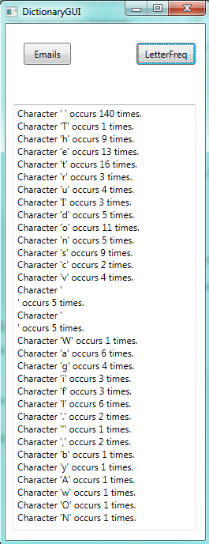
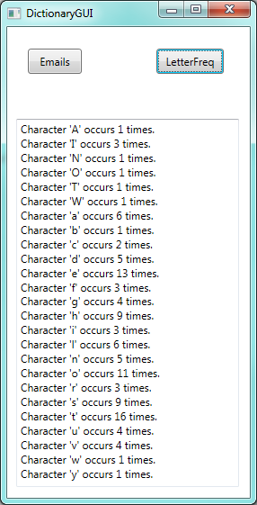

..  Copyright (C) Peter Wentworth under a Creative Commons BY-NC-SA Licence.
    See the fine print at http://creativecommons.org/licenses/by-nc-sa/3.0/ 

Dictionaries
============

.. index:: dictionary, key, value, key-value pair

.. Key uniqueness isn't talked about in this chapter. The only place its
   mentioned is in the glossary for the term key.

Arrays, strings and lists all have one thing in common: the elements 
can be accessed by their index position. 

**Dictionaries** are different.  They associate **values** with **keys**.
The keys can be one type, the values can be another (possibly different) type.   
Every entry in the dictionary is a *pair* with two parts: the key, and its
associated value.  We'll refer to the pair as a key-value pair.

Let's begin with a simple dictionary that keeps track of how many emails
we have have sent to others.  The key will be the email address that we've
sent email to, the value associated with each key will be the number of
emails we've sent to that address since we began counting.

.. sourcecode:: csharp
   :linenos:

    private void btnDemo1_Click(object sender, RoutedEventArgs e)
    {
        Dictionary<string, int> emailCounter = new Dictionary<string, int>();

        emailCounter["a.n.other@ru.ac.za"] = 3;
        emailCounter["joe123@google.com"] = 12;
        emailCounter["president@gov.za"] = 2;
        emailCounter["abbey@foxpictures.com"] = 5;

        emailCounter["joe123@google.com"] += 1;

        foreach (string k in emailCounter.Keys)
        {
            txtResult.AppendText(string.Format("Key {0} has value {1}.\n", k, emailCounter[k]));
        }
        txtResult.AppendText(string.Format(
            "There are {0} key-value pairs in the dictionary.\n", emailCounter.Count));
    }
        
Take note:

* In line 3 we define a generic dictionary and supply the type of the keys, ``string``, and the
  type of the values, ``int``.   On the right-hand-side of the assignment we instantiate a new empty dictionary.
* Lines 5-8 add new items to the dictionary.  But notice now that the "index" is a key --- a string in this case.
* Line 10 changes the value associated with a key, by incrementing it.  
* In line 12, we see that we can get an enumerator for the keys, so ``foreach`` can look at
  each key in turn.  Each key is a string, which is assigned to ``k`` in the loop.
* Line 14 outputs each key and the value associated with it.
* Line 17 shows that we can use the ``Count`` property to discover how many pairs are in the dictionary.

Here's what we get:

  .. image:: illustrations/dictionaries/dictionary_emails.png

.. admonition:: Hashing

    Our output here shows the pairs in the same order as we inserted them, but
    this is misleading!  In general, the order in which a dictionary stores
    its pairs is unpredictable.  (So the order in which we'll get them
    delivered by a ``foreach`` becomes unpredictable.)    C# uses
    complex "hashing" algorithms, designed for very fast access, to determine
    where the key-value pairs get stored in memory. In small
    dictionaries like ours, C# might choose a list, but for large dictionaries
    it will switch techniques. If you want to learn more about 
    hashing, Wikipedia has some interesting information!
    
    
    
Dictionary Initializers
-----------------------    
    
Similar to what have for integer, doubles, arrays, strings, and lists, 
there is also some useful initializer syntax in C#.  This lets us
provide some pairs when we instantiate the dictionary.
Lines 5-8 in our example can also be coded like this: 

.. sourcecode:: csharp
   :linenos:

        Dictionary<string, int> emailCounter = new Dictionary<string, int>() 
            {  {"a.n.other@ru.ac.za",    3},
               {"joe123@google.com",    12},
               {"president@gov.za",      2},
               {"abbey@foxpictures.com", 5} };
                 
If we try to
get the value associated with a key that doesn't exist in our dictionary, 
we'll get a  ``KeyNotFound`` exception.  So  
    
.. sourcecode:: csharp
   :linenos:

        int n = emailCounter["bill@microsoft.com"];  // Exception
   
is not going to work!    

Dictionary Methods
------------------ 
    
Here are a couple of useful methods:

*  ``ContainsKey(key)``  can (safely) test whether a key is
   in a dictionary.  
*  ``Remove(key)`` removes the key and its associated value from the dictionary.
*  ``Clear()`` will remove all key-value pairs and leave the dictionary empty.

A dictionary is a reference type.  Because it can be updated, 
we need to be aware of aliasing.  Whenever 
two variables refer to the same object, changes to one affect the other.

.. admonition::  Dictionaries and lists are your friends!

    As you learn more C# you'll discover more exotic ways of organizing
    your collections: we've briefly covered lists and dictionaries, but you'll
    find queues, stacks, sets, deques, and possibly others.  
    
    But most of the time the most practical 
    data structure of choice will be either a list (if you don't need
    key-value associations), or a dictionary (if you do).
    
    If you want some extra reading on C# dictionaries, try http://www.dotnetperls.com/dictionary.

Counting letters in a string
----------------------------

We'll build a frequency table of the letters in a string.  
Such a frequency table might be useful for compressing a text file. Because different
letters appear with different frequencies, we can compress a file by using
shorter codes for common letters and longer codes for letters that appear less
frequently.

Dictionaries provide an elegant way to generate a frequency table:

.. sourcecode:: csharp
   :linenos:
   
    private Dictionary<char, int> letterFreqs(string theText)
    {
        Dictionary<char, int> result = new Dictionary<char, int>();
        foreach (char c in theText)
        {
            if (result.ContainsKey(c))
            {
                result[c]++;
            }
            else 
            {
                result[c] = 1; 
            }
        }
        return result;
    }       
        
We start with an empty dictionary. For each character in the string we
test whether it is the first time we've encountered it (and it becomes
a new association in our dictionary at line 12), or we bump (increment) the counter
of the number of times we've already seen it (line 8). 

With the code below to exercise our method we get the output here.

.. sourcecode:: csharp
   :linenos:
   
    private void btnLetterFreq_Click(object sender, RoutedEventArgs e)
    {
        string poem =
    @"   The truth I do not stretch or shove
        When I state that the dog is full of love.
             I've also found, by actual test,  
                A wet dog is the lovingest.  
        
                                         Ogden Nash";

        Dictionary<char, int> freqs = letterFreqs(poem);
        foreach (char k in freqs.Keys)
        {
           txtResult.AppendText(string.Format(
                "Character '{0}' occurs {1} times.\n", k, freqs[k]));
        }
    }     
        

Those broken lines in the middle of the output correspond to the carriage return
and newline characters at the end of each line of the poem.  We'll change our frequency
counter to ignore them.  And it might be more appealing to get back a frequency 
table in alphabetical order.  

Slightly fancier dictionaries
-----------------------------

    
Dictionaries (and lists) are important enough that the .NET Framework gives us 
a number of different flavours of each that we can choose from.  This 
allows a smart programmer to choose a type that is most effective for the problem.  
 
In the ``System.Collections.Generic`` namespace (we're already using it for type ``Dictionary``) 
we also find a ``SortedDictionary`` type.   And if we want more choice, 
the ``System.Collections.Specialized`` namespace offers us a ``ListDictionary`` type, 
an ``OrderedDictionary`` type and a ``StringDictionary`` type.

Let's put some changes into our code:

.. sourcecode:: csharp
   :linenos:
   :emphasize-lines: 1, 3, 6

    private IDictionary<char, int> letterFreqs(string theText)
    {
        SortedDictionary<char, int> result = new SortedDictionary<char, int>();
        foreach (char c in theText)
        {
            if (char.IsLetter(c))
            {
                if (result.ContainsKey(c))
                {
                    result[c]++;
                }
                else
                {
                    result[c] = 1;
                }
            }
        }
        return result;
    }

* At line 6 we test that ``c`` is a letter before we count it.
* At line 3 we use a ``SortedDictionary`` instead of a plain one. This guarantees that 
  when we use the ``foreach`` we will get the keys out in sorted order.  Otherwise all the code is the same.
* At line 1 we've done something special: we're returning a type called ``IDictionary``.  We're going
  to talk about that in the next chapter.

We make one change to the calling code, --- change the definition at line 11 to also be an ``IDictionary``
instead of ``Dictionary``, and we get the new output shown here.   (Join the dots... recall that for
characters, all upper-case letters are ordered before the lower-case letters).  

You could lower-case the string if you wanted capitals and small letters to be treated equivalently.  
There are also advanced options (beyond the scope of this book) to set up a dictionary that uses 
our own "comparer" method that we supply. That would give us complete control 
over decisions about when two keys are considered less than or equal to each other.  

Dictionary, array, or list?
---------------------------

If we think about it, lists and arrays are also "mappings" of keys to associated data. 
An array of the names of the days of the week would have position 0 associated with "Sunday",
position 1 with "Monday", and so on. 

In an array or list the index (or key) must always be an integer and the lowest index is always zero.  
For dictionaries this is not the case.

So, specifically for the situation when our keys are integers, we should ask 
*"Which of list, or array, or dictionary, will be a good choice?"*.

So here are two sample problems, let us think about the best data representation for each:

    a) We want to check whether a random number generator really does give a uniform
    distribution of numbers in the range [0,100).  We'll generate ten million random
    numbers and count how many times each one occurs.  For a uniform generator, we'll
    expect the frequencies should be close to each other. (And our statistics wizards
    will be able to define exactly what is meant by "close enough".)

    b) People work in a building that uses an access card to allow
    them through specific doors.  The security card uses a date of birth followed
    by two random digits, for example 1994052674, as a key, and the 
    associated data is a string of characters describing the doors they can open --- 
    "A103,B12,Foyer,North Seminar Room,Stairwell".   

.. sidebar:: Will the large access code fit into an ``int``?

    We should double-check that our ``int`` type is suitable for storing large 
    access codes like this. 
    The biggest number that can be stored in a 32-bit integer is 2,147,483,647.  
    
    So yes, our codes will fit, but our program could
    go wrong when someone born after 2147 needs access to our building.     

In the first case the keys are "dense", and there is no need for a list that can grow
or shrink dynamically.  So an integer array of 100 elements sounds ideal.  
Each time we generate a new random number we can immediately know which array element to 
update.  So ``int[] freqs = new int[100];`` will be a great way to store this data.

In the second problem the nature of the keys is very different.  We might only have
eighty people who can access the building, but their keys are all very large 
integers, and far apart from one another.  If we plotted all the keys on a number 
line they would be very "sparse".   In this case, a ``Dictionary<int, string>`` 
would be a better choice.   

In the first case, we, the programmers, are really determining where to store
the elements.  In the second case, we've handed that problem over to the dictionary.
    
    

Glossary
--------

.. glossary::
             
        
    dictionary
        A collection of key-value pairs that maps from keys to values. 

    key
        A data item that is *mapped to* a value in a dictionary. Keys are used
        to look up values in a dictionary. Each key must be unique
        across the dictionary.

    key-value pair
        One of the pairs of items in a dictionary. Values are looked up in a
        dictionary by their key.
        

Exercises
---------

#. Perform a frequency count on randomly generated numbers in the range [0,10000).
   Do it twice: once with an array, and once with a dictionary.  Devise an  
   experiment to compare the performance of the two alternatives.   Try to control
   for the overheads of generating the random numbers and running the loops, so
   that your experimental results become an accurate measure of the speeds of
   the underlying storage mechanisms.
   
#. Suppose every computer lab user has a usercode like g09m1234.  Associated with
   the usercode is a ``UserProfile`` object that holds their name, permissions, 
   desktop preferences, and course groups that they belong to.  Give a 
   type definition for a dictionary that could maintain the mapping between
   the usercode and its profile.   
   
#. In our "List and Array Algorithms" chapter we worked extensively with 
   `Alice's Adventures in Wonderland`.  Re-use as much of that code as you 
   can, and produce an alphabetic frequency count of the words in the book,    
   something like this::

        Word              Count
        =======================
        a                 631
        a-piece           1
        abide             1
        able              1
        about             94
        above             3
        absence           1
        absurd            2

   How many times does the word "alice" occur in the book?
   
#. What is the longest word in Alice in Wonderland? How many characters does it have?

