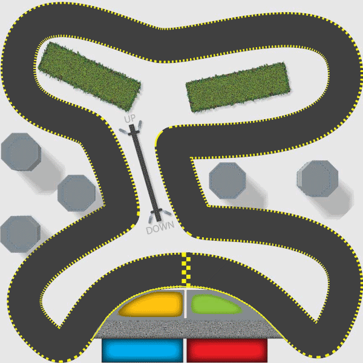

..  Copyright (C) Peter Wentworth under a Creative Commons BY-NC-SA Licence.
    See the fine print at http://creativecommons.org/licenses/by-nc-sa/3.0/ 
 
.. index:: events, handler    
    
More Event Handling
=================== 

So far, events are generated from controls like buttons and sliders when we 
interact with them.  We have also seen how we can attach a handler to an event to cause our
program to respond in some way.  Here we'll investigate three other really useful
sources of events: the keyboard, the mouse, and timers.   These will allow us to
do more interactive things like we often find in games. 

.. index:: timer, timer tick event, events; timer, animation 

Timers
------

One or more *timers* can be added to any application.   A timer generates regular *tick* events to which
we can attach handler code.  So perhaps we can check for new email arriving once every
five minutes.  Every timer has an ``Interval`` property that can be set to control the time
between successive tick events.  

.. admonition:: These timers are not brilliantly accurate or fine-grained

    Our computers multi-task: they can run more than one program simultaneously and are always
    doing some background work.  So when we ask for 20 ticks per second we'll get something
    close to that, but they won't necessarily all be exactly evenly spaced. It will depend on
    what else is going on in the background.  So these timers are not the best mechanism for 
    building a metronome, or a heart pacemaker, or for high-speed games that require very smooth graphics.
    They also cannot go very fast: the maximum rate is typically limited to about 60 Hertz (ticks per second).   
    There are other ways of doing more accurate and faster timing in C#, but they're beyond the scope of these notes.    
    
    We'll use these timers anyway for game-like situations, even if our on-screen graphics sometimes looks
    a little jerky.   There are other C# gaming frameworks (MonoGame, XNA) which are more appropriate for
    for high-speed, smooth graphics. 
    
    See also the tip at the end of this chapter.
    
    
Let's begin with a simple game called Pong: our goal is to get a ball to move around, and to bounce 
off the edges of a container.  

.. sidebar::  Visual Studio Tip: To add images to your project ...
 
    .. [#] The easiest way to add pictures to our project is to locate them on our hard drive, and drag
           and drop the pictures onto our project name in the Solution Explorer.  
           They'll get copied into the project, (so we
           can delete the original files but they'd still be in our project), and we'll see them appear
           as part of our project in the Solution Explorer.

* We create a new project of type WPF Application.           
* We put a green Canvas into the Grid that already exists in our main window \
  (the canvas is our container for the ball).   
* We set its properties so that when the window resizes the canvas will also change size.  
* We add pictures to our project.  In this case we just want a ball [#]_.
* On the canvas we place an ``Image`` Control (a control which can display a picture) which we name ``ball``.
* We edit its Source property and choose to display the picture of the ball .    
* We set the image control width and height to fit the ball snugly. (If you use this beach ball by 
  right-clicking and saving the image, it's size is 34x34 pixels.) 

    .. image:: illustrations/events/ball.png
  

Now we need a timer object.  Like our turtles, we'll need to define a variable for the timer,
create (instantiate) an instance, and set its properties (and its handler) by writing your own code.  
Dive into the code behind your window, and add a definition for a timer, create the timer, 
set some properties, and bind it to a handler by copying this code:

.. sourcecode:: csharp
    :linenos:
    :emphasize-lines: 3, 14-17, 20-23

    public partial class MainWindow : Window
    {
        System.Windows.Threading.DispatcherTimer theTimer;
 
        public MainWindow()
        {
            // Initializes the window and all the components defined in the XAML.
            InitializeComponent();   
            
            // If you initialize your own objects like a turtle or a timer, always
            // make sure you do it after the call to InitializeComponent();   That way
            // you'll be sure that the window exists, the playground exists, etc. 
            
            theTimer = new System.Windows.Threading.DispatcherTimer();
            theTimer.Interval = TimeSpan.FromMilliseconds(100);
            theTimer.IsEnabled = true;
            theTimer.Tick += dispatcherTimer_Tick;
         }

        private void dispatcherTimer_Tick(object sender, EventArgs e)
        {
            updateBall();
        }

        private void updateBall()
        {
            // To be written...
        }
    }

Line 3 defines a class-level variable that can reference our timer.  (Because it is class-level, its lifetime will only end when the window closes.)  Line 14 creates the timer, and its 
properties are set in line 15 and 16. In this case, we enable the timer, 
so it can generate its tick events,
and the Interval property controls their frequency.   The TimeSpan specifies 100 milliseconds
between each tick, so we should (in theory) get 10 events per second, and each will call ``updateBall``.

Finally, at line 17 we connect an event handler to the timer's Tick event, and lines 20-23 implement the
handler for that event.   

That's quite a lot of manual work, but the timer gives us a really fun source of events...

The position of the ball on the canvas is controlled via the canvas rather than by properties of the ball.
The method ``Canvas.GetLeft(ball)`` tells us where the top left-hand corner of the ball is,
relative to the left edge of the canvas. ``Canvas.SetLeft(ball, x)`` will change the ball's
position on the canvas [#]_.   Similarly, there are methods to control the distance of the ball 
from the top of the canvas.   So lets change ``updateBall`` and put the ball in motion:

.. sourcecode:: csharp
    :linenos:

        double velX = 4, velY = 2;

        private void updateBall()
        {
            double nextX = Canvas.GetLeft(ball) + velX;
            Canvas.SetLeft(ball, nextX);

            double nextY = Canvas.GetTop(ball) + velY;
            Canvas.SetTop(ball, nextY);
        }
        
.. [#] For the super-observant:  ``GetLeft`` and ``SetLeft`` methods are what we call *class methods* --- 
       they belong to the type ``Canvas``, rather than to ``canvas1``, which is our specific canvas instance.
        
We've made two class-level variables for the velocity in both the x and y directions.  Each time the timer ticks
we handle the event by computing and setting a new position for the ball, based on its old position.  

When we run this the ball drifts towards the lower right of the window, and eventually disappears from sight.
We can experiment with making the timer tick more rapidly, or changing the values for the velocities.

How does one bounce the ball off the edges?  Let's just think about the X movement initially. (A nice simplification 
is to comment out lines 8-9 while we think about movement in the X direction.)   

If we negate ``velX``, the ball will move to the left.  If we negate it again, it will
become positive and move to the right again.  So bouncing the ball in the X direction is as simple as changing 
the sign of ``velX``.  But we have to make the changes at the right time.

When should we do this?  On the left side it is easy: if the ``nextX`` that we've calculated in line 5
becomes negative, it is time to change direction.  

On the right side it is a bit more tricky: remember the position of a control is determined by its top left corner.
Let's look at modified code now...

.. sourcecode:: csharp
    :linenos:
    :emphasize-lines: 5
    
    private void updateBall()
    {
        double nextX = Canvas.GetLeft(ball) + velX;
        Canvas.SetLeft(ball, nextX);
        if (nextX < 0 || nextX + ball.ActualWidth > canvas1.ActualWidth && velX > 0)
        {
            velX = -velX;         // Change direction
        }
        ...
    }

.. index:: sprite, animation  
  
.. sidebar:: The timer ticks drive the animation ...

    The program organization here is often found in games with sprites (a sprite is 
    something that moves, or animates, during a game --- a bullet, a ball, a player, an explosion...).

    Here the timer ticks periodically: as part of handling the tick, we update all the 
    (potentially changing) elements of our game (we only have a ball in our game right now, 
    but we'll add a paddle shortly ...)
    
* The ActualWidth property of the canvas or the ball is the one we're interested in working with.
  As you play, you can change the size of the window and the canvas size changes.  
  ActualWidth tells what the width is at the moment.  
  
* We want the ball to bounce off the right side when the ball's right edge overshoots the edge of the canvas.
  So in line 5 we had to add the ball's width onto the ball's position. 
  
* Because the ball can be right near the right edge of a big canvas, and we can suddenly resize the
  window to be much narrower, it is possible that the ball may stay off the right edge for a while.
  So it is not good enough to simply code up "If the ball is off the right edge change direction" --- the
  test has to be more sophisticated.  So if we're off the right edge we also want to check 
  if ``velX > 0``,  i.e. is the ball still moving further away.
  

We'll leave it as an exercise for the reader to get the ball bouncing nicely off the top
and bottom edges of the canvas.  
  
The ``IsEnabled`` property of a timer can be set true or false, to start or stop the timer.
This will allow us to have some keyboard key or button on the GUI to let us pause or resume our game.
 
We can also change ``theTimer.Interval`` while the code is running.  So we can
speed up a game as it runs, or provide a slider control to determine how fast we want 
the game play to happen.

 
.. index:: events; keyboard 
 
Keyboard events
---------------

When a keyboard key is pressed and released, we get two separate events --- ``KeyDown`` and
``KeyUp``.   You can ignore both of course, or you can bind handlers to either, or to both, of these.   
 
It is important to understand which program, and which control within the program
receives events from the keyboard. Suppose we're working and we have our email open, 
and a browser, and a music player.
Only one of our desktop applications has **input focus** (i.e. it's window is uppermost 
above the other windows and is the focus of the user's attention).  
It's window title bar is highlighted differently from other applications.  It is 
the application to which key press events will be delivered.   Open a few applications and switch between
them to make sure you understand which one has focus at all times.  (On Windows 7, one way to tell is that 
the *close* button at the top right of the window is highlighted (shown in red if you have a default colour scheme) 
for the application that has focus, while other title bars of other applications are greyed out.)

    .. image:: illustrations/events/control_focus2.png

Not only does an application have input focus, but if the window contains a number of sub-controls
like text boxes, buttons, and scrollbars, only one of these can have focus within the application:
it gets the keyboard event first.  There are subtle visual changes to help us understand which control 
has focus, as shown here:

    .. image:: illustrations/events/control_focus.png

In this case the button is the focussed control on the form --- and the little visual cue we get is the
extra active highlighting around the button. Keys pressed on the keyboard now are sent first to
the button.  (Buttons tend to ignore most keys, but one notable exception is the ``Enter`` key, which causes
a click event to occur, as if the button had been clicked with the mouse!) 

Fortunately Windows Presentation Foundation (WPF) has a nice mechanism: after the button gets the event, its container 
(the button is probably on a canvas) will also get the same event, then if the canvas is on a grid, the grid will get
the event, and finally the main window will get the event.  We say that the event "bubbles" up the hierarchy of container controls.
This makes things easier for us:  rather than work with events on individual controls and concern ourselves with which control has focus,
we'll just attach our handlers to the main window.   (This works nicely for gaming type situations, it may not be best
in other situations.) 

Let's use a simple turtle example now: we want a turtle that will turn left or right 
when the user pushes the left or right arrow keys.  This will allow us to use the keyboard to turn the
turtle.  Additionally, we'll provide a timer that ticks regularly and moves the turtle
forward.  So we'll create a handler for the main window's KeyDown event, and well
also create a timer (as we did in the last section) to move our turtle automatically.

.. sourcecode:: csharp
    :linenos:

        private void updateTess()
        {       
             tess.Forward(10);    // On each timer tick, move tess forward automatically.
        }

        private void Window_KeyDown(object sender, KeyEventArgs e)
        {
            switch (e.Key)
            {
                case Key.Escape:
                    this.Close();   // Close the window, exit the game.
                    break;
                    
                case Key.Left:
                    tess.Left(15);  
                    break;

                case Key.Right:
                    tess.Right(15);
                    break;
            }
        }
    
Here are some points to note:

* We must attach the code-behind handler at line 6 to our main window's KeyDown event.  (This step is usually done
  in the GUI: either by tweaking the XAML by hand, or by using the properties editor.  C# won't
  automatically make the association simply because you've called the handler method ``Window_KeyDown``.) 
* The ``switch`` is great for deciding what to do with each of the different keys.  We've handled three
  specific keys here, but it is very easy to add more cases to the switch statement. 
* The ``Key`` type is known as an *enumerated type* --- it simplifies our code and lets us match any of
  the keys on the keyboard, including function keys, arrow keys, backspace, etc. 
* At lines 10-12, pressing the Escape key on the keyboard quits the program by closing the window (``this`` refers to the window itself).
* When the event is delivered to our handler, the parameter ``e`` contains additional information that we can use.
  For example, we can find out whether any modifier keys (e.g. Alt, Shift or Ctrl) are pressed at the same time.   
  
With this code in place (and the timer enabled, so that it ticks regularly, and its event handler calls ``updateTess``), 
Tess will move forward on every tick, but we'll also be able to steer her from the keyboard.

.. index:: state machine, finite state machine, traffic lights

An example: finite state machines
---------------------------------

A finite state machine is a system that can be in one of a few different `states`.  (The finite
bit of the definition says it has a finite number of states.)
We draw a state diagram to represent the machine, where each state is drawn as a circle or an ellipse.
Certain events occur which cause the system to leave one state and `transition` into a 
different state.  These `state transitions` are usually drawn as an arrow on the diagram.

The controller is the part of a program that sends the events to the 
the rest of the program, or for this example, to our state machine.  
A keyboard, mouse, or timers could all act as a controller to get the
state machine to switch to another state.

Some controllers depend on user-generated events: for example, 
when first turning on a cellphone, it goes into a state which we could call "Awaiting PIN".  
When the correct PIN is entered, it  transitions into a different state --- say "Ready".  
Then we could lock the phone, and it would enter a "Locked" state, and so on.

A common case where we can use a timer as our controller (to generate events and
state changes) is for a traffic light.  Here is a state diagram which 
shows that a traffic light state machine continually cycles through three 
different states, which we've numbered 0, 1 and 2.

    .. image::  illustrations/events/fsm_traffic_lights.png
 
The viewer parts of our program will determine how the current state of the
state machine appears on our GUI: 
we'll display the traffic lights by using an Image control in our window.  

We prepare
three different pictures for the three states of the state machine.  (If you're reading the
book on-line you can right click on these pictures and save them from the web page, and get them into 
your application using the same technique as we did with the ball in the first part of this chapter  
--- just drag and drop them onto the project name in your Solution Explorer window.)

.. image::  illustrations/events/trafficLightGreen.png
.. image::  illustrations/events/trafficLightAmber.png
.. image::  illustrations/events/trafficLightRed.png
   
.. sourcecode:: csharp
    :linenos:
  
        int currentState = 0;

        private void dispatcherTimer_Tick(object sender, EventArgs e)
        {
            stateControllerAdvance();
            updateView();
        }

        private void stateControllerAdvance()
        {
            switch (currentState)
            {
                case 0:
                    currentState = 1;
                    break;

                case 1:
                    currentState = 2;
                    break;

                case 2:
                    currentState = 0;
                    break;
            }
        }
        
        private void updateView()
        {
            image1.Source = thePics[currentState];
        }

We've organized the code for the state machine in its own method: when the timer
ticks we call the method to advance the state machine to its next state.  Once that
has happened we'll call ``updateView`` to change the user's view of the state machine.

The pattern of code is typical for a state machine: the ``switch`` statement selects
the appropriate case on the basis of the machine's current state, and the code within
the selected block might do some actions, and then it sets the machine into its next state.  
For this simple example,
the states are cyclic 0,1,2,0,1,2... so we could probably use simpler code (shown below),
but the more general pattern of using a ``switch`` statement to select the current state
will serve us well in the long run.

.. sourcecode:: csharp
    :linenos:
  
    private void stateControllerAdvance()     // alternative version
    {  
       currentState = (currentState + 1) % 3;  
    }

Line 29 changes what is displayed in the image.  We still have to define and
initialize the array of pictures, but assuming we can get that step done, we'll have
completed our traffic lights exercise: they'll change state by themselves.  

Working with resources
~~~~~~~~~~~~~~~~~~~~~~

When we put together a program that uses pictures, sound files, fancy fonts, video clips,
the text file containing the Alice in Wonderland book, etc. these additional bits and pieces 
are called the program's **resources**.

We can arrange to collect all our resources into a single folder somewhere on our disk. 
This is not too messy to program, but it has the disadvantage that if we give our program to 
a friend, we'll have to remember to copy the resources folder too, and our friend will have to put
her resources at the same path on her disk so that our code can find them.    

A better way to do this is to build the resources into the program --- we call these **embedded resources**.
It makes it a lot easier to deploy programs (put them on other machines)
because all we have to copy is the program as it already
contains all the resources it needs.  Visual Studio gives us mechanisms for embedding resources --- we mentioned
earlier in this chapter that you can just drop the pictures onto the project name in the Solution Explorer.

.. sourcecode:: csharp
    
    
    private BitmapImage[] thePics;  // Define a reference to an array of images
    
        // In the constructor for the window, create the array of pictures
        // We also need a magic spell that tells C# to find the images "in this application" ...
        string inThisProject = "pack://application:,,,/";  
        thePics = new BitmapImage[] { 
                        new BitmapImage(new Uri(inThisProject + "TrafficLightGreen.png")),
                        new BitmapImage(new Uri(inThisProject + "TrafficLightAmber.png")),
                        new BitmapImage(new Uri(inThisProject + "TrafficLightRed.png")) };

This array definition has an initializer that loads three pictures from our embedded resources.  
The magic spell part of the URI (pack://application:,,,/) means "you'll find these images inside the current project".

It is also possible to load pictures without embedding them first: this is useful if we want to  
open our own photographs.  We obviously don't want to build our personal photo albums into
our programs.  So here we show how we can load a picture from a hard disk, or from the web.

.. sourcecode:: csharp

    BitmapImage greenPic = new BitmapImage(new Uri("c:\\temp\\trafficLightGreen.png"));
    BitmapImage logo = new BitmapImage(new Uri("http://www.ict.ru.ac.za/Resources/thinkSharply/ThinkSharply_Part2/_static/csharp_lessons.png"));
        
So perhaps you can get three different pictures of yourself: jumping, laughing, hugging.  Stick them
somewhere on your hard disk, or drag them into your project.  Instead of silly traffic lights 
you can be much more creative!  
 
 
Adding a Paddle to Pong
----------------------- 

Our Pong program from earlier in the chapter used a timer to drive some updates to the ball position.   
Now we'll add a paddle that can move left or right (while we hold down the left or right arrow keys).
To represent the paddle in the game we'll just use a button (named ``paddle``).  
If the paddle can only move horizontally, we can move it by using the ``Canvas.SetLeft`` method that we 
saw earlier. (If you want to be able to resize your window while playing, it would be nice to make 
the paddle stay near the bottom of the canvas.  So ``Canvas.SetTop`` will be useful too!)

.. image:: illustrations/events/pong2.png

The game will be to prevent the ball from getting past the paddle.  We'll move the paddle from left to right 
by holding down one of the left or right arrow keys.    

The keyboard events we can get (``KeyDown`` and ``KeyUp``) don't allow us to easily respond to "key held down".  
So instead, we're going to build our own small finite state machine to track the desired state of the paddle.  
Keyboard presses won't directly move the paddle: instead, they'll just trigger state changes in the 
finite state machine that controls our paddle. 

The paddle's controller logic (it's state machine) can be in one of three states --- moving left, 
moving right, or stopped.  

Now, when our timer ticks, we'll update the position of the paddle.  
Depending on the state of the controlling state machine, 
we'll move it left, move it right, or leave it where it is:

.. sourcecode:: csharp
    :linenos:
   
        double paddleSpeed = 4;
        string paddleState = "stopped";
        
        private void dispatcherTimer_Tick(object sender, EventArgs e)
        {
            updatePaddle();
            updateBall();       
        }

        private void updatePaddle()
        {
            switch (paddleState)    // See what state the paddle is in, and respond appropriately
            {
                case "stopped":
                    break;
                case "movingLeft":
                    double nextX1 = Canvas.GetLeft(paddle) - paddleSpeed;
                    Canvas.SetLeft(paddle, nextX1);
                    break;
                case "movingRight":
                    double nextX2 = Canvas.GetLeft(paddle) + paddleSpeed;
                    Canvas.SetLeft(paddle, nextX2);
                    break;
            }
        }

In line 2 we've chosen to represent the state of our paddle as a string. (We could have used
an integer with values 0,1,2, etc.)  On the timer tick we add code to also update the paddle, 
and either do nothing, or we move the paddle left or we move it right. 

Now all we need to do is get the events from the keyboard, and update the state machine.  

.. sourcecode:: csharp
    :linenos:
    
        private void Window_KeyDown(object sender, KeyEventArgs e)
        {
            switch (e.Key)
            {
                case Key.Left:
                    paddleState = "movingLeft";
                    break;
                case Key.Right:
                    paddleState = "movingRight";
                    break;
                default:
                    paddleState = "stopped";
                    break;
            }
        }

        private void Window_KeyUp(object sender, KeyEventArgs e)
        {
            paddleState = "stopped";
        }

.. sidebar:: Note the design here. 
 
   Our state machine is acting as a kind of middle-man between  
   the keyboard events, 
   and the timer events which move the paddle, and update its view.
   
   So key presses do not directly move the paddle: they set a finite state machine into
   some state which indicates what needs to be done. The handler code for the timer tick then 
   looks to see what state the machine is in, and uses that information to decide how to move the paddle. 
   
   This is a really useful separation, easy to understand, and easy to code up.
 
Now the paddle can be moved by holding down the arrow keys.

There are a number of enhancements you can make now.
The paddle should not be able to move off the edges of its container.  And, of course,
you need some *collision detection*.  The ball should no longer bounce off the bottom: the game should
end if the player misses the ball.  But it should bounce off the paddle.  And it would be nice to add
some text for a score: perhaps you score 10 points each time you hit the ball with the paddle.  And,
if you're into this kind of thing, you can speed up the timer ticks or the velocity of the ball and 
the paddle as the score gets higher, to make the game more challenging.   So there is a lot of 
experimentation, plenty of learning opportunity, and some fun to be had with a simple game like this! 

.. admonition:: Hey, what if the timer tick and the keypresses events occur at exactly the same time?

   This will not happen.  All events arriving at your window are put into a special queue, and 
   (unless you do some amazing things) your window will not start handling a new event until 
   it has finished handling the current one.  So one of the two will win the race to get to the
   queue first, and only when it has finished executing, can the other event handler begin.
 
.. index:: events; mouse 

 
Mouse events
------------
 
When the mouse moves over any control, that control receives events generated by the mouse.
The most popular events are clicks, double-clicks, and mouse movement.  Like the keypress events,
they will also bubble up to their container control, and its container, until the finally reach
the topmost window for the application. 
So we'll go to our main window and attach a handler for whenever the mouse moves:
 

    .. sourcecode:: csharp
        :linenos:
    
        private void Window_MouseMove(object sender, MouseEventArgs e)
        {
            Point pos = e.GetPosition(canvas1);
            this.Title = string.Format("Mouse at {0}", pos);
        }
        
* If you move the mouse over your window, you'll find the window's title bar changes very
  rapidly as the events fire. 
* Line 3 shows how to retrieve the position of the mouse relative to canvas1.
* Line 4 just turns this position into a string and puts it into the title bar.
* Experiment with what happens when the mouse goes outside the canvas, and outside the window.

Now we can just use the mouse as a controller for the paddle, like this:
 
    .. sourcecode:: csharp
        :linenos:
    
        private void Window_MouseMove(object sender, MouseEventArgs e)
        {
            Point mousePos = e.GetPosition(canvas1);
            Canvas.SetLeft(paddle, mousePos.X);
        }

You may also like to try setting the ``Cursor`` property of the main window to ``None``.  
Then the Cursor will disappear when you're over the window.  But the MouseMove events will
still fire, so you'll be able to control the paddle by using the mouse.

Using the mouse to draw
-----------------------

As our turtles move, they draw lines behind them.  So assuming we have a turtle set up,
here is a simple two-line handler: 

    .. sourcecode:: csharp
        :linenos:
    
        private void Window_MouseMove(object sender, MouseEventArgs e)
        {
            Point mousePos = e.GetPosition(canvas1);
            tess.Position = mousePos;
        }

Now moving the mouse moves the turtle to the mouse position.  If the turtle brush is down, it
will draw! 

Now a clever idea is to use the state of the mouse button (up or down) to set whether the
turtle brush is down.  Then we could draw only while we hold down the button.
One extra line of code before line 4 can set the brush up or down for us:

    .. sourcecode:: csharp
        :linenos:
        
            tess.BrushDown = e.LeftButton == MouseButtonState.Pressed;
            

   
Racing turtles
--------------

Okay, we can control Tess using key presses.  And we can update Tess automatically when a timer ticks. 
The update can move her forward. 
Can we make the turtle playground into a race-track, and race Tess around our race-track?

It is easy to get the playground to look like a race-track: the playground is a ``Canvas`` control, 
so we can set any background, including a picture.  
So we'll set the canvas background to this picture (right-click and save it
from the web page for your own version of the program...)

If we get the picture into our project as one of its resources (like we did earlier in this chapter),
and open the picture with Visual Studio, we'll find its size is 600x600, and we'll also find
that (287, 444) are great starting coordinates for positioning our turtle at the start/finish line 
on the track.   

Now we're ready to race.  We can start (and perhaps stop) the timer using the space bar.  
And we can steer the turtle.  So we have a 
racing game just using the bits of code that we've already covered in this chapter.

Now for some fun improvement: if we go off-road, Tess should move really slowly, but when she's on
the highway, we'd like to keep her moving fast.  So our next abstraction is to assume that we have a 
way to test if she is on or off the road.  We'll code the update logic like this:

    .. sourcecode:: csharp
        :linenos:
  
        private void updateTess()
        {
            if (onTheRoad(tess))
            {
                tess.Forward(tessSpeed);
            }
            else   // off-road, go 5 times slower
            {
                tess.Forward(tessSpeed / 5.0);  
            }
            // Or we can write it all in one line like this:
            //    tess.Forward(onTheRoad(tess) ? tessSpeed : tessSpeed / 5.0);
        }

Of course we still need to write the test about whether a turtle is on the road. But the approach
of *"let's assume we can solve the sub-problem"* is a really powerful way to make progress. 
It allows us to break the whole problem into simpler sub-problems and focus on just one thing at a time. 

If you look again at the image we're using you'll see that it has been quite carefully
doctored so that the road is darker than all other regions of the image.  So testing
if we're on the road can be coded like this:

    .. sourcecode:: csharp
        :linenos:
  
        private bool onTheRoad(Turtle t)
        {
            Color c = t.ColorUnderTurtle;
            return (c.G < 66);    // Inspect the green channel to tell if Tess is on the road.
        }

Notice that we didn't work with turtle Tess.  We used a parameter ``t`` instead.  Perhaps this will
allow us to also put Bert and Alex on the race track too, and turn this into a proper race. 

.. admonition::  How did I come up with that magic constant 66 in line 4 of ``onTheRoad``?  
    
    By experiment and clever guessing.  I used the trick from the previous section of
    making Tess follow the mouse.  Each time I got a MouseMove event on the main window,  
    I moved Tess to the new position, and then got the colour under the turtle.  
    By displaying this (I used the Title bar of the main window for a quick and dirty experiment), 
    I could scan the colour values rapidly by just moving the mouse around.
    From there it was easy to guess that 66 would be a good threshold for the test.

        
Putting these bits of code together gives a fun game: a turtle that moves forward at different speeds
depending on whether it is on the road or off the road. And we can steer it with keyboard keys.
We'll leave it as an extension now to add some logic for a second turtle and
a second player to race against you.     

Sounds
------
We can get our games to play sounds.  Download some suitable "wav" files from the Internet,
or use :download:`bounce.wav <bounce.wav>`. 
(We can't play mp3s, but free tools like Audacity can
convert mp3 files into wav files.  The wav files can 
get very big, so exercise some caution!)
   
In the same way that we embed images 
in our project, we can embed sound
files (or any other kind of file) by dragging and dropping the files 
onto our project name in the Solution explorer.  
Then right-click on the new files in your Solution Explorer, choose 
the Properties, and ensure that the **Build Action** property is set to **Resource**   
so that Visual Studio embeds (copies) the file as a resource into the executable file.

We'll need some ``using`` directives at the top, 

    .. sourcecode:: csharp
        :linenos:
        
        using System.Media;
        using System.Windows.Resources;

and new the code is straightforward:

    .. sourcecode:: csharp
        :linenos:

        private void makeBounceSound()
        {   
            Uri pathToFile = new Uri("pack://application:,,,/bounce.wav");
            StreamResourceInfo strm = Application.GetResourceStream(pathToFile);
            SoundPlayer sp = new SoundPlayer(strm.Stream);
            sp.Play();
        }
        
We can now put a call to this method into our Pong game whenever we hit 
the wall or paddle and change the direction of the ball.

Alternatively, we could also put some nice music to loop in the background 
while our game plays.  Here we don't embed the resource, we simply 
play the wav file directly from our hard drive.

    .. sourcecode:: csharp
        :linenos:

        SoundPlayer sp = new SoundPlayer("C:\\temp\\music.wav");
        sp.PlayLooping();
   
The sound player will only play one sound file at any time, so we 
can't have background music and bounce sounds at the same time: 
the bounce sound will kill our background music. 
    
Glossary 
-------- 

.. glossary::

    controller
        Some device or mechanism like a keyboard, mouse, touch screen, timer, or game-pad that lets us
        interact with objects in our program.   

    embedded resource
        A self-contained resource that is part of the executable program that you ship to your customer. 

    resource
        Something that your program uses when it runs --- sounds, pictures, video clips, background scenery, text passages, fonts, etc.   

Exercises
---------
   
#.  In the bouncing ball example we reasoned that it was not good enough to change
    the ball direction simply because the ball was beyond the right edge of the canvas. 
    Remove the extra test  ``velX > 0`` from that logic, and show that you can make
    the program go wrong.     
   
#.  Your traffic light program has been patented, and you're about to 
    become seriously rich.  But your new client needs a change.  They want different
    times spent in each state.  The machine should spend 3 seconds in the Green state, 
    followed by one second in the Orange state, and then 2 seconds in the Red state.  
    Change the logic. 
    
#.  Write one of those irritatingly stupid programs that has a button labelled "Click Me!".  
    When the cursor moves over the button, make the button immediately jump to some other
    random location so that it can't be clicked by the user. (Hint: look at what events
    you have available on the button.)
       
#.  If you don't know how tennis scoring works, ask a friend or consult Wikipedia.  A single
    game in tennis between player A and player B always has a score.  We want to think
    about the "state of the score" as a state machine.   The game starts in state (0, 0), meaning 
    neither player has any score yet.  We'll assume the first element in this pair is the score
    for player A.   If player A wins the first point, the score becomes (15, 0).  
    If B wins the first point, the state becomes (0, 15).  Below are the first 
    few states and transitions for a state diagram. In this diagram, each state 
    has two possible transitions (A wins the next point, or B does), and the 
    uppermost arrow is always the transition that happens when A wins the point. 
    Complete the diagram, showing all transitions and all states.  
    (Hint: there are twenty states, if you include the deuce state, the advantage states, 
    and the "A wins" and "B wins" states in your diagram.)
    
    .. image::  illustrations/events/fsm_tennis_scores.png
    
#. Change the Pong program into a two-player game where you can play against a friend.
   Make the paddles move vertically, one player on the left and one with a paddle on the right.  
   Each player uses their own keyboard keys to control their paddle. Whoever misses the ball loses 
   the point.
   
   A few seconds after a player loses a point the ball is "served" from the paddle of the 
   winner of the previous point.  The game should play for a total of 11 points, and should show the 
   players' scores as they play.  

#.  If you've done the racing turtle game you'll find your turtles slow down when they hit
    the yellow grid on the start/finish line, or the yellow paint on the borders of the
    racetrack.  But that just seems like a bug.  Fix it.   
   
#. Turn the turtle racing program into a two-player game.  Also provide keyboard keys to 
   increase or decrease the turtle speed, so that players can accelerate on the straight, but
   apply brakes for the corners.
   
#. Make an autonomous racing turtle (a bot) that steers itself around the track.  

#. Design a better race track. 

.. admonition:: (Advanced) Next Steps for Better Timing in our Games

   The slight irregularity of the timer tick events in these games
   is sometimes noticeable when we're moving sprites like the ball and the paddle. 
   This is because we move the sprites a fixed distance on each tick, 
   but the ticks are not precisely evenly spaced. 
   
   We can compensate for that if we can get an accurate measure of the time since
   we got our last tick event.  The ``Systems.Diagnostics.Stopwatch`` gives us a 
   high-resolution way to accurately measure intervals. Once we know the time since we 
   last moved the ball, we can scale the distance we move the ball on this tick.  
   This should give our users a much smoother experience, and our game will appear 
   to run at the same speed whether we are running on very fast or quite slow hardware. 
   
   Also, if we don't set any interval at all for a Timer, the timer ticks occur "as fast
   as the system can manage them" -- much faster than the typical 60 events per second.  
   This may be useful in some situations.
      
   
