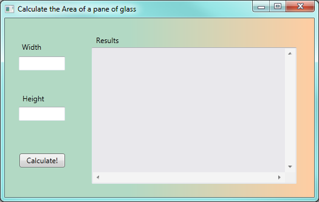
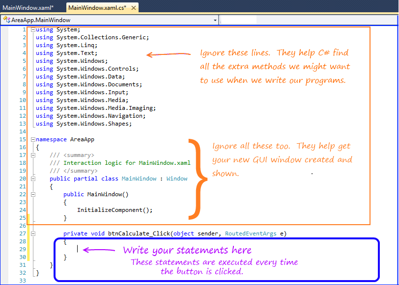
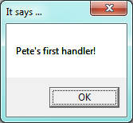
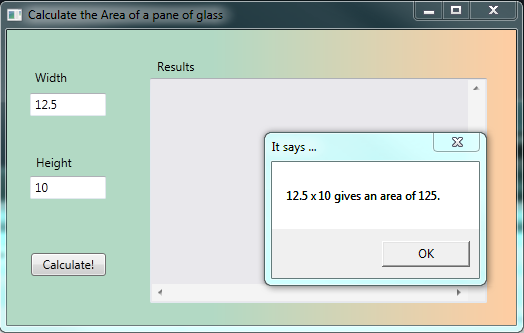
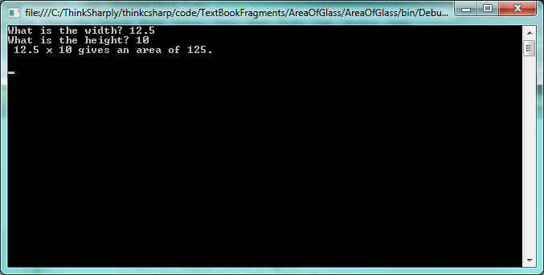

..  Copyright (C) Peter Wentworth under a Creative Commons BY-NC-SA Licence.
    See the fine print at http://creativecommons.org/licenses/by-nc-sa/3.0/ 

.. index:: code-behind, handler, event handler

Code-Behind: Events and Handlers  
================================

Once we have designed our GUI, we need to write the code-behind: the part of
the program that will respond to events caused by the user.  

You really need a bit of theory about program code: types, variables, assignment
statements, etc. before we can write code.  But we're going to delay talking about
that until the next chapter. We want to emphasize first the links between the front-end 
GUI and the code-behind, and the idea that the program responds to the user's actions.
So for this chapter, you might have to copy the code verbatim into your program, and focus
more on how the big parts fit together.  We'll dive deeper into the concepts of coding 
quite soon!

There are two tasks we'll need to get a GUI and a its code-behind to cooperate with one another:

* Determine which events the GUI should respond to.  Use the GUI designer to "wire them up"
  so that they trigger the running of some **handler** code-behind,
* Write the guts of the handler code.

We'll sometimes call a handler an **event handler**.  We mean the same thing.

How to wire up an event so that it triggers execution of our handler code:
--------------------------------------------------------------------------

The easiest event to start with is a ``Click`` event on a button.   What 
code do we want to run when the user clicks the button? 

Let's assume we need an application that calculate the area of a rectangular 
pane of glass from its width and height.

The *inputs* to the program are going to be the width and height.  
The *calculation* will compute width times height.
The *output*, or feedback to the user, will be the result of our calculation.

We design our Window to look like this:  it has three text box controls, a few
labels, and a button to perform the calculations. 

  
When we run the program the user will be able to enter the width and height.  But what
we want to do next is to respond when the user clicks the ``Calculate!`` button.  
In Visual Studio (VS), we can get into the Designer View, and simply double-click on
the button.  VS then creates a skeleton handler **method** in the code-behind, and 
changes our view so that we're now viewing the code behind, ready to write our new
code. If our button was called  ``btnCalculate`` [#]_, after double-clicking the 
button in the designer, VS will show us this code-behind:
 
.. [#] If you can't remember how to use the Property Editor to change the name of a control, peek back to Section 2.2.  
   

     
VS did a lot of (necessary) work, but at this stage the best advice is to ignore most of it. 
Lines 27-30 is the bit that interests us: --- this is the handler method that will be executed 
each time the button is clicked by the user.  We are going to write our code at line 29
(where VS has conveniently positioned our cursor).  

Notice that there are two tabs now at the top: one called ``MainWindow.xaml``, which is
our GUI component of the program, and the active one (shown highlighted), which is the
code-behind.  Its name (``MainWindow.xaml.cs``) hints that it is the C# code (the .cs part
of the name tells us that) behind MainWindow.xaml.  You can switch between the two tabs
freely.  If you close a tab, you can always open it again from the Solution Explorer window
in VS.

.. index:: MessageBox example

How to write some interesting code in the handler:
-------------------------------------------------- 

Before we tackle the real problem, let's play around a bit.  At line 29, we can insert
a fragment of code like this:

.. sourcecode:: csharp
 :linenos:
 
   MessageBox.Show("Pete's first handler!", "It says ...");
   

   
Now we run our program and click its *Calculate!* button, and a message box pops up like this:
      
So we've got the program to *do* something in response to our event!  This is significant
progress!  You can close 
the pop-up message box and next time you click the button you'll get a new event, the
handler code will be called again, and a new message box will pop up.

With confidence now that we can get from our GUI to our code-behind, we'll delete the line
we've just written and get back to solving the problem of calculating the area.

We expect the user to type some numbers into the two text boxes on the GUI. We named them
``txtWidth`` and ``txtHeight`` while we were setting properties in the designer, and
we named the big text box ``txtResult``.  The names are not used while we are designing the GUI,
but they are used in the code-behind that we write, where need have to refer to the
controls by their names.  

So in our handler we have to take the text (a string) in each of the two input text boxes, 
and convert it into a double number so that we can do arithmetic. 
Then we'll compute the area (a double), and we'll have to convert that 
back to a string.  Then we can output it.   Here is our code for our handler (you may
want to just copy and paste this from the on-line textbook into your own code):

.. sourcecode:: csharp
   :linenos:
 
   private void btnCalculate_Click(object sender, RoutedEventArgs e)
   {
       double w = Convert.ToDouble(txtWidth.Text);  // Convert string in textbox to double.
       double h = Convert.ToDouble(txtHeight.Text); // Same again.
       double area = w * h;
       string result = string.Format(" {0} x {1} gives an area of {2}\n", w, h, area);
       MessageBox.Show(result, "It says ...");
   }

And here is what gets displayed when we run the program, enter data, and click the button:

 
There are a few different options for displaying our results once we've calculated them.
We've chosen to use a message box here, but in future we'll probably prefer to put the
answers into the third big text box that we've got on the screen.  We can do
this quite easily by changing line 7 in the above code, to this:

.. sourcecode:: csharp
   :linenos:
 
        txtResults.AppendText(result);
            
The nice thing about doing it like this is that new results simply get appended to the 
bottom of previous results: so you can click the ``Calculate!`` button repeatedly or change
the width and height and see all the results appear in your text box.  (We even made
the vertical and horizontal scroll bars visible for this text box, so if you get enough
results you'll be able to scroll through them). 

.. index:: Console, Console-based example

Console-based programs:  Computation as Calculation
--------------------------------------------------- 

In this book we're stressing the idea that modern computing is about *computation as interaction*. 
Our touch screens, smart phones, tablet devices have controls like 
scrollbars, buttons, and menus, so *interaction* is currently the big deal.

We've used a GUI-based program to program in this style, and this chapter has shown
how we wire up our programs for this way of thinking.  In the GUI style,  
events occur, and these are wired up to trigger execution of the code in the handlers.

There is another style of programming called *computation as calculation*.  
Here a program doesn't have a GUI, or events, or handlers.   

It often does three steps:  

* input some data, 
* process the data, 
* output the results.  

It does the input and output in a **console**, and the flow of logic is very 
strictly top-to-bottom, pre-determined by the program logic, rather than dictated by 
when and how the user clicks buttons.   
We'll call this style of program a **console-based program**.   

.. sidebar:: A teletype console from 1963 

   .. image::  illustrations/1963teletypeASR-33.jpg
      
   
   Once upon a time all input and output with computers was like this...   The image comes
   from the museum at http://www.fcet.staffs.ac.uk/jdw1/sucfm/sucfmoutput.htm 
   

Fortunately, C# can work well either with GUIs, or using the
console (although the console is just represented as a window on the screen these days).  
Sometimes we can even use a mix of the two styles in the same program.

Let us re-code the above problem about computing the area of glass.  This time
we'll do it as a Console program.   So in Visual Studio, create a new project.
But instead of choosing a WPF Application, create a Console Application.  VS
will write a skeleton like this:

.. sourcecode:: csharp
   :linenos:
   
   using System;
   using System.Collections.Generic;
   using System.Linq;
   using System.Text;

   namespace AreaOfGlass
   {
        class Program
        {
            static void Main(string[] args)
            {
            }
        }
   }

Once again, there is some necessary scaffolding code (much less than the scaffolding
for a GUI, though), that we can mainly 
ignore.  What is very different from the WPF flavour of programs is that there is no
GUI in a Console-based program. 

The program will start executing our code in the body of the
Main method, i.e. at line 11.    So here is a completed method that you can copy and
paste into the scaffolding that VS gave you:

.. sourcecode:: csharp
   :linenos:

    static void Main(string[] args)
    {
        // Get the inputs to the program
        Console.Write("What is the width? ");
        string s1 = Console.ReadLine();
        Console.Write("What is the height? ");
        string s2 = Console.ReadLine();

        // Do the calculations
        double w = double.Parse(s1);
        double h = double.Parse(s2);
        double area = w * h;

        // Output the results 
        string result = string.Format(" {0} x {1} gives an area of {2}\n", w, h, area);
        Console.WriteLine(result);

        // This extra ReadLine keeps the console window open while we admire our results.
        string dummy = Console.ReadLine();   
    }

When we run the program, the console-based interaction looks like this: 

    
You'll find many Console-based examples in the Help system, in textbooks, and in on-line tutorials.
Authors sometimes prefer them, because they can demonstrate one small technique without 
the overhead of having to design a window. The top-to-bottom execution is also a bit
easier because we don't need to understand events and handlers.  And everything is in one
file, rather than having to have a GUI window, and some code-behind in another window.  

Of course, one downside to Console programs is that they can only work with text, 
not graphics, and they don't match our modern experience with our computers, our 
iPads, and our cellphones. 

In this book we'll tend to focus more on GUI-based programs that promote the
idea of "computation as interaction".   

Glossary
--------

.. glossary::

    code-behind
        Code that is "attached" to a GUI and provides the logic for the application.
        See the slightly different definition in the first chapter's glossary too. 
         
    console-based program
        Alternative to a GUI-based program.  A console-based program does its input from
        and its output to a text-only console window. 
       
    GUI-based program
        An application that uses a GUI as its interface to the user.
        
    handler
        Code that we write to respond to an event.  
        
    response
        We get an event, and give a response.  The handler is the code that determines
        what our response is.

Exercises
---------

#. a) Design an application that contains a button with a suitable caption, and a text box 
      (with pretty colours and a nice font!).  When the button is clicked,
      the text in the text box should show the current time of day.  
      Here is the code similar to that needed
      in the handler for your button click event:
   
      .. sourcecode:: csharp
          :linenos:
          
          private void button1_Click(object sender, RoutedEventArgs e)
          {
             textbox1.AppendText(DateTime.Now.ToShortTimeString());
          }
   
   b) Now experiment by changing the code.  There is another method called ``ToLongTimeString``,
      Use it instead, and make a note of what is different.
      
   c) Add another button to your interface. When it is clicked, show the date. 
   
#. Add another button to your program above.  When this button's click 
   event occurs, make the program respond by randomly choosing an 
   inspirational saying, or a joke, and displaying it in a message box.  
   Here is some skeleton code that randomly picks one of your sayings: 
   (You are not expected to understand this all at this stage ... you can
   just copy and paste the code into your program.  All you still have to do 
   to complete this is to show the chosen saying in a message box.)

   .. sourcecode:: csharp
      :linenos:
       
      private void button1_Click(object sender, RoutedEventArgs e)
      {
            // Make a list of possible sayings ...
            string[] possibleSayings = {
                "Out of my mind... Back in five minutes.",
                "Your gene pool needs a little chlorine.",
                "Ever stop to think, and forget to start again?",
                "I used to have a handle on life, but it broke." 
            };
            
            // Pick a random number between 0 and 3 
            // (because that is how we number these possible sayings)
            Random rng = new Random();
            int choice = rng.Next(0, 4); // sets choice to either 0,1,2, or 3
            
            // Now put the chosen saying into a string variable ...
            string whatToSay = possibleSayings[choice];
            
            // Complete this now by using a message box to 
            // show whatever is in 'whatToSay' to the user.
       }
        
#.  Add three more buttons to your program above, with content "Red", "Green" and "Blue".
    When one of the buttons is clicked the background brush of the window should be changed.
    Here is some sample code:
   
    .. sourcecode:: csharp
        :linenos:
      
        private void buttonRed_Click(object sender, RoutedEventArgs e)
        {
             this.Background = Brushes.Red;     // "this" refers to our GUI window
        }
 

 
