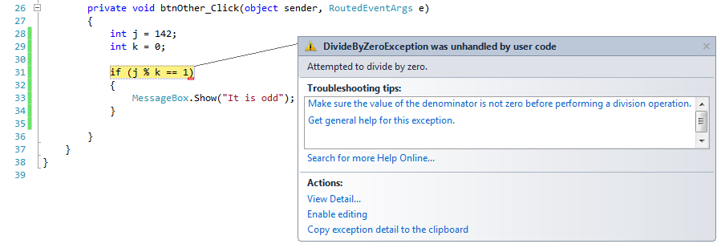
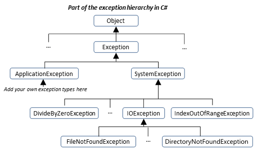
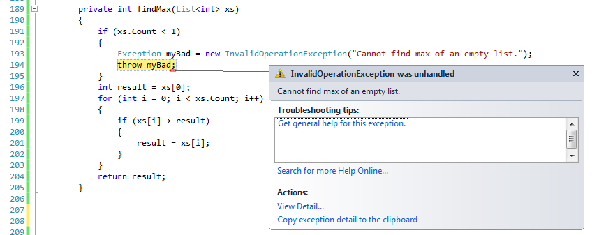

..  Copyright (C) Peter Wentworth under a Creative Commons BY-NC-SA Licence.
    See the fine print at http://creativecommons.org/licenses/by-nc-sa/3.0/   
    
Exceptions
==========

.. index:: exception, exception; handling, try ... catch statement, breakpoint

Catching exceptions
-------------------

Whenever a runtime error occurs, the system **throws** an **exception**.  When this
happens, an ``Exception`` object is created.  It holds details about what went 
wrong, and where.  We use the word "throw" to describe what happens, as one might say
*"I'm throwing this problem at my boss"*, or *"I'm throwing this problem over the fence"*. 
  
Unless we take some special action to **catch** and handle the problem, the program will
*crash* at this point.    For example, division by zero will throw an exception.
So will an array or list index out of bounds, or an attempt to use a file that
does not exist. 

The key to what we're going to do here is given by the title bar of the 
exception window in this image: the exception *"was unhandled by user code"*.
We're about to see how we can handle it.

In the picture above, also on the title line, we're also told what type of exception  
was thrown, in this case a ``DivideByZeroException``. 

Sometimes we want to execute an operation that might throw an exception, but we
don't want the program to crash. We can handle the exception using the
``try ... catch`` statement to "wrap" a region of code.  

For example, we might ask our user to enter a name of a file and then we'll try to
read from it. If the file doesn't exist, we want to catch and handle the exception:

    .. sourcecode:: csharp
        :linenos:
        :emphasize-lines: 2,8
        
        string filename = textBox1.Text;
        try
        {
            string content = File.ReadAllText(filename);
            /// do other useful things with the content 
            /// ...   
        }
        catch (Exception ex)
        {   
            string msg = string.Format("Reading file {0} threw an exception: \n{1}", 
                  filename, ex);
            MessageBox.Show(msg);
        }
        ...
  
The ``try ... catch`` statement consists of a try block followed by one or more catch clauses, which specify 
handlers for different types of exceptions.  Each catch clause has an associated block of code.
  
``try`` executes and monitors the statements in the first block (lines 3-7). If no
exception is thrown, it skips any ``catch`` clauses and continues execution 
(at line 14 in this example). 
If any exception occurs, information about the error is packed into a 
new exception object, and the exception is thrown.  In this example, the exception
is caught at line 8, and is assigned to variable ``ex``.  
Control immediately jumps into the ``catch`` block, where we execute lines 10-12.
When the block completes, execution continues at line 14 in this example.

Within the catch block, object ``ex`` is like any other parameter we've encountered: 
it has a type, it has some properties, and it has some methods, and you can choose 
your own variable name for it.  If you're inquisitive about what else is inside an 
exception object, set a breakpoint at line 10 and use the debugging tools to inspect it. 

We can catch exceptions that occur in methods we've called
----------------------------------------------------------

As our software becomes more complex we attempt to manage the complexity by
breaking it into methods (and coming soon) separate objects, and perhaps even
separate libraries.  

Suppose your method ``P`` has a ``try ... catch`` statement to catch exceptions.
``P`` calls method ``Q`` which calls ``W``.  But ``W`` throws a ``FileNotFoundException``.  
What happens next?

If ``W`` does not catch the exception, it exits immediately, and the exception is
thrown up to its caller ``Q``.  If ``Q`` can't catch it, the same happens again,
with the exception thrown up to ``P``.  Now because ``P`` has a ``catch``, it can recover.

We call the process of exiting all the called methods until we find one that is willing
to catch our exception *unwinding the call stack*.

So the important idea is that a ``try ... catch`` statement can catch exceptions that
occur, even if they occur indirectly in other methods that are called from the wrapped
statements.  

We'll need some care, though. In the example above we caught the exception at line 8, with
an assumption that it was line 4 that caused the fault.  But in fact lines 5 or 6, or any
methods called by them could be our culprit.  

.. index:: exception hierarchy,  hierarchy, is-a 
 
The Exception Hierarchy
-----------------------

In Section 13.4 we introduced the idea that classes, or types, were organized 
hierarchically via a system of inheritance.    
We saw that an ``Ellipse`` object is-a kind of ``Shape`` object which is-a kind of ``UIElement``.

Exception types are also organized hierarchically.  Here is a small fragment 
diagram showing just a few possible types of exception.

A ``catch`` can only catch certain kinds of exception.  In line 8 in our example, we
offered to catch anything of type ``Exception``.  That is the most general type of
exception, and because ``FileNotFoundException`` is-a ``Exception``, our ``catch`` will catch it.

But you can (and are generally encouraged) to catch specific exception types.  Consider this
fragment of code: 
  
    .. sourcecode:: csharp
        :linenos:

        try
        {
            ...
        }
        catch (FileNotFoundException ex1)
        {  ... }
        catch (DirectoryNotFoundException ex2)
        {  ... }
        catch (IOException ex3)
        {  ... }
        
Here we're offering to catch three different kinds of exceptions
(so our ``try`` can have multiple ``catch`` clauses), but we wouldn't catch
a ``DivideByZeroException`` if one occurred, either on line 3, or in some method
called indirectly by line 3.

Notice too that line 9 catches ``IOException``.  Although ``FileNotFoundException``
is-a ``IOException``, it won't be caught at line 9 --- it will get caught instead at
line 5.  The ``catch`` clauses are examined in the order that we write them, top-to-bottom.

The very readable Microsoft 
documentation at  http://msdn.microsoft.com/en-us/library/vstudio/0yd65esw.aspx says

    It is possible to use more than one specific catch clause in the 
    same ``try ... catch`` statement. In this case, the order of the catch 
    clauses is important because the catch clauses are examined in 
    order. Catch the more specific exceptions before the less 
    specific ones. The compiler produces an error if you order 
    your catch blocks so that a later block can never be reached. 
 
 
A good guideline is to only catch the exceptions that you can recover
from.  For example, if your user is entering the name of the 
file to open, they're going to get it wrong sometimes.  
Perhaps catch ``FileNotFoundException``, or the more general ``IOException``.  

There is a trade-off, though.  If you catch the general exception you might
be able to sidestep a wider range of problems.  For example we might try to 
open a file that is already in use by another program, or perhaps the file is 
on a network drive and we have a timeout because the network fails temporarily.
If you catch the general exception, you'll be able to recover from all these
cases, however, you won't be able to react uniquely to each cause of the error. 
 
.. index:: throw statement, exception; throw

Throwing our own exceptions
---------------------------

So far, run time errors throw exceptions.  But there doesn't always have
to be an error.  Our program can deliberately use a ``throw`` statement 
to throw an exceptions. Here is a method that expects a non-empty 
``List<int>`` from the caller, and it finds the maximum:

    .. sourcecode:: csharp
       :linenos:
       :emphasize-lines: 5,6
        
        private int findMax(List<int> xs)
        {
            if (xs.Count == 0)
            {
                Exception myBad = new InvalidOperationException("Cannot find max of an empty list.");
                throw myBad;
            }
            int result = xs[0];
            for (int i = 0; i < xs.Count; i++)
            {
                if (xs[i] > result)
                {
                    result = xs[i];
                }
            }
            return result;
        }
  

Line 5 creates an exception object  
which encapsulates specific information about the error, and line 6 throws
the exception.
 
``InvalidOperationException`` is one of the built-in exception types that seem 
to most closely match the kind of error we want to raise.  

If the method that called ``findMax`` (or its caller, or their caller, ...) 
handles the error, then the program can
carry on running; otherwise the program crashes.

 
The error message includes the exception type and the additional information
that was provided when the exception object was first created.

It is often the case that lines 193 and 194 (creating the exception object, then raising
the exception) are combined into a single statement, but there are really two different
and independent things happening, so perhaps it makes sense to keep the two
steps separate when we first learn to work with exceptions.   
Here we show it all in a single statement:

    .. sourcecode:: csharp
        :linenos:
        
         throw new InvalidOperationException("Cannot find max of an empty list.");
 

Glossary
--------

.. glossary::

    catch an exception
        Instead of the default behaviour of having our program crash, we can
        catch and recover from exceptions by wrapping regions of code   
        in a ``try`` ... ``catch`` statement.
        
    exception
        An error that occurs at runtime.   We say the exception is *thrown*.
  
    exception hierarchy
        Different types of exceptions are already defined in C#.  
        The types of exceptions are organized into a hierarchical (tree-like) type structure, 
        so, for example, an ``FileNotFoundException`` is-a kind of ``IOException`` 
        which is-a kind of ``SystemException``, which is-a kind of ``Exception``.  
    
    is-a
       A made-up word that Computer Scientists use to describe 
       a relationship between a more specific type and a more general type.   
       A Toyota is-a car. 
         
    ``throw`` statement
        A C# statement that allows us to throw exceptions from our code.

    unwinding the call stack
         The process of exiting all the called methods until we find one that is willing to catch our exception.
         If the method which throws an error is unable to handle it we will 
         exit that method and return to the call-site to see if the 
         caller is able to catch the exception. If it cannot, we will 
         continue to exit called methods until one is
         found which can handle the exception or the pogram crashes.

Exercises
---------
   
                
#.  Create a GUI with a textbox for entering a month number. The number is valid
    if it is an integer between 1 and 12.  Convert what the user enters to an integer,
    and validate that the number is between 1 and 12.  If not, pop up a MessageBox that
    describes the problem, and ask the user to try again.  Catch any cases where the
    user enters invalid characters, floating point numbers, leaves the text box blank, etc.
    
#.  Your car can break down in various ways.  Make a list of at least 15 different ways
    (e.g. flat tyre, no fuel, door fell off, battery flat, won't start, license expired, 
    crashed into lamp pole, repossessed by bank, etc.) 
    Google may be able to help if you ask the right question. 
    
    Now organize these problems into a hierarchy of ``BreakDown`` exceptions.  Draw
    a tree diagram like the one in this chapter to show these relationships.
   

