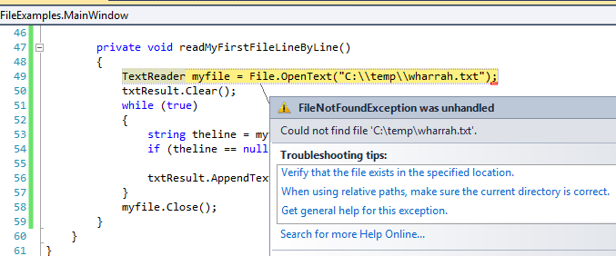

..  Copyright (C) Peter Wentworth under a Creative Commons BY-NC-SA Licence.
    See the fine print at http://creativecommons.org/licenses/by-nc-sa/3.0/ 
    
I/O, Files, and Networks 
========================

.. index:: file, I/O
    
About I/O, Files and Networks
-----------------------------

While a program is running, its data is stored in *random access memory* (RAM).
RAM is fast, but it is also **volatile**, which means that when
the program ends, or the computer shuts down, data in RAM disappears. To make
data available the next time the computer is turned on and the program
is started, it has to be written to a **file** on a **non-volatile** device 
such as a disk or USB memory stick, or the data needs to saved somewhere 
on the Internet (in the "cloud").

I/O is a shorthand for Input/Output.  So whenever a program 
reads or writes data to something (or somewhere) outside itself 
(including files, memory, or the Internet), we'll call this I/O.

By reading and writing files, programs can save information between program runs.

Working with I/O is often like working with a notebook. To use a notebook,
it has to be opened. When done, it has to be closed.  While the
notebook is open, it can either be read from or written to. In either case,
the notebook holder knows where they are in the notebook. They can read the 
whole notebook in its natural order or they can skip around.

All of this applies to files as well. To open a file, we specify its name and
indicate whether we want to read or write. 

Most of the file-related classes are in the library called ``System.IO``, so all
the programs in this chapter will need a ``using System.IO;`` directive at the 
top of the file.

Writing our first file
----------------------

Let's begin with a simple program that writes a few lines of text to a file:   

.. sourcecode:: csharp
    :linenos:
    
    private void writeMyFirstTextFile()
    {
        TextWriter myfile = File.CreateText("C:\\temp\\test1.txt");
        myfile.WriteLine("My first file written from C#");
        myfile.WriteLine("-----------------------------");
        myfile.WriteLine("Hello, world!");
        myfile.WriteLine("The time now is {0}", DateTime.Now.ToLongTimeString());
        myfile.Close();
    }
        
If there is no file with the given name on our disk,
one will be created. If there already is one, it will be replaced by the
file we are writing now.

To put a line of data into the file we invoke the ``Write`` or ``WriteLine`` method on the object, shown
in lines 4-7 above.  In bigger programs, these lines will usually be
replaced by a loop that writes many lines into the file.

Closing the file (line 8) tells the system that we are done writing and makes
the file available for reading by other programs (or by our own program).   

The ``WriteLine`` method can do everything that ``string.Format`` can do, so it
provides a convenient way to format our strings as we write them to the file. 

Reading a file line-by-line (style 1)
-------------------------------------

Let us now read all the lines in some file, one line at a time.  

.. sourcecode:: csharp
    :linenos:
          
    private void readMyFirstFileLineByLine()
    {
        TextReader myfile = File.OpenText("C:\\temp\\poem.txt");
        txtResult.Clear();
        while (true)                              // Keep reading forever.
        {
            string theline = myfile.ReadLine();   // Try to read another line.
            if (theline == null) break;           // If no more lines, leave the loop.

            txtResult.AppendText(theline + "\n"); // process the line we've just read.
        }
        myfile.Close();                           // Close the file.
    }
        
This is a handy pattern for our toolbox. In bigger programs, we'd normally
squeeze more extensive logic into the body of the loop at line 10 ---
perhaps even call another method and pass the line to that method for handing.
For example, if each line of the file contained the name and email address
of one of our friends, perhaps we'd split the line into some pieces and 
send the friend a party invitation. 

The end-of-file detection logic is important: when there are no more lines to be
read from the file, ``ReadLine`` returns ``null`` --- it does not refer to 
any string, not even an empty string.

.. admonition::  Fail first ...

    In our sample case here, if we have three lines in the file, we'll
    execute line 7 and 8 *four* times.  In C#, we only learn that
    the file has no more lines when we try to read another line, and fail.  
    In some other programming languages 
    (e.g. Pascal), things are different: we have what is called *look ahead*.
    Before reading each line we must call a method to test if there is a line to be read.  
    In Pascal, we're not allowed to try to read a line that does not exist. 
    
    So the styles and templates for working line-at-a-time in Pascal and C# are
    subtly different!   

    When we transfer our C# skills to our next computer language, we'll need to
    clarify how we'll know when the file has ended: is the style
    in the language "try, and after we've failed we'll know", or is the style
    "look ahead"?
 
     
If we try to open a file for reading, but it doesn't exist, we'll get an error:

.. admonition::  Relative File Paths

   A file path like ``C:\\temp\\poem.txt`` is an **absolute file path**.
   Navigation begins at ``C:`` and goes into the ``temp`` folder.
   
   Another way of expressing file locations --- **relative paths** --- can
   be used instead.  In that case, navigation starts in the folder where
   the executable *.exe file is. The designation ``..\\`` means "go up one
   level to my parent".   So consider these statements:
   
   .. sourcecode:: csharp
      :linenos:
          
      TextWriter a = File.CreateText("test.txt");
      TextWriter b = File.CreateText("..\\..\\test.txt");
      TextWriter c = File.CreateText("..\\..\\..\\test.txt");
        
   * Line 1 creates the file in the same folder as the executable.
   * Line 2 creates the file two levels above where the executable is.       
     With a standard configuration of Visual
     Studio, that means "in our project directory".
   * Line 3 creates the file three directory levels above the executable.  
     In VS that usually means "in our solution directory".
        
.. index:: sort; array   

Reading a file into an array of lines (style 2)
-----------------------------------------------

It is often useful to fetch data from
a disk file and turn it into a array of strings, one string per line in the file.  
Suppose we have a
file containing our friends and their email addresses, one per line
in the file.  But we'd like the lines sorted into
alphabetical order.  A good plan is to read everything into an
array of lines, then sort the array, and then process the lines:
 
.. sourcecode:: csharp
    :linenos:
          
    private void readToArrayOfLines()
    {
        string[] lines = File.ReadAllLines("..\\..\\poem.txt");
        Array.Sort(lines);

        foreach (string line in lines)
        {
            txtResult.AppendText(line + "\n");
        }
    }
     
        
The ``ReadAllLines`` method in line 3 reads all the lines and
returns an array of the strings.  (Notice it even opens and closes the
file for us, so it just needs one line our our code!)
Line 4 uses a method in the ``Array`` class
to sort the array, and lines 6-9 processes each line in some way. 

We could have used the template from the previous section to read each line
one-at-a-time, and to build up a list ourselves, but it is a lot easier
to use the method that the C# implementors gave us!   
        
.. admonition:: What if we want to read a file into a list instead of array?

    We cannot do so directly.  But, recall that it is easy to convert arrays to
    lists, or vice-versa.  Here we show how to read the contents of two files
    and put all their lines into the same list:
    
    .. sourcecode:: csharp
            :linenos:
        
            string[] textLines1 = File.ReadAllLines("..\\..\\vocab.txt");
            List<string> xs = new List<string>(textLines1);

            string[] textLines2 = File.ReadAllLines("..\\..\\alice_in_wonderland.txt");
            xs.AddRange(textLines2);

            MessageBox.Show(string.Format("There are {0} strings in list xs", xs.Count));
            
            
    Line 1 reads one text file into one array of strings, line 4 does the same for reading
    another file to a second array. 
    In line 2 we construct a new list containing all the strings
    in the first array.   In line 5, we add all the second file's lines onto the
    end of ``xs``.
    
    Of course, you could even combine the logic of lines 1 and 2 into a single line,
    like this:
    
    .. sourcecode:: csharp

       List<string> xs = new List<string>(File.ReadAllLines("..\\..\\vocab.txt"));
        
    And some Computer Scientists consider it fun to see how much logic they
    can cram into a single line of code.   So this one-liner is possible too ...
    
    .. sourcecode:: csharp

      List<string> xs = new List<string>(File.ReadAllLines(...)).AddRange(File.ReadAllLines(...));   
    
.. index:: string.Split
    
Reading the whole file into one string (style 3)
------------------------------------------------
        
Another way of working with text files is to read the complete
contents of the file into one big string, and then to use our string-processing
skills to work with the contents.   

We'd normally choose this style of working if we were not
interested in the line-by-line structure of the file.   For example, we've
seen the ``Split`` method on strings which can break a string into 
words.  So here is how we might count the number of words in a
file:

.. sourcecode:: csharp
    :linenos:
          
    private void readToString()
    {
        string content = File.ReadAllText("..\\..\\poem.txt");

        string[] delimiters = null;
        string[] words = content.Split(delimiters, StringSplitOptions.RemoveEmptyEntries);

        MessageBox.Show(string.Format("There are {0} words in the file.", words.Length));
    }
    
    
.. _processingtextfiles:
    
Processing data from text files
-------------------------------

We're often asked to process data from scientific instruments, or from surveys, 
or data that has been exported from a spreadsheet.   We'll assume here 
that we want to process "one line at a time", because data collection files are
often very large.   We'll call each line a **record**, and each record will
have a couple of **fields**.   

There are two cases we'll consider: some data files are "fixed-format": the fields
occur in the same columns in every line of the file.  In the other kind of file,
we have fields that will be delimited by some special character that doesn't otherwise
occur. 

In the fixed-format case our strategy will be
to read the line, (so we'll have a string), and then to extract our fields from
the file using the string's ``Substring`` method.  We might also need to convert
the field into a number.  Here are a few lines from a fixed-format text file 

    .. sourcecode:: pycon
 
        Tiger Woods            67   67   71   70
        Kevin Streelman        69   70   71   67
        Jeff Maggert           70   71   66   70
        David Lingmerth        68   68   69   72
        Martin Laird           71   67   73   67
        Henrik Stenson         68   67   71   72
        Ryan Palmer            67   69   70   72
        ...
        
In a delimited file, we'll use the string ``Split`` method to turn the fields into an array
of strings, and we may also need to convert some of the fields to numbers.  Here is the 
same data in a comma-delimited file:

     .. sourcecode:: pycon

        Tiger Woods,67,67,71,70
        Kevin Streelman,69,70,71,67
        Jeff Maggert,70,71,66,70
        David Lingmerth,68,68,69,72
        Martin Laird,71,67,73,67
        Henrik Stenson,68,67,71,72
        Ryan Palmer,67,69,70,72
        ...

There are some exercises at the end of this chapter where we can practice processing 
both fixed-format or delimited files ...

.. index:: file; text,  text file

An example: programming a filter
--------------------------------

Many useful line-processing programs will read a text file line-at-a-time and do some minor
processing as they write the (modified) lines to an output file.  They might number the
lines in the output file, or insert extra blank lines after every 60 lines to
make it convenient for printing on sheets of paper, or only extract some specific
columns from each line in the source file, or only print lines that 
contain a specific substring.  This kind of program is called a **filter**. 

Here is a filter that copies one file to another, 
omitting any lines that are too short:

    .. sourcecode:: csharp
       :linenos:
        
        TextReader myfile = File.OpenText("..\\..\\poem.txt");
        TextWriter newfile = File.CreateText("..\\..\\poem_filtered.txt");
        while (true)                               
        {
            string theline = myfile.ReadLine();    
            if (theline == null) break;
            if (theline.Length > 30)
            {
                newfile.WriteLine(theline);
            }
        }
        myfile.Close();
        newfile.Close();        
 
Working with binary files
-------------------------

Files that hold photographs, videos, zip files, executable programs, etc. are called
**binary** files: they're not organized into lines, and cannot be opened with a
normal text editor like NotePad++.  C# works just as easily with binary files, but
when we read from the file we're going to get bytes back rather than 
a string.  Here we'll copy one binary file to another the easy way:

.. sourcecode:: csharp
    :linenos:
    
    byte[] buffer = File.ReadAllBytes("C:\\temp\\somewhere.mp4");
    File.WriteAllBytes("C:\\temp\\thecopy.mp4", buffer);
 
All the bytes are read into a buffer (which has type ``byte[]``), and then the content
of the buffer is written to a new file.

This method only works well if the file size is small enough so that the buffer can
comfortably be held in memory.  But if the buffer gets too big your system will become
really slow or it will crash. 
        
A more reliable but long-winded way of copying a big binary file is to read a chunk of
the file, write it out, read the next chunk, etc.  This means our computer memory only has
to be large enough for the chunk that we're working with.  Here is some code that shows how 
we'd organize that:

.. sourcecode:: csharp
    :linenos:

    Stream inpf = File.OpenRead("C:\\temp\\somewhere.mp4");
    Stream outf = File.Create("C:\\temp\\thecopy2.mp4");
    
    const int chunkSz = 1024;
    byte[] buffer = new byte[chunkSz];
    while (true)
    {
        int n = inpf.Read(buffer, 0, chunkSz);
        if (n == 0) break;
        outf.Write(buffer, 0, n);
    }
    inpf.Close();
    outf.Close();
                    
There are a few new things here. In line 4 the const keyword prevents the 
value of chunkSz from being changed or reassigned at a later stage. 
In line 5 we pre-allocate an array (our buffer)
to hold the data.  At line 8 we read data into the buffer. The third
argument gives the maximum number of bytes to be read.  The ``Read`` method
will transfer bytes into the buffer, and return the number of 
bytes successfully transferred.  This gives us a mechanism for detecting
when we're at the end of the input file, at line 9, to break out of
the loop.

Note too that in line 10 we only write ``n`` bytes to the new file.
On the last iteration of the loop, we're almost certain to get back
fewer bytes than we requested.  So it is important to use the count 
of how many we *actually* got when we write the data to our new file.
 
We don't do any more detailed work with the ``byte`` type in these notes!  

What about fetching something from a network?
---------------------------------------------

The general, harder way
~~~~~~~~~~~~~~~~~~~~~~~

In the above example our file was exposed to our program as 
a ``Stream`` object that we could read from. 

But there are other kinds of specialized streams too, some very sophisticated.  
A stream can get its data from memory, from a file, from a connection
to another program, from a database, or from the web, to name just a few
sources.  Additionally, some streams can unzip or decrypt data
while reading, or encrypt or compress while writing. 

So a ``Stream`` is a very central type of object allowing for different
kinds of input and output in your program.  (In the early sections of
this chapter we used other object types like ``TextReader`` and ``TextWriter``.
These are "convenience" wrappers around streams, so there is still a ``Stream`` 
object at work in the heart of the system.)

To fetch a resource from the web we'll create a stream
to read from. Then we'll just copy and reuse lines 4-13 from the code above.   
 
.. sourcecode:: csharp
    :linenos:

    using System.Net;  // Include this directive to access the Internet

    ...                // Find an image to download from the web.
    string myUri = "http://www.ict.ru.ac.za/resources/thinkSharply/thinksharply/_images/csharp_lessons.png";

    // Create a web request
    HttpWebRequest myReq = (HttpWebRequest) HttpWebRequest.Create(myUri);
    // Get the response from the remote server
    WebResponse myResp = myReq.GetResponse();

    // Part of the response is a stream with our data ...
    Stream inpf = myResp.GetResponseStream();
    Stream outf = File.Create("C:\\temp\\theLogo.png");
    
    // Repeat / adapt the code at lines 4-13 from the previous example.

We'll need to get a few things right before this works:
  
* The resource we're trying to fetch must exist!  Check this using a browser.
* We'll need permission to write to the destination file, and the file will
  be created in the "current directory" --- i.e. the same folder that the C# program is saved in.
* If we are behind a proxy server that requires authentication, 
  (as some students are), this may require some more special handling to work around our proxy.  
  Use a local resource for the purpose of this demo! 
  
With the powerful notion of streams we can start to generalize how we think about
data. Whether we're reading or writing data from or to files, the web, or another 
program, there are one consistent set of underlying I/O ideas.

There are some useful samples of how to do common I/O tasks at
http://msdn.microsoft.com/en-us/library/ms404278(v=vs.100).aspx.

An easier way
~~~~~~~~~~~~~

.. sourcecode:: csharp
    :linenos:

    using System.Net;  // Include this directive to access the Internet
    ...
       
    // Now let a web client do the messy work for us ...
    WebClient wc = new WebClient();

    string addr1 = "http://www.ict.ru.ac.za/resources/ThinkSharply/thinkSharply/_downloads/golf_fixed_format.txt";
    string content1 = wc.DownloadString(addr1);  // brings down the whole text file.

    // Now fetch an image into a byte array, and save it to disk
    string addr2 = "http://www.ict.ru.ac.za/resources/ThinkSharply/thinkSharply/_images/csharp_lessons.png";
    byte[] buf = wc.DownloadData(addr2);
    File.WriteAllBytes("C:\\temp\\pic.png",  buf);

The WebClient is a powerful class that makes fetching text or binary data 
from the web easy.  We show two of its methods here (there are more): in the first case we 
fetch a text file.  In the second we fetch an image.   Instead of "http" as the protocol,
others are possible too. So if the server understands "ftp", you could download a file using
the ftp protocol instead.  (ftp was an older way of fetching network files before 
the Web and http were invented.)

The important thing here is how our libraries can encapsulate and 
hide detail, and provide us with really powerful abstractions. 

A cool thing about network programming
~~~~~~~~~~~~~~~~~~~~~~~~~~~~~~~~~~~~~~

Historically, we had files but no networks.  Modern network tools can not only
access data over the network, but they can also treat your local disks as
part of the network: 

.. sourcecode:: csharp
    :linenos:
       
    // One way to get all the text from a file     
    string content1 = File.ReadAllText("C:\\temp\\poem.txt");
       
    // And a newer way to do the same thing! 
    WebClient wc = new WebClient();
    string content2 = wc.DownloadString("file:///C:/temp/poem.txt");

Note ``File.ReadAllText`` uses backslashes whereas ``wc.DownloadString`` uses forwardslashes.

Glossary
--------

.. glossary::

    delimited file
        Often comma-delimited file or semicolon-delimited file: the fields in each record (line)
        are separate from one another by a delimiter.  (Sometimes we also call this a file with 
        *comma separated values*, or a CSV file).
        Our technique for processing a file like this will be to use 
        the string ``Split`` method to split the record into its fields.
        (Compare fixed-format file.)
        
    delimiter
        Something that shows boundaries. In files, fields in a record are often
        delimited or separated by commas or semicolons.
        
    field
        A single unit of information, usually as part of a bigger record.  In a
        student record, the student name would be one field, the birth date another
        field, etc.

    file
        A named entity, usually stored on a disk drive or network.
        It contains data. (See text file.)

    file system
        A method for naming, accessing, and organizing files and the data they
        contain. 
        
    filter
        A program that reads an input file and produces an output file, generally with
        some transformation or selection of the data.  It might only output lines
        that are not empty, or it might number the lines in the output file.
        
    fixed-format file
        A file in which every record, or line, has a fixed layout in specific columns.
        Our strategy for processing a file like this will be to extract the fields
        we need by using the string's ``Substring`` method.  (Compare delimited file.)
        
    I/O
        An acronym for Input/Output.  The mechanisms by which your program 
        reads and writes data to other devices or other programs. 
     
    non-volatile memory
        Memory that can maintain its state without power. Hard drives, flash
        drives, and compact disks (CDs) are examples of non-volatile memory.

    path
        A sequence of directory names that specifies the exact location of a
        file.
        
    record
        A sequence of fields that make up a single entity.
        Each student would have a record in a school's mark system.  If a file
        is used to hold records, a record would usually be a single line in the file.
        
    ``Stream``
        A type in the C# libraries that provides a very flexible source or
        destination for doing I/O. Streams can be used to read or write to
        files, or to or from memory, or to or from the web.          
        
    text file
        A file that contains characters organized into lines
        separated by newline characters.

    volatile memory
        Memory which requires an electrical current to maintain state. The
        *main memory* or RAM of a computer is volatile.  Information stored in
        RAM is lost when the computer is turned off.
 
Exercises
---------
         
#. Write a program that reads a file and writes out a new file 
   with the lines in reversed order
   (i.e. the first line in the old file becomes the last one in the new file.)
   
#. Write a program that reads a file and prints only those lines that contain the 
   substring ``void``.
   
#. Write a program that reads a file and produces an output file which is a 
   copy of the file, except the first five columns of each line contain a four
   digit line number, followed by a space. 
   Start numbering the first line in the output file at 1.  Ensure that
   every line number is formatted to the same width in the output file.  Use one
   of your C# programs as test data for this exercise: your output should be 
   a printed and numbered listing of the C# program. 

#. Write a program that undoes the numbering of the previous exercise: it should
   read a file with numbered lines and produce another file without line numbers. 
   
#. Building on the example data in section :ref:`processingtextfiles` , 
   download and save the 
   files :download:`a fixed format data file <golf_fixed_format.txt>` 
   and :download:`a comma-delimited data file <golf_delimited.txt>`.
   
   a. Write a program that reads the fixed format file and writes a new fixed-format
   file that shows each golfer, their scores for the four rounds, and their total 
   score for all four rounds of the tournament: 

     .. sourcecode:: pycon
      
        Tiger Woods            67   67   71   70    275
        Kevin Streelman        69   70   71   67    277
        Jeff Maggert           70   71   66   70    277
        David Lingmerth        68   68   69   72    277
        Martin Laird           71   67   73   67    278
        Henrik Stenson         68   67   71   72    278
        Ryan Palmer            67   69   70   72    278
        ...
        John Senden            73   70   71   73    287
        ...
        
   b. Now also output the golfer's position in the tournament.   Woods was first with the
   lowest score, then the next three players all came (tied) second, and the next 
   three all came (tied) 5th, etc.   So output a file as shown below, 
   where the field-width of the position is four columns, and the position is right-justified:
    
     .. sourcecode:: pycon
      
      Position   1  Tiger Woods            67   67   71   70    275
      Position   2  Kevin Streelman        69   70   71   67    277
      Position   2  Jeff Maggert           70   71   66   70    277
      Position   2  David Lingmerth        68   68   69   72    277
      Position   5  Martin Laird           71   67   73   67    278
      Position   5  Henrik Stenson         68   67   71   72    278
      Position   5  Ryan Palmer            67   69   70   72    278
      ...
      Position  45  John Senden            73   70   71   73    287
      ...
        
   c. Now repeat the exercise: output exactly the same as the above, but take the input data
   from the comma-delimited file instead of the fixed format file.  You should attempt 
   to organize the code so that, as far as possible, you have as few changes between this 
   version of the solution and the previous one. 
   
