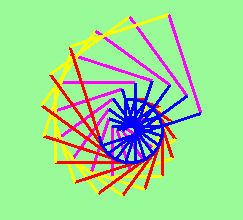
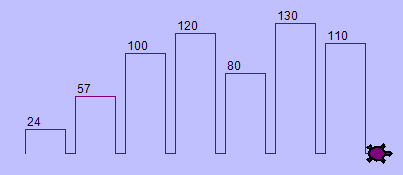

..  Copyright (C) Peter Wentworth under a Creative Commons BY-NC-SA Licence.
    See the fine print at http://creativecommons.org/licenses/by-nc-sa/3.0/ 

Void Methods
============

.. index::
    single: method
    single: void method
    single: method void

Methods
-------
     
In C#, a **method** is a named sequence of statements
that belong together.  Their primary purpose is to help us
organize programs into chunks that match how we think about
the problem. 

There are two main kinds of methods that we work with: 

* **value-returning methods** which are executed because we want them to 
  do some calculation and return a value,
* **void methods** which do not return a value.  They are executed
  because they *do* something interesting. 

We cover the void methods in this chapter, and talk about value-returning 
methods a little further into the course.

Suppose we're working with turtles, and we find that we're having to 
draw many squares, all of different sizes.   "Draw a square" is an *abstraction*, 
or a mental chunk, of a number of smaller steps.  So let's write a method to capture the pattern
of this "building block":   We'll make these changes to our Alex and Tess program from the previous chapter.
This will be a void method, because our goal is not to calculate a result:  our goal is to get
the turtle to *do* something.

.. sourcecode:: csharp
    :linenos:
    :emphasize-lines: 1,15,18,21

    private void drawSquare(Turtle t, double sz)  // t and sz are parameters
    {
        int side = 0;
        while (side < 4)
        {
            t.Forward(sz);    
            t.Right(90);
            side = side + 1;
        }
    }
    
    private void btnDemo1_Click(object sender, RoutedEventArgs e)
    {
        tess.WarpTo(10.5, 30.8);
        drawSquare(tess, 50.2);      // this is a call-site where we use our method

        alex.WarpTo(80.0, 80.0);
        drawSquare(alex, 80.0);

        tess.WarpTo(200.0, 150.0);     
        drawSquare(tess, 120.0);     // tess and 120.0 are arguments
    }

Clicking the button now produces this:
  
    .. image:: illustrations/turtle05.png 

        
Every method has a **method signature** followed by a **method body**.

Here the method signatures are at lines 1 and 12.   

The body of the ``DrawSquare`` method contains everything from line 2 to line 10, while
the body of the ``btnDemo1_Click`` method is at lines 13-22.

The signature contains a name for our method --- in our example we called it ``drawSquare``.  
The signature also has two **parameters** that make it general: 
one to tell the method which turtle to use, and the other to tell it the size
of the square to draw.      

Defining a new method does not make the method run. To **invoke** the method we need a
**method call**. We've already seen how to call some of the turtle methods like
``Right`` and ``Forward``.  A method call requires the name of the method
followed by some values, called **arguments**.   The arguments are **passed** to
the method by assigning them to the parameters in the method.  

At this stage, if your method has two parameters, your **call sites**  
--- the places in our code where we call the method --- should have two matching 
arguments. (This rule is relaxed in more advanced C#.)  And any argument value you provide
must be of an appropriate type that can be assigned to its corresponding parameter.

We use the terms *call a method* and *invoke a method* interchangeably --- they mean the same thing.

So lines 15, 18, and 21 are our call sites.  We call our new method three times in this code, 
passing different arguments each time.  So, for example, 
when the method is invoked from line 15, the variable ``sz`` is assigned the value 50, 
and the variable ``t`` refers to Tess.

Once we've defined a method, we can call it as often as we like, and its 
statements will be executed each time we call it.  And, as we see above, we 
can use it to get any of our turtles to draw a square of any size.   

Parameters play a very interesting role in methods.  They allow us to generalize
the methods.  Look again at ``drawSquare``.  We could have written it without the ``sz``
parameter, and simply hard-coded a value like 100 into line 6.  But then our method
would be less general: it would only be able to draw squares of size 100. Similarly,
we could have omitted the Turtle parameter from the method and hard-coded to use 
some specific turtle, say Tess, at lines 6 and 7. Once again, that would make the 
method less general. 

An important thinking skill when we create our own methods is to decide what parts
of the task (or mental chunk) that we're coding for must be fixed for all uses of
the methods, and what parts should be *pluggable* to make the method general.  Parameters
provide the mechanism to plug different values into the method at each different
call site.

In the next example, we've created a variation, and we get  
Alex to draw 15 squares.

.. sourcecode:: csharp
    :linenos:

    private void drawMulticolorSquare(Turtle t, double sz)
    {
        Brush[] bs = { Brushes.Red, Brushes.Yellow, Brushes.Magenta, Brushes.Blue };
        foreach (Brush b in bs)
        {
            t.LineBrush = b;
            t.Forward(sz);
            t.Right(90.0);
        }
    }

    private void btnDemo1_Click(object sender, RoutedEventArgs e)
    {
        alex.BrushWidth = 3.14;
        alex.Visible = false;
        double size = 20.0;
        for (int i = 0; i < 15; i = i + 1)
        {
            drawMulticolorSquare(alex, size);
            size = size + 6.1;        // Increase the size for next time
            alex.Forward(10.0);       // Move alex along a little
            alex.Right(18.0);
        }
    }
        

    
Here we've sneaked in arrays, and two more of C#'s looping mechanisms.

Line 3 creates an *array* of values --- four in this case.  Each value is a different
colour brush.   Line 4 *iterates* through all the elements in the array using C#'s ``foreach`` loop.  
So on the first pass of the loop, the variable ``b`` is assigned (given) the value ``Brushes.Red``.  
Then the body of the loop
is executed.  Next time, ``b`` is assigned the value ``Brushes.Yellow``.  Again the body of the loop is 
executed (and it sets the turtle brush to ``b``, draws a side, turns the corner).  So in a ``foreach``
loop, the number of times the loop is executed depends on how many elements are in the array.
In our example, we have four different brushes in the array, so we draw four sides.

Line 17 introduces the third flavour of C# loops: the ``for`` loop.  Look up the ``for`` loop in Microsoft's 
C# Reference manual.

Methods can call other Methods
------------------------------ 

Let's assume now we want a method to draw a rectangle.  (A rectangle is a generalization
of a square.)  We need to be able to call
the method with different arguments for width and height.  And, unlike the case of the
square, we cannot repeat the same thing 4 times, because the four sides are not equal.

So we eventually come up with this rather nice code that can draw a rectangle.

.. sourcecode:: csharp
    :linenos:

    private void drawRectangle(Turtle t, double wSz, double hSz)
    {
        for (int i = 0; i < 2; i = i + 1)
        {
            t.Forward(wSz);
            t.Right(90.0);
            t.Forward(hSz);
            t.Right(90.0);
        }
    }

The parameter names are deliberately chosen to be short to ensure they're not misunderstood.
In real programs, once we've had more experience, we will insist on better variable names than this.
But the point is that the program doesn't "understand" that we're drawing a rectangle, or that the
parameters represent the width and the height.  Concepts like rectangle, width, and height are 
the meaning we humans have, not concepts that the program or the computer understands.    

*Thinking like a scientist* involves looking for patterns and 
relationships.  In the code above, we've done that to some extent.  We did not just draw four sides.
Instead, we spotted that we could draw the rectangle as two halves, and used a loop to
repeat that pattern twice.

But now we connect some more dots in our head: we realize that a square is a 
special kind of rectangle.  We already have a method that draws a rectangle, 
so we can use that to draw our square too. 

.. sourcecode:: csharp
    :linenos:

    private void drawSquare(Turtle tx, double sz)   // a new version
    {
        drawRectangle(tx, sz, sz);
    }
    
    private void btnDemo1_Click(object sender, RoutedEventArgs e)
    {
        drawRectangle(tess, 150.0, 100.0);
        drawSquare(alex, 75.0);
    }
        
After clicking the button we'll find this in our playground:
    
    .. image:: illustrations/turtle07.png 

There are some points worth noting here: 

* Methods can call other methods.
* Rewriting ``drawSquare`` like this captures the relationship
  that we've spotted between squares and rectangles.  
* A caller of this method might say ``drawSquare(alex, 75.0)``.  The parameters
  ``tx`` and ``sz``, are given the values of alex and 75.0 respectively.
* In the body of ``drawSquare``, the parameters are just like any other variable. 
* When the call is about to be made to ``drawRectangle``, the values in variables ``tx`` and ``sz``
  are fetched first, then the call happens.  So as we enter the top of
  method ``drawRectangle``, its parameter ``t`` is assigned the Tess object.  ``wSz`` and
  ``hSz`` are both given the value 75.
* In this example we've chosen different names for the parameters in ``drawSquare`` and in 
  ``drawRectangle``.  But the names are what we call **local** names:  You can choose any
  name you like for the parameters of a method.  Even if you re-use the same name as is used in
  some other method, they are different variables.  (Different families could have a
  dog called Rex: the same name doesn't mean they're the same dog!)  So make sure
  you still understand the argument passing if the parameter name in ``drawSquare``
  is changed to ``t`` instead of ``tx``.  

So far, it may not be clear why it is worth the trouble to create all of these
new methods. There are many good reasons, but this example demonstrates two:

#. Creating a new method gives us an opportunity to name a group of
   statements.  Methods can simplify a program by hiding a complex computation 
   behind a single call. The method (including its name) can capture our 
   mental chunking, or *abstraction*, of the problem.  
#. Creating a new method can make a program smaller by eliminating repetitive 
   code.  

.. index:: flow of control; control flow

Flow of Control
---------------

We can imagine the computer has a moving finger which always points to
the next statement to be executed.  The way the finger moves from one
statement to the next is called the **flow of control**, sometimes also
called **control flow**.   

We've see event handlers attached to events: when a button is clicked,
the flow of control executes the statements in the handler one after the
other, until it leaves the handler and goes back to wait for another event. 

Method calls are a detour in the control flow. Instead of going to
the next statement, the control jumps to the first line of the called method,
executes all the statements there, and then comes back to pick up where it left
off.

That sounds simple enough, until we remember that one method can call
another. While in the middle of one method, the program might have to execute
the statements in another method. But while executing that new method, the
program might have to execute yet another method!

C# keeps track of where it is, so each time a method completes, 
control returns to where it was called from.

.. index:: Visual Studio; single stepping; breakpoints

.. admonition:: Watch the control flow in action

   See a video demonstration at http://www.ict.ru.ac.za/resources/thinksharply/videos/debugging1.avi 
   
   In Visual Studio (VS), we can debug our programs and "single-step" through
   any program.  VS will highlight each line of code just before it is about to
   be executed.  

   To get into *debugging mode*, we set **breakpoints** in the code.  This fragment shows
   a breakpoint set on line 50.  (Set or remove the breakpoints by clicking where the red
   icon is shown to the left of line 50.)  The red highlighted section shows that execution
   will be interrupted before the first step of the ``for`` loop (defining the variable ``i``
   and initializing it to zero.)
   
   .. image:: illustrations/breakpoint01.png 
   
   Once breakpoints are set we can execute the program, click its buttons, etc. and when we
   reach a breakpoint VS enters **debugging mode**. (VS has at least three modes: editing,
   running and debugging.  We know which mode we're in by watching the title bar of VS: when
   editing, only the name of your solution is shown. Otherwise VS shows the name of the 
   solution followed by  "(Debugging)" or by "(Running)".)

   In debugging mode we can single-step (key F11 executes the next instruction), 
   or we can hover the cursor over any 
   variable to get VS to pop up the current value of that variable. 
   So this makes it easy to inspect the state of the program --- the
   current values that are assigned to the program's variables.  Below we see
   that we've stepped through a few statements and we're about to execute line
   55.  We've hovered the cursor over the variable ``hSz`` and we see that
   it currently has the value 100.0.
   
   .. image:: illustrations/breakpoint02.png 
    
   Notice also that there is a little pin on the pop-up. If you pin the pop-up,
   it remains there.  So you can pin values for many variables and see how they
   change as you execute your code step by step.  So here is the same code with
   three variables pinned for inspection:
   
   .. image:: illustrations/breakpoint03.png 
    
   Single-stepping is a powerful mechanism for building a deep and thorough understanding of
   what is happening as each statement is executed.  Learn to use breakpoints and
   single-stepping feature well, and be mentally proactive:  as you work through the code,
   challenge yourself before each step: *"What changes will this line make to 
   any variables (or *state*) in my program?"* and *"Where will flow of execution go next?"* 

   After a few steps of debugging you can go back to running mode by 
   removing the breakpoint and clicking the Run icon again.
   
 

.. index:: bar chart

A Turtle Bar Chart
------------------

Let's do a slightly bigger example now.  

The turtle has a lot more power than we've seen so far. 
Details are in the documentation for the turtle, in the appendix of this book. 

Here are a couple of new tricks for our turtles: 

* We can get a turtle to display text at its current position.  The method to do that is
  ``alex.Stamp("Hello")``.   The argument is the text to be displayed --- it must be a string.
  But the Stamp method takes some extra *optional* arguments which can change the position and rotation of the
  text.  If you use the method with only the one string argument, it creates a rectangular label containing the text,
  and places the top left edge of the label at the turtle position.  So the text lines up below the turtle, and
  is written horizontally across the screen.
* If you supply the next two arguments e.g. ``alex.Stamp("Hello",5, -20)`` the label will be offset an additional
  5 units in the X direction, and -20 in the Y direction.  So the text will now appear further to the right of
  the turtle, and above the turtle, 20 units nearer the top edge of the screen.
* And there is still another optional argument.  Once we know where the text should go relative to a turtle who is
  facing east (its Heading is 0.0 degrees), we can provide a Boolean argument to tell the system to rotate the 
  text to the same heading as the turtle.  So here is a small sample that shows the options we have:
  
  .. sourcecode:: csharp
    :linenos:
    
        tess.Reset();
        tess.Left(70);
        tess.Stamp("1. Default position of text is here...");
        tess.Stamp("2. With offsets, we move the text. ", 10.0, -24.1);
        tess.Stamp("3. With offsets and rotation.", 10.0, -24.1, true);
        
  .. image:: illustrations/turtle08.png
  
* Every turtle has some properties called TextBrush, TextFontFamily, TextFontSize, TextFontStyle, TextFontWeight, 
  which we can set: so we can get our turtle to create huge text in hot pink colours with our favourite font.  Experiment a bit. 
* Turtles usually draw shapes with lines: but there is a property called ``Filling`` that tells the turtle to fill the 
  interior of its shapes rather than draw an outline. Along with this we can set the FillBrush property (If we don't set
  it, the turtle's LineBrush will be used to fill too.)
 

Ok, so can we get Tess to draw a bar chart?  Let us start with some data to be charted,

    ``int[] xs = { 24, 57, 100, 120, 80, 130, 110 };``

To tackle the problem, we think about how to break it into decent sub-problems or chunks.  A good building block
is to be able to draw a single bar of a given height, with a fixed width.  So let's make a void method to capture 
this mental chunking:

.. sourcecode:: csharp
    :linenos:

    private void draw_bar(Turtle t, int height)
    {
        // Get turtle t to draw one bar, of height.  
        t.Left(90);          
        t.Forward(height);     // Draw up the left side
        t.Right(90);
        t.Forward(40);         // Width of bar, along the top
        t.Right(90);
        t.Forward(height);     // And down again!
        t.Left(90);            // Put the turtle facing the way we found it.
        t.Forward(10);         // Leave small gap after each bar
    }            
     
   
Now to draw the whole chart we need to repeatedly call our method.  So code like this
could appear in a handler:

.. sourcecode:: csharp
    :linenos:
    :emphasize-lines: 9
   
    private void drawChart_Click(object sender, RoutedEventArgs e)
    {
        tess.Reset();
        int[] xs = { 24, 57, 100, 120, 80, 130, 110 };
        tess.LineBrush = Brushes.Purple;
        
        foreach (int v in xs)
        {
            draw_bar(tess, v);
        }
    }
        
What we get is not fantastically impressive, but it is a good start!
        
    .. image:: illustrations/tess_bar_1.png

Notice that we used an array of integers
and integer angles for turning the turtle.  But, of course, C# can see that the turtle's methods take
double parameters.  C# will do the type conversions automatically for us, because it is always safe
to convert an int to a double.  But C# won't try to do the automatic conversion in the opposite 
direction, because converting a double to an int can lose information.  If we want to do a conversion 
that potentially could discard some precision, we have to do it ourselves.

Next, at the top of each bar, we'll print the value of the data.
We'll do this in the body of ``draw_bar``, by adding   ``t.Stamp(string.Format("{0}", height), 0, -24);`` 
just before line 7.   The result looks much better now: 

        
Now let's turn on the filling capability for a nice effect.  Our final handler now looks like this:

.. sourcecode:: csharp
    :linenos:
    :emphasize-lines: 7, 12

    private void drawChart_Click(object sender, RoutedEventArgs e)
    {
        int[] xs = { 24, 57, 100, 120, 80, 130, 110 };
        tess.Reset();    
        tess.LineBrush = Brushes.Purple;
 
        tess.Filling = true;
        foreach (int v in xs) 
        {
            draw_bar(tess, v);
        }
        tess.Filling = false;        
    }

It produces the following very satisfying result:

    .. image:: illustrations/tess_bar_3.png
    
  
.. admonition:: A small challenge 
        
        Brushes are very flexible things.  A LinearGradientBrush gives a blend of colours along a certain angle.  A RadialGradientBrush 
        is also quite interesting.  Turtles have different brushes for their line operations and their filling operations.  So after line 5, 
        you could try one of these.
        
        .. sourcecode:: csharp
            :linenos:
            
            tess.FillBrush = new LinearGradientBrush(Colors.Cyan, Colors.Red, 45);
            tess.FillBrush = new RadialGradientBrush(Colors.Yellow, Colors.Magenta);

Glossary
--------

.. glossary::

    argument
        A value provided to a method when the method is called. This value
        is assigned to the corresponding parameter in the method.  The argument
        can be the result of an expression which may involve operators, 
        operands and calls to other value-returning methods.

    call site
        A place in our code where we call a method.

    flow of execution
        The order in which statements are executed.

    method
        A named sequence of statements that performs some useful operation.
        Methods may or may not take parameters.  In this chapter we've seen void methods 
        (they don't return any result).  In a future chapter we'll see value-returning methods.
        
    method body
        The block of statements that come after the method signature.  The body always
        starts and ends with matching braces  {  }.

    method call
        A statement that causes a method to execute. It consists of the name of the
        method followed by arguments enclosed in parentheses.
        
    method signature, signature
        The initial part of a method which contains details about its name, it's return type (or 
        the special keyword ``void``), and its parameters. (Some headers may use more advanced features
        --- for example, the keyword ``private`` will be covered later.)  See *method body*.

    lifetime
        Variables and objects have lifetimes --- they are created at some point during
        program execution, and are destroyed at some later time. 
        
    local variable
        A variable defined inside a method. A local variable can only be used
        inside its method.  Parameters of a method are also special kinds
        of local variables.

    parameter
        A name used inside a method to refer to the argument which was passed 
        to it from the call site.
           
    refactor
        A fancy word to describe reorganizing our program code, usually to make 
        it more understandable.  Typically, we have a program that is already working,
        then we go back to "tidy it up".  This often involves writing good comments, 
        choosing better variable names, simplifying the code where we can, or spotting repeated patterns 
        and moving that code into a method.    
        
    signature
        See *method signature*.
        
    void method
        The opposite of a value-returning method: one that does not return a value.  It is
        executed for the work it does, rather than for the value it returns.

Exercises
---------

#.  Write a void method to draw a square.  Use it in a program to draw the image shown below. 
    Assume each side is 20 units.
    (Hint: notice that the turtle has already moved away from the ending point of the last 
    square when the program ends.)
    
    .. image:: illustrations/five_squares.png
    
#.  Write a void method to draw this. Assume the innermost square is 20 units per side,
    and each successive square is 20 units bigger, per side, than the one inside it.   
    
    .. image:: illustrations/nested_squares.png

#.  Write a void method ``draw_poly(t, n, sz)`` which makes a turtle 
    draw a regular polygon. 
    When called with ``draw_poly(tess, 8, 50)``, it will draw a shape like this:
    
    .. image:: illustrations/regularpolygon.png

#. Draw this pretty pattern.

   .. image:: illustrations/tess08.png    
   
#.  The two spirals in this picture differ only by the turn angle.  Draw both.

    .. image:: illustrations/tess_spirals.png
       :height: 240
       
#.  Write a void method ``draw_equitriangle(t, sz)`` which calls ``draw_poly`` from the 
    earlier question to have its turtle draw a equilateral triangle. 

#.  Write a void method to draw a star, where the length of each side is 50 units.
    (Hint: You should turn the turtle by 144 degrees at each point.)  
    
     .. image:: illustrations/star.png
     
#.  Extend your program above.  Draw five stars, but between each, pick up the pen, 
    move forward by 175 units, turn right by 144, put the pen down, and draw the next star.
    You'll get something like this:
    
    .. image:: illustrations/five_stars.png
    
    What would it look like if you didn't pick up the pen?
    
#.  Study the turtle bar chart program, and determine what you think will happen if we provide some
    negative values in the data to be charted.  Then try it out and confirm that you understand it well!
    Then peek ahead at the next chapter, see how the ``if`` statement works, and change the turtle bar chart
    program so that positive bars are filled with a blue brush, and negative bars are filled with a red brush.
    Also arrange that the value that labels negative bars displays below the bar, rather than inside it.
