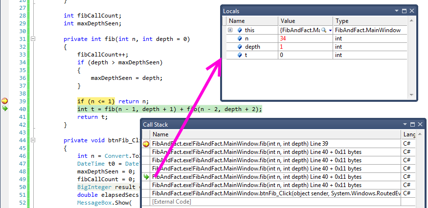
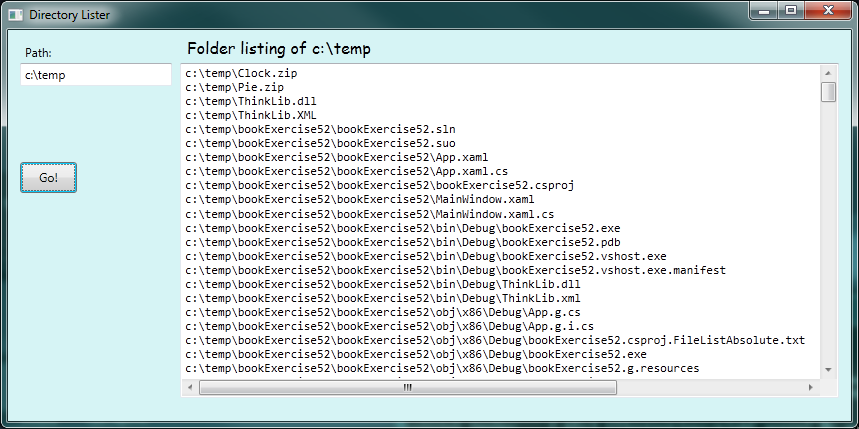
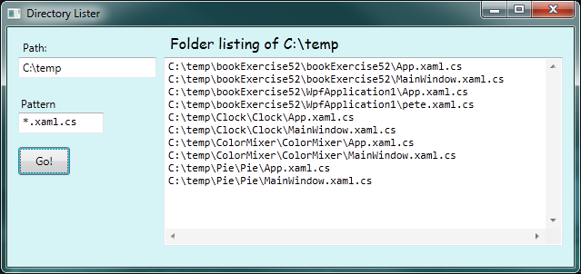
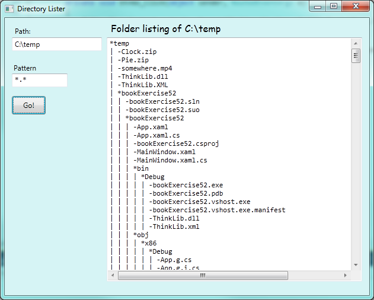
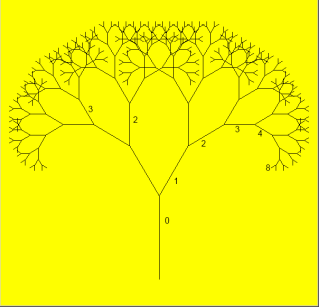
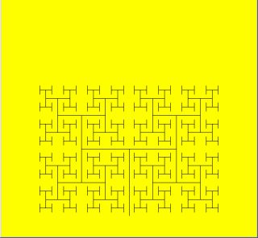

..  Copyright (C) Peter Wentworth under a Creative Commons BY-NC-SA Licence.
    See the fine print at http://creativecommons.org/licenses/by-nc-sa/3.0/ 
 
Recursion
========= 

**Recursion** means "defining something in terms of itself" usually at some 
smaller scale, perhaps multiple times, to achieve your objective.  
For example, we might say "A human being is someone whose mother is a human being",
or "a directory is a structure that holds files and (smaller) directories", or "a family tree starts
with a couple who have children, each with their own family sub-trees".

So methods can *call themselves* to solve smaller sub-problems.  This idea that
the method can usefully call itself is the essence of recursion.
   
.. index:: fractal; Koch   
   
Drawing Fractals
----------------

For our purposes, a **fractal** is a recursive drawing which has *self-similar* structure. 
It can be defined in terms of itself.

Let us start by looking at the famous Koch fractal.  An order 0 Koch fractal is simply
a straight line of a given size.

.. image:: illustrations/recursion/koch_0.png

An order 1 Koch fractal is obtained like this: instead of drawing just one line,
draw instead four smaller segments, in the pattern shown here:

.. image:: illustrations/recursion/koch_1.png

Now what would happen if we repeated this Koch pattern again on each of the order 1 segments?  
We'd get this order 2 Koch fractal:

.. image:: illustrations/recursion/koch_2.png

Repeating our pattern again gives us an order 3 Koch fractal:

.. image:: illustrations/recursion/koch_3.png

Now let us think about it the other way around.  To draw a Koch fractal
of order 3, we can simply draw four order 2 Koch fractals.  But each of these
in turn needs four order 1 Koch fractals, and each of those in turn needs four
order 0 fractals.  Ultimately, the only drawing that will take place is 
at order 0. This is very simple to code up in C#:

.. sourcecode:: csharp
    :linenos: 
   

        void koch(Turtle t, int order, double size)
        {
            // Make turtle t draw a Koch fractal of 'order' and 'size'.
            // Leave the turtle facing the same direction as it started in.

            if (order == 0)
            {   // The base case is just a straight line
                t.Forward(size);   // This is the only place we draw!
            }
            else
            {
                koch(t, order - 1, size / 3);   // Make a smaller koch drawing, 1/3 size
                t.Left(60);
                koch(t, order - 1, size / 3);
                t.Right(120);
                koch(t, order - 1, size / 3);
                t.Left(60);
                koch(t, order - 1, size / 3);
            }
        } 
            
The key thing that is new here is that if order is not zero,
``koch`` calls itself recursively to get its job done.

Whenever ``koch`` calls itself, it asks for a koch line of one order less
than itself.  Take some time to convince yourself that every recursive call
is a "simpler" sub-problem, and that the process must terminate.

.. admonition:: Recursion, the high-level view

    One way to think about this is to convince yourself that the method
    works correctly when you call it for an order 0 fractal.  Then do
    a mental *leap of faith*, saying *"the fairy godmother* (or C#, if
    you can think of C# as your fairy godmother) *knows how to 
    handle the recursive order 0 calls for me on lines 12, 14, 16, and 18, so
    I don't need to think about that detail!"*  All I need to focus on
    is how to draw an order 1 fractal *if I can assume the order 0 one is
    already working.*
    
    You're practising *mental abstraction* --- ignoring the sub-problem 
    while you solve the big problem.

    If this mode of thinking works for you (and you should practice it!), then take
    it to the next level.  Aha! Now can I see that it will work when called
    for order 2 *under the assumption that it is already working for order 1*.  

    And, in general, if I can use mental abstraction to gloss over how the order n-1 
    case works, can I just focus on solving the order n problem?

    Students of mathematics who have played with proofs of induction should
    see some very strong connect-the-dots similarities here.  

.. admonition:: Recursion, the low-level operational view

    Another way to understand recursion is to get rid of it! If we
    use separate methods to draw an order 3 fractal, an order 2 fractal, an order 1
    fractal and an order 0 fractal, we could simplify the above code, quite mechanically,
    to a situation where there was no longer any recursion, like this:
    
    .. sourcecode:: csharp
        :linenos:
        
        void koch0(Turtle t, double size)
        {
            t.Forward(size);
        }

        void koch1(Turtle t, double size)
        {
            koch0(t, size / 3);   
            t.Left(60);
            koch0(t, size / 3);
            t.Right(120);
            koch0(t, size / 3);
            t.Left(60);
            koch0(t, size / 3);
        }

        void koch2(Turtle t, double size)
        {
            koch1(t, size / 3);
            t.Left(60);
            koch1(t, size / 3);
            t.Right(120);
            koch1(t, size / 3);
            t.Left(60);
            koch1(t, size / 3);
        }

        void koch3(Turtle t, double size)
        {
            koch2(t, size / 3);
            t.Left(60);
            koch2(t, size / 3);
            t.Right(120);
            koch2(t, size / 3);
            t.Left(60);
            koch2(t, size / 3);
        }
    
    This trick of "unrolling" the recursion gives us an operational view
    of what happens.  You can trace or single-step the program into ``koch3``, and from
    there, into ``koch2``, and then into ``koch1``, etc., all the way down
    the different layers of method calls.  
    
    If ``koch3`` is called once, ``koch2`` will be called four times.  How many times
    will ``koch0`` eventually be called?
    
    Single-stepping and taking an operational view of recursion can help build your insight. 
    The mental goal is, however, to be able to do the abstraction for the general case!

Case study: Factorials  
----------------------

Six factorial (written elsewhere as 6!) can easily be calculated in a loop, as 6x5x4x3x2x1.  
But we can also look at this
with our recursive spectacles: N factorial is N x (N-1 factorial).  Of course, if we define
it in terms of itself we'll need a base case too.  So we complete our recursive definition by 
defining 0 factorial to be 1.   Here is a recursive value-returning method that computes factorials:

    .. sourcecode:: csharp
        :linenos:
        
        private int fact(int n)
        {
            if (n <= 1) return 1;
            else return n * fact(n - 1);
        }
        
        private void btnFact_Click(object sender, RoutedEventArgs e)
        {
            int n = Convert.ToInt32(txtFact.Text);
            MessageBox.Show(string.Format("{0} factorial is {1}", n, fact(n)));
        }

When we run this a message box pops up to (correctly) tell us
that 5 factorial is 120.   

A deck of playing cards has 52 cards (without Jokers). If we shuffle a deck, how many 
possible shufflings are there? (Shuffling a deck puts the cards into a different
permutation, so the question becomes "how many permutations can we have of 52 distinct
objects?", and the answer, of course, is 52 factorial.)

But when we run our program to compute 52 factorial, our program gets it wrong, with an incorrect
result of zero.    

52! is a large number (relative to our 32-bit integers in C#) --- too big to store in a ``int``.
So the computation fails with what is called an *overflow error*, and fails to detect the problem. 

We can set some options in Visual Studio for *overflow checking*, and make sure that the run-time
error is brought to our attention rather than silently ignored.  (Search the Internet 
for "C# enable Overflow Checking" if you want to try this approach, but it won't help you 
to compute 52! or 1000!)

Often we do need to compute with big integers, especially in fields like cryptography and
problems that need us to compute 1000! exactly.  So there is a library called ``System.Numerics``
that provides a structure called ``BigInteger`` for representing an arbitrary large signed integer.

We need to add a reference to our project to include the ``System.Numerics`` module,
and we'll add the directive ``using System.Numerics;`` at the top of the file we're working with.
But after that, it is really simple: all we change is the return type of the ``fact`` method
in line 1 above, to make the return type ``BigInteger`` rather than ``int``.   Now we're good
for this example:

   .. image:: illustrations/recursion/fact1000.png
 
 
.. index:: fibonacci numbers

Case study: Fibonacci numbers  
----------------------------- 

The famous **Fibonacci sequence** 0, 1, 1, 2, 3, 5, 8, 13, 21, 34, 55, 89, 134, ... was devised by 
Fibonacci (1170-1250), who used this to model the breeding of pairs of rabbits.   
If, in generation 7 you had 21 pairs in total, of which 13 were adults, 
then next generation the adults will all have bred new children, 
and the previous children will have grown up to become adults.  
So in generation 8 you'll have 13+21=34, of which 21 are adults.

This *model* to explain rabbit breeding made the simplifying assumption that rabbits never died. 
Scientists often make (unrealistic) simplifying assumptions and restrictions 
to make some headway with the problem.

If we number the terms of the sequence from 0, we can describe each term recursively
as the sum of the previous two terms::
 
    fib(0) = 0
    fib(1) = 1
    fib(n) = fib(n-1) + fib(n-2)  for n >= 2

This translates very directly into some C#: 

.. sourcecode:: csharp
    :linenos:

    using System.Diagnostics;   // for Stopwatch
    
    private int fib(int n)
    {
        if (n <= 1) return n;
        int t = fib(n - 1) + fib(n - 2);
        return t;
    }
     
    private void btnFib_Click(object sender, RoutedEventArgs e)
    {
        int n = Convert.ToInt32(txtFib.Text);
        Stopwatch sw = new Stopwatch();
        sw.Start();
        int result = fib(n);
        double elapsedSecs = (sw.Elapsed).TotalSeconds;
        MessageBox.Show(string.Format("The {0}'th Fib number is {1}\nTime taken {2:F2} secs.", 
                                                                     n, result, elapsedSecs));
    }
    
..

    .. image:: illustrations/recursion/fib45.png
    
We get the correct result, but as we ask for more terms in the sequence we get 
an exploding amount of work!  This is a particularly inefficient algorithm.
There are much better ways to compute this.
  
.. index:: breakpoint; conditional

Debugging and instrumenting recursion
-------------------------------------

Suppose we wanted to know how many times ``fib`` had been called above, and what the maximum depth
of recursion was that had been reached.   Using class-level variables and some extra parameter information
is a handy way of arranging this:

.. sourcecode:: csharp
    :linenos:
    :emphasize-lines: 3,5, 7-1, 23-24 

    using System.Diagnostics; // for Stopwatch
    
    int fibCallCount, maxDepthSeen;

    private int fib(int n, int depth = 0)
    {
        fibCallCount++;
        if (depth > maxDepthSeen)
        {
            maxDepthSeen = depth;
        }

        if (n <= 1) return n;
        int t = fib(n - 1, depth + 1) + fib(n - 2, depth + 2);
        return t;
    }

    private void btnFib_Click(object sender, RoutedEventArgs e)
    {
        int n = Convert.ToInt32(txtFib.Text);
        Stopwatch sw = new Stopwatch();
        sw.Start();
        maxDepthSeen = 0;
        fibCallCount = 0;
        BigInteger result = fib(n);
        double elapsedSecs = (sw.Elapsed).TotalSeconds;
        MessageBox.Show(
            string.Format("The {0}'th Fib number is {1}\nTime taken {2:F2} secs.\nCalls={3} MaxDepth={4}", 
                          n, result, elapsedSecs, fibCallCount, maxDepthSeen));
    }
..

   .. image:: illustrations/recursion/fib_with_instrumentation.png

   
Notice that the caller had to set the two class-level variables to zero at lines 20-21 before calling
``fib``.   Notice too on line 3 that depth was made an optional parameter with a default value
of zero.  So the first call to ``fib`` (line 22) did not supply an argument, but the recursive
calls at line 11 made sure than the value passed to the "next" recursive invocation was one more than
the depth at the current invocation.

Another useful mechanism is single-stepping and debugging.  In Visual Studio one can set a *condition* on 
a breakpoint by right-clicking on the breakpoint, and adding a condition.  So let's set a conditional 
breakpoint at line 11 in the program above: the program should only break when ``n == 30``.

The picture shows that the program has entered debugging mode at line 39.  The
Call Stack window shows the stack frames of all the recursive calls, with the most recent one at the top.  
We've chosen one of the stack frames (with the curly green arrow at the left).  The local variable window 
shows the local variables for whichever stack frame we select: in this case we're inspecting
the values in the frame that is at depth 1 (counting from the bottom, the first ``fib`` frame is at depth
zero).  

Using the debugger cleverly like this will not only help us find problems, but inspecting the
stack and the locals in each stack frame will build a solid and accurate understanding of 
how our programs are executing.
    
Processing recursive directories and files
------------------------------------------

While the recursive Fibonacci and Factorial examples are interesting teaching examples 
(especially if you know the typically recursive definitions from a mathematics course),
both are easier to implement without using recursion.  This section introduces a
much more compelling example --- one that is much more difficult to implement if we
don't use recursion.

The problem is to traverse a recursive data structure: in our case, a directory on
our disk.  The directory may recursively contain other directories and files.

The following program lists all the files in the directory and its sub-directories
(and of course, the sub-sub-sub directories ...)

.. sourcecode:: csharp
    :linenos:
    :emphasize-lines: 14,20,23
    
    ...
    using System.IO;
    ...
    
    private void btnGo_Click(object sender, RoutedEventArgs e)
    {
        lblHeading.Content = string.Format("Folder listing of {0}\n", txtPath.Text);
        txtResults.Clear();
        showFilesIn(txtPath.Text);
    }

    private void showFilesIn(string path)
    {
        string [] filenames = Directory.GetFiles(path);
        foreach (string fn in filenames)
        {
            txtResult.AppendText(String.Format("{0}\n", fn));
        }

        string[] subfolders = Directory.GetDirectories(path);
        foreach (string fldr in subfolders)
        {
            showFilesIn(fldr);  // recurse for each subfolder! 
        } 
    }
 
* Line 14 shows how we can get the full pathnames of all the files in a given folder.  
  Line 20 is very similar: it gets the full pathnames of all the sub-directories.  
* The interesting recursive call occurs in line 23.  

With a suitable font-end GUI we could get this:       
 

     

.. admonition:: Tip:  
    
   Recursive structures, such as directories and menu trees, are *much* easier to 
   process if you use a recursive algorithm.

Let's take this example one or two steps further.  A nice extension is to only
list files matching a certain pattern --- let's say only the C# code-behind our GUI files.
Those all have names that end in ``*.xaml.cs``.  
One way to do this would be to wrap line 16 in an ``if`` test.
But even easier is that the ``GetFiles`` method in line 14
has another overloading: one that accepts a pattern, and does the filtering for us. 
When searching for a string (eg. the file's name) the asterix (*) is a special character 
which allows us to return all strings starting or ending in a specific pattern as it returns 
all results which contain any number and variation of characters in the place of the asterix.

We'll provide a new text box on the GUI to allow the user to enter a pattern, and 
use this slightly revised code:

.. sourcecode:: csharp
    :linenos:
    :emphasize-lines: 5,8,10,17

    private void btnGo_Click(object sender, RoutedEventArgs e)
    {
        lblHeading.Content = string.Format("Folder listing of {0}\n", txtPath.Text);
        txtResults.Clear();
        showFilesIn(txtPath.Text, txtPattern.Text);
    }

    private void showFilesIn(string path, string pattern)
    {
        foreach (string filename in Directory.GetFiles(path, pattern)) //utilising overload of GetFiles
        {
            txtResults.AppendText(string.Format("{0}\n", filename));
        }

        foreach (string foldername in Directory.GetDirectories(path))
        {
            showFilesIn(foldername, pattern);
        }         
    }    

Notice the changes to pass the extra filtering pattern into our method, to use
the extra pattern in the call to `GetFiles`, and to ensure that
when we call ``ShowFilesIn`` recursively at line 17, we supply the extra pattern 
argument to the method that must solve our subproblem.

Now our listing looks like this:

In the listings above, each file name is
shown with its full path.  A more interesting idea is to just show the directory names
and file names (without the full path from C:\), but to use some simple layout or extra characters
to help the user visualize the recursive folder structure.  
So for the next version of this program, we want to produce output like this:

To do this, we will output each line with a prefix string: something like "``| | |``" 
that will indicate that we're three levels deep into the structure.  In the code below,
we start on line 6 with an initial prefix ``"| "``.  Then, on line 19, each time we recurse 
down to a deeper level of the directory tree, we extend the existing prefix string.  

We also use some existing magic from the built-in libraries on lines 5, 13, and 18 (the ``GetFilename`` method): this 
call returns just the file name part of a full file path:

.. sourcecode:: csharp
    :linenos:
    :emphasize-lines: 6,13,18
    
    private void btnGo_Click(object sender, RoutedEventArgs e)
    {
        lblHeading.Content = string.Format("Folder listing of {0}\n", txtPath.Text);
        txtResult.Clear();
        txtResult.AppendText(string.Format("*{0}\n", Path.GetFileName(txtPath.Text)));
        showFilesAsTree(txtPath.Text, txtPattern.Text, "| ");
    }

    private void showFilesAsTree(string path, string pattern, string prefix)
    {
        foreach (string filename in Directory.GetFiles(path, pattern))
        {
            txtResult.AppendText(string.Format("{0}-{1}\n", prefix, Path.GetFileName(filename)));
        }

        foreach (string foldername in Directory.GetDirectories(path))
        {
            txtResult.AppendText(string.Format("{0}*{1}\n", prefix, Path.GetFileName(foldername)));
            showFilesAsTree(foldername, pattern, prefix + "| ");
        }
    }
   
  
     
.. index:: fractal; animated tree

An animated fractal using our turtle
------------------------------------

Here we have a tree fractal pattern of order 8.  We've hand-labelled some of the edges,
showing the depth of the recursion at which each edge was drawn.  

In the tree above, the angle of deviation from the trunk is 30 degrees. 
Varying that angle gives other interesting shapes, for example, with
the angle at 90 degrees we get this:
 

An interesting animation occurs if we generate and draw trees very rapidly,
each time varying the angle a little.   We'll use a timer to generate regular 
tick events.  On each event, we'll clear the previous tree and draw the new 
tree from scratch.   Each tick will also change the angle slightly, to give
the animation we desire.  Let's begin with the definition for the turtle,
and setting up of the timer.  (You can cut and paste this code into 
your programming environment if you're reading the book on-line.) 

.. sourcecode:: csharp
    :linenos:
    
    ...
    public partial class MainWindow : Window
    {
        Turtle tess;
        double theta = 90;

        public MainWindow()
        {
            InitializeComponent();
            tess = new Turtle(playground);
            tess.Visible = false;

            System.Windows.Threading.DispatcherTimer theTimer = new System.Windows.Threading.DispatcherTimer();
            theTimer.Interval = TimeSpan.FromMilliseconds(50);
            theTimer.IsEnabled = true;
            theTimer.Tick += dispatcherTimer_Tick;
        }

        private void dispatcherTimer_Tick(object sender, EventArgs e)
        {
            drawNextTree();
        }

The most notable thing here is on line 14: the timer interval times the period between
the end of one tick event, and the start of the next.  So if we have processor-and-drawing
intensive work (which is the case here), this does not translate into a regular tick.
We can set the interval to zero, (or leave out line 14 completely), which means 
"tick as fast as possible".  Experiment with some different values for the timer interval.

Let's consider the recursive pattern now for the tree: To draw a tree of order 0,
just draw a straight line trunk part, with no further branches or leaves.  And when
we exit the method, we'll always ensure that the turtle is back where it started, in
the same orientation as it was in when the method was called.

For a tree of order greater than 0, we draw the trunk, turn for the new sub-tree,
compute the smaller sub-tree size, and recursively draw the sub-tree.  We do this
for both our left and right sub-tree.  So the code comes out like this:

.. sourcecode:: csharp
    :linenos:

    const double trunk_ratio = 0.29;    // The trunk length is 29% of the tree size.

    public void drawTree(int order, double theta, double treeSize)
    {
        double trunkSize = treeSize * trunk_ratio;  // compute length of trunk
        tess.Forward(trunkSize);                    // always draw the trunk

        if (order > 0)                              // must we also draw subtrees?
        {
            double branchSize = treeSize - trunkSize;
            tess.Left(theta);
            drawTree(order - 1, theta, branchSize);
            tess.Right(2 * theta);
            drawTree(order - 1, theta, branchSize);
            tess.Left(theta);
        }

        tess.Forward(-trunkSize);    // make sure we end up back where we started.
    }            

 
* Lines 11,13 and 15 ensure that whatever heading the turtle started at will be its final heading too.
* Line 18 puts the turtle back where it began, by "undoing" the movement from line 6.  
* The all-important recursive calls on line 12 and 14 decrease the order at the next level, and
  decrease the overall remaining size to be drawn.
  
So what is left: we need to handle the timer tick, clear the old drawing,
draw the new tree, and change our class-level variable ``theta``.  So the final 
piece of the puzzle is this:

.. sourcecode:: csharp
    :linenos:

    private void drawNextTree()
    {
        tess.Clear();
        tess.BatchSize = 0;
        tess.WarpTo(playground.ActualWidth / 2, playground.ActualHeight - 10);
        tess.Heading = -90;
        drawTree(7, theta, playground.ActualHeight - 10);

        theta += 5;
    }

* Lines 5 and 7 show that we can make the tree size and the starting position for the 
  turtle depend on the playground size.  If your playground stretches as your window resizes, 
  the tree will grow bigger or smaller.  
* Line 4 needs some explanation. When the turtle "draws" it constructs new WPF 
  controls - mainly line segments. In it's default setting, the turtle forces our screen to
  refresh after each new line segment is created.  This one-at-a-time refreshing 
  can be very slow if there are many line segments in our drawing.  Setting the 
  batch size of the turtle to zero means "do not refresh the screen until all the current
  computation finishes".
  It means we'll show the whole tree at once, and things will be much faster.  Try commenting
  out line 4 and see the difference.

    
Glossary
--------

.. glossary::

    base case
        A branch of the conditional statement in a recursive method that does
        not give rise to further recursive calls.

    infinite recursion
        A method that calls itself recursively without ever reaching any base
        case. Eventually, infinite recursion causes a runtime error.

    recursion
        The process of calling a method that is already executing.

    recursive call
        The statement that calls an already executing method.  Recursion can
        also be indirect --- method `f` can call `g` which calls `h`, 
        and `h` could make a call back to `f`.

    recursive definition
        A definition which defines something in terms of itself. To be useful
        it must include *base cases* which are not recursive. In this way it
        differs from a *circular definition*.  Recursive definitions often
        provide an elegant way to express complex data structures, like a directory
        that can contain other directories, or a menu that can contain other menus.

Exercises
---------
   
#. Change a small recursive program from this chapter so that the base case test
   is never satisfied.  Run it and see what happens.  Can you make sense of
   the error message, and recognize it in future?   
   
#. Modify the Koch fractal program so that it draws a Koch snowflake, like this:

   .. image:: illustrations/recursion/koch_snowflake.png
   
   |
   
   .. index:: fractal; Cesaro torn square
   
#. a.  Draw a Cesaro torn line fractal, of the order given by the user.  
       We show four different lines of orders 0,1,2,3.     
       In this example, the angle of the tear is 10 degrees.   
      
       .. image:: illustrations/recursion/cesaro_torn_line.png
       
   b.  Four lines make a square.  Use the code in part a) to draw Cesaro squares.
       Varying the angle gives interesting effects --- experiment a bit, 
       or perhaps let the user input the angle of the tear. 

       .. image:: illustrations/recursion/cesaro_torn_square.png
   
   .. index:: fractal; Sierpinski triangle
   
   c. (For the mathematically inclined). In the squares shown here, the higher-order drawings
      become a little larger. (Look at the bottom lines of each square - they're not aligned.)
      This is because we just halved the drawn part of the line for each recursive sub-problem.  
      So we've "grown" the overall square by the width of the tear(s).  
      Can you solve the geometry problem so that the total size of the sub-problem case 
      (including the tear) remains exactly the same size as the original?
 
   |
   
#. A Sierpinski triangle of order 0 is an equilateral triangle.  
   An order 1 triangle can be drawn by drawing 3 smaller triangles 
   (shown slightly disconnected here, just to help our understanding).   
   Higher order 2 and 3 triangles are also shown.  
   Draw Sierpinski triangles of any order input by the user.   
   
   .. image:: illustrations/recursion/sierpinski.png
  
#. Adapt the above program to change the brush colour of its three sub-triangles at some depth
   of recursion. The illustration below shows two cases: on the left, the colour is changed at depth 0
   (the outermost level of recursion), on the right, at depth 2. If the user supplies a negative
   depth, the colour never changes.
   (Hint: add a new optional parameter ``colourChangeDepth`` (which defaults to -1), and make this one
   smaller on each recursive sub-call. Then, in the section of code before you recurse, test
   whether the parameter is zero, and change color.)

   .. image:: illustrations/recursion/sierpinski_color.png
   
#. (Pretty challenging problem, but solvable.) 
   A woodworker uses a CNC (computer numerical controlled) 
   machine to carve a Sierpinski triangle into a 
   piece of wood. However, the cleanest cuts occur 
   if the cutting bit (i.e. tess' pen)
   is never lifted, and never goes over the same line more than once.  
   
   .. image:: illustrations/recursion/sierpinski_woodcarve.jpg
   

   a. By hand, draw a Sierpinski triangle of order 2 such that you never lift your pen,
      and never go over any line more than once.  (Ignore the Smiley!)
	  
   b. Program your turtle to do the same for any order Sierpinski triangle. 	  
    

#. Rewrite the Fibonacci algorithm without using recursion.  Make use of the BigInteger
   type that was introduced in the ``factorial`` section.  
   Find ``fib(200)``.
   
#. 10! has two trailing zeros. 20! has four trailing zeros. But 30! has 7 trailing
   zeros, which is not what you might have guessed!  Explain where these trailing 
   zeros are coming from, and what is special about the range between 20! and 30!
   (Hint: Count and display the trailing zeros to allow you to easily investigate
   the problem.)
  
#. Modify our program that traverses a directory structure. 
   Instead of outputting file names, it returns a list of all
   the full paths of files in the directory or the subdirectories.  (Don't include
   directories in this list --- just the files.)  For example, the output list might
   have elements like this::
   
      ["C:\temp\Clock.zip", "C:\temp\Pie.zip", "C:\temp\ThinkLib.dll",  ... ]   

#. Write a method named ``litter`` that creates an empty file named
   ``trash.txt`` in each subdirectory of a given directory tree. 
   *Hint:* Use ``File.Create`` to create a file.
   
#. Now write a method named ``cleanup`` that removes all the litter files.

   *Hint 1:* Use the directory lister program from this 
   chapter as a basis for these recursive programs.  Because you're
   going to destroy files on your disks, you had better get this right, or
   you risk losing files you care about.  So excellent advice is that
   initially you should fake the deletion of the files --- just output
   the full path names of each file that you intend to delete.  Once
   you're happy that your logic is correct, and you can see that you're
   not deleting the wrong things, you can put the real code in place.

   *Hint 2:* Use ``File.Delete`` to remove a file.
