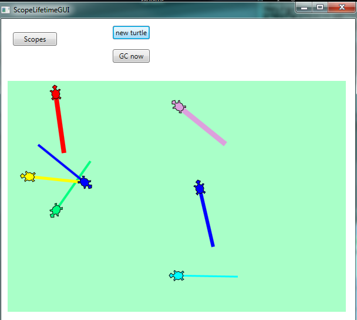
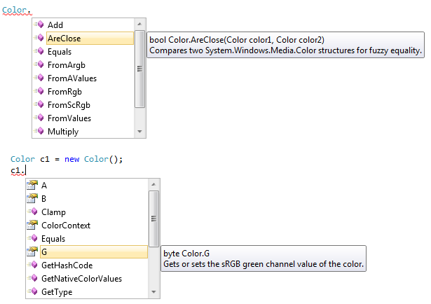
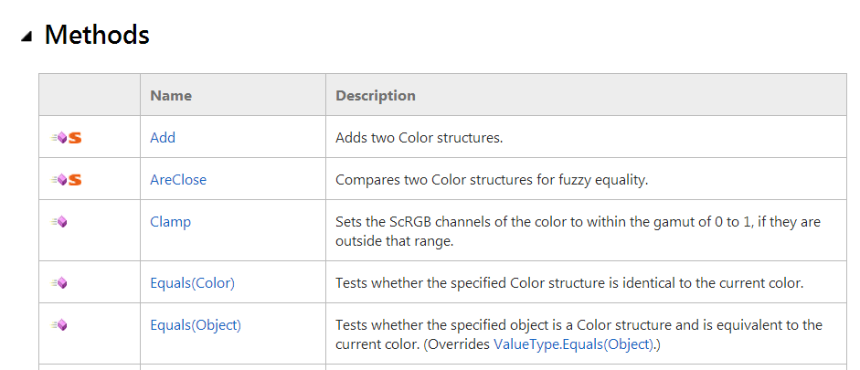

..  Copyright (C) Peter Wentworth under a Creative Commons BY-NC-SA Licence.
    See the fine print at http://creativecommons.org/licenses/by-nc-sa/3.0/     
    
Scope and Lifetime
==================

.. index:: scope,   scope; local,  scope; class 
    
Scope
-----

The **scope** of a name is the region of program code in which a 
name can be used without the need for extra qualification.  

There are two important scopes in C#:

* **Local scope** refers to names defined within a method or a within a block within a method.   
* **Class-level scope** refers to all the names defined within the current class (but this 
  excludes any local names that are defined inside methods of the class.)  
  
Let's look at the ``RandomDemoGUI`` program of the previous chapter again.
The class ``RandomDemoGUI`` extends from line 6 to line 29.  

    .. sourcecode:: csharp
        :linenos:
        :emphasize-lines: 8,13,20,21,24
        
        using System;
        using System.Windows;

        namespace Fragments
        {
            public partial class RandomDemoGUI : Window
            {
                Random myRandomSource;
                
                public RandomDemoGUI()
                {
                    InitializeComponent();
                    myRandomSource = new Random();
                }

                private void btnRandom_Click(object sender, RoutedEventArgs e)
                {
                    // Pick two (different) random cards from a deck of cards numbered 0 to 51.

                    int card1 = myRandomSource.Next(52);
                    int card2 = myRandomSource.Next(52);
                    while (card2 == card1)  // oops. try again till we get a different second card.
                    {
                        card2 = myRandomSource.Next(52);
                    }
                    txtResult.AppendText(string.Format("The two cards are {0} and {1}\n", card1, card2));
                    txtResult.ScrollToEnd();
                }
            }
        }

Within the class
there are 3 class-level definitions: one variable called
``myRandomSource`` is defined on line 8, and two methods are defined on lines
10 and 16 (one of these methods is the constructor).  These are the class-level scope names.

In addition, we have two local variables defined on lines 20 and 21.  They are
local to the ``btnRandom_Click`` method.  On line 16, that method also takes
two parameters with names ``sender`` and ``e``.   Parameters of a method are
in the local scope of the method in which they are defined.

What this means is that the four names defined in the ``btnRandom_Click`` method 
(i.e. ``sender``, ``e``, ``card1``, ``card2``) can only be used within the 
method where they're defined.  They're local.  
You would get an error if you attempted to assign
something to ``card1`` at line 13, for example. 

But class-level names can be accessed from anywhere in the class, including 
from inside methods of the class.  So at lines 13, 20, 21 and 24 we can 
use ``myRandomSource``.

Now what would happen if we moved the definition at line 8 into the constructor
method at line 10?   It would become a local definition within the constructor, rather
than a class-level definition. So within the constructor we'd still be able to access it, 
but lines 20, 21 and 24 would give errors: 
*The name 'myRandomSource' does not exist in the current context.*

Scopes can nest inside each other
---------------------------------

When we said "local scope" or "class-level scope" we made a bit of a simplification.
It is slightly more complicated that that.  Although we've not seen
examples yet, one can define one class inside another class, so we could nest classes
very deeply. (We do not have any use for so-called *inner-classes*, or nested classes,
in this book, but we should know that such things can exist!)

Additionally, C# allows us to define variables inside a block of code (recall that a
block is a group of statements enclosed in braces).  The scope rule is then that the
name is only visible within the block where it has been defined.  

In another twist of convenience, C# also allows us to define variables as part of
a ``for`` or ``foreach`` statement. In this case the scope of the defined variable 
is the statement and its loop body.  

With classes or scopes that are nested within each other, there is a potential
ambiguity: if we have a class-level variable called ``num``, and we also call one
of our parameters to a method ``num``, then we need to be clear about 
which ``num`` we're referring to when we use it!  

The scope lookup rules are that the most closely nested scope where ``num`` is defined
is the one that will be used.  Let's look at this very contrived example:

    .. sourcecode:: csharp
        :linenos:
        
        double v1 = 10.5;
        int v2 = 2;

        private int f1(int v1)
        {
            int result = 0;

            for (int i = 0; i < v1; i++)
            {
                result += v2 * i;
            }

            {   
                Random rng = new Random(2013);
                int d1 = rng.Next(1, 7);
                int d2 = rng.Next(1, 7);
                result += d1 + d2;
            }

            {   
                int i = 1;
                int d1 = 15;
                result += d1 + i;
            }

            return result;
        }

        private void btnScopes_Click(object sender, RoutedEventArgs e)
        {
            int v2 = 5;
            int n = f1(v2);
            MessageBox.Show(string.Format("The result is {0}", n));
        }
  
Lines 1 and 2 define two class-level variables with initializers. But method ``f1`` names
its parameter ``v1``.  This means that within the method body, any reference to ``v1``
uses the local name, not the class-level ``v1``.  So on line 8 (where we use ``v1``), the 
number of times the loop body is executed depends on the argument passed to it from
the call site. (At line 32 we have a call site that passes the value 5 to the method.)

At line 31 we define a new local variable ``v2``.  This definition *hides* the class-level
variable defined at line 2, and when ``v2`` is used on line 32, it uses the local ``v2``. 

There are a number of local variables defined inside method ``f1``.  We have the definition
of ``result`` on line 6 (and its uses on lines 10, 17, 23 and 26). We also have a definition 
of variable ``i`` as part of the for loop at line 8.  It's scope is lines 8 - 11, and cannot
be used outside that scope.  There are two blocks at lines 13-18, and 20-24.  Each block
has some definitions of new variables that are local to the blocks.  We've deliberately
defined variables ``i`` and ``d1`` at lines 21 and 22 to make the point that these are
different variables (in different scopes) from the earlier ``i`` defined in the loop,
and the ``d1`` variable defined at line 15.

On line 10 we use variable ``v2``.  It is not locally defined, so the scope lookup
rule says "use the variable at the closest enclosing scope".  In this case, the
class-level variable at line 2 is used. Note that although line 31 also defines
a variable called ``v2``, that variable is not the one referred to at line 10! 

You should ensure that you can trace through the code and determine what value the 
method will return.   (Check yourself by copying the code and running it.)

If you want some more advanced information about scopes, take a look at
http://msdn.microsoft.com/en-us/library/aa691132(v=vs.10).aspx 
  
Lifetimes of objects and variables
----------------------------------

Each time you click the button in the sample above, you'll get a message box showing
the value 42.  But wait!  We're using a random number generator at lines 15 and 16 to
throw two dice which we add to the result.  Why are we not getting random results?

Every object and variable in a program has a **lifetime**.  It gets created (or instantiated)
at some particular moment in time, and then at some later time it dies.

Variables that are defined within a method or a block only live *while the method or
block is being executed*.  So calling method ``f1`` creates local parameter ``v1``
and local variable ``result``.  When ``f1`` returns, those variables are destroyed.

Similarly, in the loop, the variable ``i`` is created when the loop starts running, and
it is destroyed when the loop exits.  And the same is true for the blocks of code at lines
14-18, and 20-24.  

What this means is that we're not creating a single random number generator here: we're creating
a brand new one each time we execute line 14.  And because we've given it a seed value as an argument in line 14, we
will always get the same throws for the two dice.  

If we moved line 14 out of the method ``f1`` and put its definition and instantiation 
at line 3, say, it would become a class-level variable instead of a local variable. 
Now the behaviour of our program would change.  The random number generator would be created 
when the class was created (i.e. just before our window first appears, if this code is part 
of a WPF window), and its lifetime would only end when the window's lifetime ended.  

Class-level instance variables (i.e. not variables that are static) 
have a lifetime that is the same as the lifetime of the object they belong to.

For writing the kinds of event-based GUI programs that we work with in this book, 
what this means is that if we want something to persist across multiple events, we should 
define it as a class-level variable.  So if we need to count how many times a particular
button is clicked, we need that counter to keep its value between clicks: it needs to be
a class-level variable. 

Objects can take some time to die
---------------------------------

We've mentioned earlier that we have two kinds of types in C# --- value types and reference types.
A value type (like ``int``, ``double`` or ``Point``) is stored directly in a variable. Variables
are instantly destroyed when control exits the scope in which they are defined.

But a reference type creates a reference, or a pointer, to the object it refers to.  Our
``Turtle`` is a reference type,  ``Window`` is a reference type, and ``Random`` is a reference type.

With reference types, the object is stored elsewhere in a region of memory called the *heap*.   
We've also seen that when we pass a reference type as an argument to a method, or when we
assign one Turtle to another, we can create *aliases* --- we can have more than one reference
referring to the same object.

Objects become *inaccessible* when there are no longer any references pointing to them.  So
looking at our program above, on line 14, the variable ``rng`` is created, a new Random object
is created in the heap, and ``rng`` is made to reference it.  After passing line 18 in the
program, the ``rng`` variable is destroyed. So at this point the object in the heap becomes 
inaccessible --- no references point to it.  We call inaccessible objects **garbage**. The
object is still "alive", however.

Periodically, C# runs a **garbage collector**.  It's job is to kill any garbage objects in
the heap, and to recycle the memory so that the memory can be used again for new objects. 

.. admonition:: This is a little like some file or email systems

    Often when we delete a file or email it gets moved to a *recycle bin* or a *deleted folder*.  
    So it is not dead yet --- just inaccessible from our "normal" filing system or inbox.  
    When we do get around to emptying the recycle bin or our deleted folder, it is finally gone forever. 

So for reference types, lifetimes are a bit more complicated than they are for value types.

Normally we need not concern ourselves with lifetimes: C# will handle most situations very
nicely in the background.  But we can have some fun exploring the mechanism, and we can
build a really good understanding of the inner workings by doing this.

Let's go back and play with another Turtle program.  When we create a Turtle,
we create an object on the heap, but we also create some graphical lines and 
shapes on our playground canvas.   When our turtle becomes inaccessible it won't  
die immediately --- it hangs around until the garbage collector decides it is time
to clean up and kill off all inaccessible objects.  Just before a turtle dies, it gets an
event from the garbage collector that allows it to do its "final actions".  (Technically,
we call the handler a *destructor*, the lifetime opposite of the *constructor*.)
As its final action, a turtle will removes its shapes (lines, footprints, etc.) from the 
playground. This gives us a nice visual way for us to "see when the turtle actually dies". 

    .. sourcecode:: csharp
        :linenos:
 
        Brush[] myFaves = { Brushes.Aqua, Brushes.Red, Brushes.Plum, 
                            Brushes.Yellow, Brushes.Blue, Brushes.SpringGreen };

        private void btnNewTurtle_Click(object sender, RoutedEventArgs e)
        {
            Random rng = new Random();
            Turtle tess = new Turtle(playground, rng.Next(400), rng.Next(400));
            tess.Heading = rng.Next(360);
            tess.BrushWidth = rng.Next(2, 10);
            tess.LineBrush = myFaves[rng.Next(myFaves.Length)];
            tess.Forward(100);
        }
        

        
Each time the button is clicked we create a new turtle.  We start it off at a 
random position in the playground, on a random heading, with a random brush width,
and a random brush colour.  Then we draw a single line. 

Each time we click the button we get a new turtle on the heap, and will soon have 
something looking this screen-shot.  But each time we exit the
handler, we destroy variable ``tess`` --- so we lose the reference to the turtle,
and it becomes inaccessible, or garbage. (But not dead yet, so we can still see its shapes
on the playground.)  After a while the garbage collector springs
into action, and all the shapes suddenly disappear from the
playground as the inaccessible turtles die. 

The garbage collector kicks in at unpredictable times ---
sometimes when we resize our window, sometimes when we click the button, sometimes
when we just move the mouse over the window, occasionally when we're just sitting 
back watching our screen.      

C# provides a ``GC`` class (in the ``System`` namespace) that provides a method
for the programmer to explicitly ask for garbage collection.  So we can add an 
extra button to our GUI, and give it a handler like this:

    .. sourcecode:: csharp
        :linenos:
        
        private void btnForceGC_Click(object sender, RoutedEventArgs e)
        {
            GC.Collect();
        }
        
This lets us explicitly force a garbage collection whenever we want one.

Let us summarize the main idea of this section again: variables and objects have lifetimes.
In the case of reference types, the objects in the heap become inaccessible, often because
the variables that reference them are destroyed.  But the object itself might live on a while 
longer in the heap, until the garbage collector gets around to cleaning it up and 
reclaiming its memory. 

Static members, static classes
------------------------------

We've talked about instances of a type: ``tess`` and ``alex`` are instances of type Turtle.
``button1`` and ``button2`` could be instances of type ``Button``.  And every instance
has its own members (fields, variables, or methods),  

But sometimes we want to have members that don't apply to the object, but they apply
to the *type*.   Let us suppose we have 10 instances of Samsung S5 phones. They'll
each have their own settings: phone numbers, address books, and so on.  
But there can be other information that applies to the *type* of phone, not just to 
individual instances.  For example, the screen and camera resolutions,
and the size and weight of the phone apply to all Samsung S5 phones.

A member (property, method, variable) can be defined to be **static** in a class.
This means that it will be associated with the class, not with the objects that
are instantiated from the class.   

Let's see some examples that we know well already:

``Math`` is a class in namespace ``System``.  It provides static methods like 
``Math.Sqrt`` and ``Math.Cos`` that we can call.  It also has a few static
fields (``Math.E`` and ``Math.PI``) that hold some useful constants.

The important point is that we don't have to instantiate an object of type ``Math``
and then call methods of the instance: we use the methods directly from the class.

**Static classes** are classes that *cannot* be instantiated.
They exist only for their static members.  ``Math`` is
a static class.  You cannot create an instance of a Math object.   
We've also used methods from the static class ``System.Convert``, e.g.
``Convert.Int32("1234")``. 

Some other classes we've seen have static members, but they can also
be instantiated.  (So they have static members, but they're not static classes.)
For example, ``Color`` (from the namespace ``System.Windows.Media``)
is a class like this: 

In the upper part of the image we see the IntelliSense showing us
members that are static: the class name is ``Color``, and IntelliSense
pops up the static members.

In the lower part of the image we've instantiated a colour instance
called ``c1``.  Now IntelliSense shows us the members that belong to
the instance.  They're not the same as the static members. 

The help files for C# also use little icons to signal whether
members are static or whether they belong to an instance.
In the fragment of the help page from 
http://msdn.microsoft.com/en-us/library/system.windows.media.color.aspx 
notice the big red static markers that tell us that the first two
methods belong the the class, the others belong to instances. 

Glossary
--------

.. glossary::

    scope
       The region of program code in which a name can be used without the need 
       for extra qualification.
    
    class-level scope
       Any name defined directly within a class, and visible to methods within the class.
    
    garbage
        Any object that has become inaccessible.
    
    garbage collection
        A periodic process that reclaims and recycles the memory
        used by inaccessible objects.
    
    heap
        An area of memory where objects are created and where they live. 
     
    inaccessible object
        An object which has no references from the program pointing to it.
        This happens because a variable can be reassigned, and made to point
        to a different object, or because a variable gets destroyed when
        control leaves the scope in which it is defined. 
     
    lifetime
        The time from when a variable or an object is created (e.g. from control 
        entering a new scope or from object instantiation) until it is 
        destroyed (from control exiting the scope, or the garbage collector
        reclaiming the memory associated with the object.)
    
    local scope
        The closest enclosing block or method in which names are defined.
    
    static class
        A class that cannot be instantiated.  ``Math`` is a static class.
    
    static member
        A member that is accessible via the class name, not via an instance object.
        ``Canvas.GetLeft`` in our *More Event Handling* chapter is one example.
    

Exercises
---------

#. The ``GC`` class can tell us how much heap memory our program is using.  Create
   a button on your GUI, and bind it to a handler like this so that the memory usage
   gets shown in the title bar of the window:

   .. sourcecode:: csharp
      :linenos:
        
        private void btnMemUsage_Click(object sender, RoutedEventArgs e)
        {
           this.Title = string.Format("Memory in use = {0}", GC.GetTotalMemory(false));
        }
        
   What is interesting is that each click of the button consumes quite a large number
   of bytes of memory (for processing the event, passing the arguments to the handler,
   redrawing the window, and so on.)  Notice that if 
   you click enough times the garbage collector will recover the memory. 
   
#. Do an experiment to measure how much memory gets used each time we create
   a new array of int.  Because there is a lot of system overhead on every click and
   redraw of the window, we need to find some sensible way of controlling our
   experiment.  Here is a suggestion: 
  
   .. sourcecode:: csharp
      :linenos:
        
        long m1 = GC.GetTotalMemory(false);
        int[] xs = new int[10000];
        long m2 = GC.GetTotalMemory(false);
        this.Title = string.Format("Memory for the array = {0}", m2-m1);
 
#. Repeat the above experiment, but this time allocate an array of double.
 
 