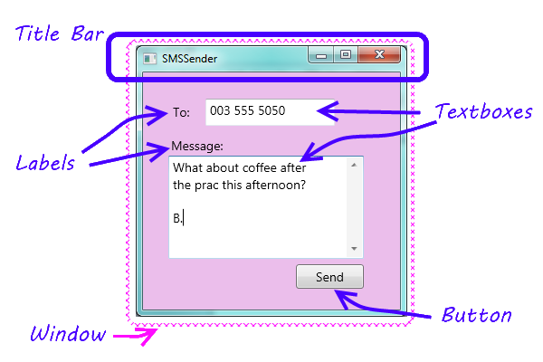
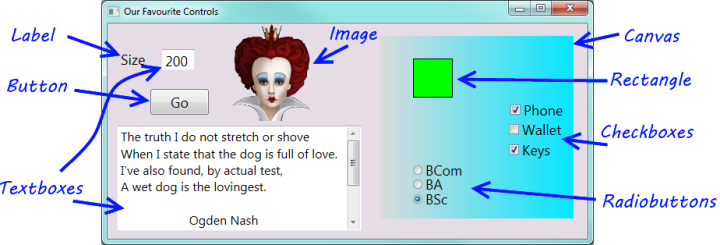

..  Copyright (C) Peter Wentworth under a Creative Commons BY-NC-SA Licence.
    See the fine print at http://creativecommons.org/licenses/by-nc-sa/3.0/ 
     

Start with a Window  
===================

Do this chapter by hands-on practice
------------------------------------

*Most of the the ideas in this chapter are best conveyed by hands-on practical 
demonstrations.   So rather than write long wordy text, you should watch out
for some short videos that we'll release to cover this content.*

A little more about the GUI
---------------------------

In Chapter 1 we introduced the idea that programs have a GUI, some code-behind,
and sometimes a back-end.  Let us revisit our SMS application we introduced there.

Our programs will usually have a single window.  We'll want to refer to some of 
the parts in the window, so here is the diagram again, with some terminology added ...

    
Separating our two roles in our head
------------------------------------ 

When we write programs, we write them for others to use.  So there are two
very distinct roles: we design and write our programs, and our users use them.

When we start learning to program we will sometimes be programming, and sometimes
we'll also be the user.  We need to separate these two roles in our heads, and imagine what
we want our users to experience, then we can design our interfaces and write our code to
give them the desired experience.   

We saw in the previous chapter that Visual Studio behaves differently at  
*design time* and *run time*. At design time, or when we are debugging, we are in the role of 
a programmer. When we're running our programs, we're in the role of a user.
    
Our favourite controls
----------------------

We saw in the Visual Studio Toolbox that there are a large number of 
controls that can do very impressive and powerful things:  progress bars, web browsers,
calendars, and so on.  So we could have a whole textbook devoted to describing all the controls
and their detail.  But we won't do that.  Instead, we'll introduce very few controls, 
just enough to get us comfortable with how the front-end GUI and the code-behind work together.   

Here is a GUI showing a few of our favourite controls used in this textbook.  

 
Most of these controls have properties called ``Background`` and ``Foreground`` that can set the colours.

For controls that can display text, we can set properties like the ``Font`` and ``FontSize``.
    
* **Label**: We'll use a label whenever we want some fixed text on the GUI.  The most important property
  is ``Text`` --- the text to be displayed.

* **Button**:  A button has a ``Content`` property. It can display many kinds of things, including text.  
  Buttons are great because they allow the user to click and control our program.  In the top right 
  corner of the window you'll find more buttons that belong to the window.  These are displaying images
  rather than text, and the one has a red background colour.

* **TextBox**:  A text box is used for displaying text, or for allowing the user to type text.
  In our example we've used two text boxes: the user has typed the value 200 into one of them,
  and we've made our program put a poem by Ogden Nash into the second text box.  
  
  The second text box is also
  interesting because it has multiple lines for displaying its text, and because we've set one
  of its properties to turn on a vertical scroll bar so that we'll be able to  
  bring the extra text into view.  
  
  The most important property of a text box is ``Text`` --- the text to be displayed.

* **Image**: An image control lets us display a picture, with some options to stretch
  or crop (cut off the bits that do not fit) the picture to fit 
  the available space.  The most important property is the ``Source`` which tells
  the control where to find the picture to be displayed.
  
* **Canvas**:  We will use the canvas control extensively starting from our Turtle chapter.  A canvas
  is really cool because it is a *container* that can hold and manage other controls.  So we've put
  a canvas here on our GUI, given it a nice light-to-darker blue gradient colour, 
  and then we've put seven more controls onto 
  the canvas.  These are called the *children* of the canvas.  
  
* **Rectangle**: We use these quite a bit in the later chapters of the book when we draw some chess boards. 
  
* **CheckBox**: A check box allows the user to check (or tick) an option. The two important properties 
  are ``Content`` (same as the button above), and a property called ``IsChecked`` that allows the 
  program to find out whether the user has ticked the check box or not.
  
* **RadioButton**:  A group of radio buttons act together: only one can be selected at any time.  So they
  provide a nice way to get the user to make a choice, or select one of a small set of options.  They
  too have ``Content`` and ``IsChecked`` properties.

      
    
..      * How do humans interact with computers?
        * Introduce the idea of *Computation as Interaction*.
        * What is a GUI?
        * What are events and responses?

  
Glossary
--------

.. glossary::

        
    container control
        A control that can have children controls.  It allows us to group, organize, 
        and lay out the children controls.  The Canvas is a container.  In the last
        chapter we also saw that a Grid is a container, and can have children.        
        
     
    event
        Something external that happens.  An SMS arriving at your phone is an event.  For
        GUI applications that we write, events occur when a user clicks a button, or moves a
        slider, or resizes our window, or moves the mouse, or presses a key on the keyboard.  
        An event can occur on a control --- if the ``send`` button is clicked, the button
        gets the click event and passes it to our code behind.
        Events can also occur on our window --- e.g. if the window is resized, so the resize event 
        happens to the window. 

    interface
        How a system (like an application or a cellphone) presents its features and capabilities
        to the outside world.  More generally, how one system presents its capabilities
        to another.  So a printer presents an interface to a computer. 
        
    window
        A rectangular area on the screen.  A window usually has a title bar at the
        top giving some description. 

Exercises
---------

#. Design a GUI that lets you show your mood.  It won't need any code-behind. 
   So make you GUI look (approximately) like this:

   .. image:: illustrations/myMood.png
       :alt: myMood.png

#. Design a GUI that allows you to set an option telling others 
   where you are.  It should look something like this:   
   
   .. image:: illustrations/myWhereabouts.png
       :alt: myWhereabouts.png
       
   (Hint: the Radio Buttons are all placed on a Canvas to group them.)
       
#. Design a GUI that allows the user to choose a meal and a drink.  
   The meal can be one of Hamburger, Pizza, Fish and
   Chips or Curry.  The drinks can be Coke, Fanta, or
   Tea.  The default options when the program runs 
   should be a Hamburger and a Coke.
   
   (Hint: each independent group of Radio Buttons should be on its
   own Canvas.)
   
#. Design an interface that allows the user to select the kinds of movies
   they like watching.   It should look something like this:

   .. image:: illustrations/myMoviePreferences.png
       :alt: myMoviePreferences.png 
       
   (Hint: the Canvas background uses *gradient* colours.)
   
#. Explain why we chose to use Radio Buttons for Question 2, 
   but we used Check Boxes for
   Question 4.  If we used Check Boxes for Question 2, what would it mean
   for the user of our program?   If we used Radio Buttons for Question 4,
   what would it mean for the user of our program?
      
#. Design an interface with two combo box controls that allows a user
   to enter the month and the year of their birth from the drop-down items.
   (Hint: the property editor has a very tedious process for achieving
   this.  Add one or two months of the year in the tedious way with the
   property editor, then inspect your XAML.  You should be able to copy,
   paste and change the XAML much faster.)  Here is what the fragment of
   XAML is going to look like...
   
   .. sourcecode:: csharp
   
        <ComboBox ...  >
            <ComboBoxItem Content="January" />
            <ComboBoxItem Content="February" />
            <ComboBoxItem Content="March" />
            ...
        </ComboBox>
        
   
#. Design a GUI for sending an SMS.   See whether you're able to 
   produce a more tasteful design than the one in our textbook.
   
#. Experiment and learn how to use one or two controls 
   that we have not covered in this chapter.  
 

 
   

 
