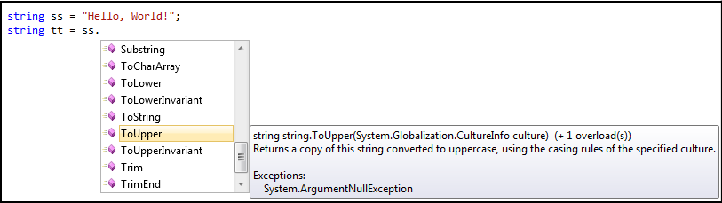
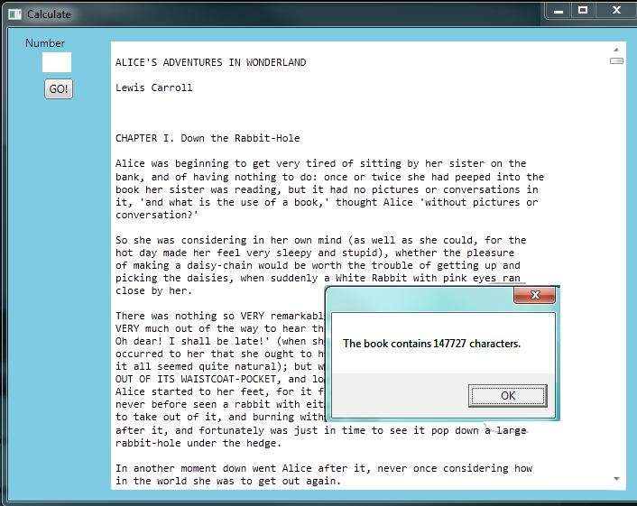

..  Copyright (C) Peter Wentworth under a Creative Commons BY-NC-SA Licence.
    See the fine print at http://creativecommons.org/licenses/by-nc-sa/3.0/ 
    
Strings
=======

.. index:: character, subscript operator, index

So far we have seen built-in types like ``int``, ``double``, ``char``,
``bool``, ``string`` and we've also had some brief exposure to arrays. 

Strings and arrays are different from the others because they
are made up of smaller pieces.  In the case of strings, they're made up of *characters*.  

Depending on what we are doing, we may want to work with the string as a whole,
or we may want to access its characters. This ambiguity is useful.

Working with strings as single things
-------------------------------------

We previously saw that each button or turtle instance (object) has its own properties, and 
some methods that can be applied to the instance.  For example,
we could set the button's colour or size, and we wrote ``tess.Right(90)`` to get Tess to turn.  

Just like a turtle, or a button, a string is also an object.  So each string instance 
has its own properties and methods.  For example:

.. sourcecode:: csharp
    :linenos:

    string ss = "Hello, World!";
    string tt = ss.ToUpper();
    MessageBox.Show(tt);
  
This code pops up this message box:

 .. image:: illustrations/hello_world.png
   
    
``ToUpper`` is a method that can be invoked on any string object. 
It creates a new string, in which all the 
characters are in upper-case.  (The original string ``ss`` remains unchanged.)

There are also methods such as ``ToLower``, ``Trim``, and
``Split`` that do other interesting things.

To learn what methods are available, you can consult the Help documentation, look for 
string methods, and read the documentation.  Or, if you're a bit lazier, 
simply type your string name followed by a period. Visual Studio will pop up a 
selection box (Microsoft call this feature *IntelliSense*) showing all the methods 
(there are around 40 of them --- thank goodness we'll only
use a few of those!) that could be used on your string. 

 
 
Working with the individual characters of a string
--------------------------------------------------

The **indexing operator** (C# uses square brackets to enclose the index) 
selects a single character from a string:

    .. sourcecode:: csharp
       :linenos:
        
       string fruit = "banana";
       char m = fruit[1];
       MessageBox.Show(string.Format("The character is {0}", m));

The expression ``fruit[1]`` selects character number 1 from whatever 
string the variable ``fruit`` refers to.  This is assigned
to variable ``m``.  When we display ``m``, we could get a surprise: It displays an 'a'!

Computer scientists usually start counting from zero! 
The character at subscript position zero of ``"banana"`` is ``b``.  At
position ``[1]`` we have the character ``a``.

If we want to access the zero'th character of a string, we just place 0,
or any expression that evaluates to 0, in the indexing brackets:

.. sourcecode:: csharp
    :linenos:
    
    string fruit = "banana";
    char m = fruit[25 / 5 - 5];
 

The expression in brackets is called an **index**, or a **subscript**. 
We'll use either word to mean the same thing.
 

.. index::
    single: runtime error
    
    
If we attempt to access a character from an index position that does not exist, we'll
get a runtime error...

  .. image:: illustrations/indexOutOfRangeException.png
    
Indexing works on strings, and can also be used on arrays, lists and other ordered collections of data. 
(Er ... we haven't done lists and collections yet, so our current take-away message is 
that indexing is general, if we understand it here and we'll be able to use it in other situations too.)

.. sourcecode:: csharp
   :linenos:
   
   string[] dayNames = {"Sunday", "Monday", "Tuesday", "Wednesday",  
                                  "Thursday", "Friday", "Saturday"};
   string x = dayNames[3];
   char c = dayNames[3][2];

This makes variable ``x`` point to the string "Wednesday", and it puts a 'd' into the variable ``c``.        
        
.. index::  substring

Substrings
----------

The ``Substring`` method let's us create a new string from a section of the another string:

.. sourcecode:: csharp
    :linenos:
    
    string s = "Pirates of the Caribbean";
    MessageBox.Show(s.Substring(0,7)); 
    MessageBox.Show(s.Substring(11,3)); 
    MessageBox.Show(s.Substring(15)); 
           
This will show "Pirates", "the", and "Caribbean" in three successive message boxes.          
           
The ``Substring`` method is used here in two different ways. (A method that can
take various combination of arguments is called **overloaded**.)  On line 2 we build a new
string from the original, by taking the characters starting at index position 0, and taking 
exactly 7 characters. Line 3 above takes exactly 3 characters, starting from index position 11.
But if you leave out the second argument to ``Substring``, it takes all the rest of the string.  So line
4 here takes a substring starting at index position 15, all the way up to the end of the string.

The ``Length`` property
-----------------------

.. index::
    single: length property
    single: property; length

The ``Length`` property of a string gives the number of characters in a string:

.. sourcecode:: csharp
    :linenos:
    
    string fruit = "banana";
    int n = fruit.Length;      // The value 6 is assigned to n
       
To get the last character of a string, you might be tempted to try something like
this:

.. sourcecode:: csharp
    :linenos:

    char last = fruit[fruit.Length];       // Oops!

That won't work. You'll get an ``IndexOutOfRange`` exception. 
The reason is that there is no
character at index position 6 in ``"banana"``. 
Because indexing is *zero-based* (i.e. we start counting at zero), the six indexes are
numbered 0 to 5. To get the last character, we have to subtract 1 from
the length of ``fruit``:

.. sourcecode:: csharp
    :linenos:

    char last = fruit[fruit.Length-1];     // Yay! 

.. index:: concatenation, read only (strings)
  
  
Strings are *read only*
-----------------------

It is tempting to use the ``[]`` operator on the left side of an assignment,
with the intention of changing a character in a string.  For example:

.. sourcecode:: csharp
    :linenos:
    
    string myName = "Pexer";
    myName[2] = 't';            // ERROR!
  
Strings are **read only**, which means you can't change an existing string once it has been
created.  The best you can do is create a new string that is a variation of the original:

.. sourcecode:: csharp
    :linenos:
    
    string bookName = "Thank Sharply!";
    string correctedName = bookName.Substring(0, 2) + "i" + bookName.Substring(3);
    MessageBox.Show(correctedName);  
        
Remember that the ``+`` operator means *concatenation* when we apply it to 
strings: so the strings are joined together to create a bigger string.

.. admonition:: Understand this subtle point

   The variable ``bookName`` in line 1 above 'points to' the string "Thank Sharply!". 
   The *pointee* (the thing being pointed to) is read-only, and cannot be modified after it is created.  
   But we can assign some other string to ``bookName`` (so it will then point to a new pointee). 
   So the variable *can* be changed, but the thing it points to *cannot* be changed.
   
   This code is therefore perfectly legal:
   
   .. sourcecode:: csharp
        :linenos:
        
        string bookName = "Thank Sharply!";
        bookName = bookName.Substring(0, 2) + "i" + bookName.Substring(3);
        MessageBox.Show(bookName);  

   Remember how assignment works: we first evaluate the expression on the right hand side, (in this
   case that evaluation creates a new string "Think Sharply!".  Then we update the variable on the 
   left to point to the new expression.
      
.. index:: traversal, for, foreach, while 

Traversal with ``while``, ``for`` and ``foreach`` loops
-------------------------------------------------------

Computations often involve processing a string one character at a time.
Usually they start at the beginning, select each character in turn, do something
with it, and continue until the end. This pattern of processing is called a
**traversal**. One way to encode a traversal is with a ``while`` loop:

.. sourcecode:: csharp
    :linenos:
         
    int ix = 0;
    while (ix < fruit.Length) 
    {
        char c = fruit[ix];
        Console.WriteLine(c);
        ix++;
    }

This loop traverses the string and displays each character on a line by itself.
The loop condition is ``ix < fruit.Length``, so when ``ix`` is equal to the
length of the string, the condition is false, and the body of the loop is not
executed. The last character accessed is the one with the index
``fruit.Length-1``, which is the last character in the string.

Our advice in the previous chapter is that ``for`` loops ire easier when definite
iteration is involved.  So here is a better example that does the same thing:

.. sourcecode:: csharp
    :linenos:
         
    for (int ix = 0; ix < fruit.Length; ix++)
    {
        Console.WriteLine(fruit[ix]);
    }

Both examples above force us to think about the indexes, and we then use 
the index to extract the character we want.  But we've previously seen how the 
``foreach`` loop can easily iterate over the elements in a array without us
needing to think about the indexes.  It works for the characters in a string too 
(and it works for elements in other kinds of collections that we will cover later):

.. sourcecode:: csharp
    :linenos:
    
    foreach (char c in fruit) 
    {
        Console.WriteLine(c);
    }

Each time through the loop, the next character in the string is assigned to the
variable ``c``. The loop continues until no characters are left. Here we
can see the expressive power the ``foreach`` loop gives us compared to the
``while`` or ``for`` loops when traversing a string.

Let's look at a bigger example now:  we're going
to read a book from a file on our disk into a string in the program.  
That will give us a longer string to work with.  

.. sourcecode:: csharp
    :linenos:
    
    private void button1_Click(object sender, RoutedEventArgs e) 
    {
        string book = System.IO.File.ReadAllText("C:\\temp\\alice_in_wonderland.txt");
        txtResult.Text = book;
        MessageBox.Show(string.Format("The book contains {0} characters.", book.Length));
    }
        
 
Line 3 we'll cover in more detail later in the course.  But for now, it tells our program to find 
``File.ReadAllText`` in a specific library called ``System.IO``.
The argument to the method is a fully qualified pathname to the file.  
Line 4 makes our GUI text box show the contents of the book (and in the screen snapshot below, the vertical
scroll bar has also been turned on for the text box).   Line 5 pops up a message box telling us how many 
characters are in the string. 

Now let's do a string traversal.  Let's say we want to convert all the text to lower-case, and
then count how many times 'e' occurs in the book:

.. sourcecode:: csharp
    :linenos:
    
    private int countEs(string s)
    {
        string slc = s.ToLower();
        int count = 0;
        foreach (char c in slc)
        {
            if (c == 'e')
            {
                count++;
            }
        }
        return count;
    }

    private void button1_Click(object sender, RoutedEventArgs e)
    {
        string book = System.IO.File.ReadAllText("c:\\temp\\alice_in_wonderland.txt");
        txtResult.Text = book;
        int c = countEs(book);
        MessageBox.Show(string.Format("The book contains {0} 'e's.", c));
    }
  

 
A message box pops up to let us know that there are 13572 occurrences of the letter 'e' in the book.

Notice something important and interesting here:  when we executed line 1 above, to create a lower-case
version of the string, the original string remains unchanged.  So the string displayed in the text box on
our GUI does not change to lower-case.   Remember that once they've been initially created, strings are read only.  

We didn't need to make a separate method, but it seems like the kind of logic that we might
want to adapt and reuse later.  Also, making it a separate method allows us to add test cases with
small examples:

.. sourcecode:: csharp
    :linenos:

    Tester.TestEq(countEs("only one"), 1);
    Tester.TestEq(countEs("morE than one"), 2);
    Tester.TestEq(countEs("good day"), 0);
    Tester.TestEq(countEs(""), 0); 
        

.. index:: string comparison, comparison of strings, CompareTo method (strings)

String comparisons
------------------

Not all the comparison operators work on strings. We can directly check strings for equal or not equal, but 
the less than and greater than comparisons work a little differently:

.. sourcecode:: csharp
    :linenos:
    :emphasize-lines: 3
    
    if (fruit == "banana") ...  // this works 
    if (word != "hello") ...    // this works
    if (fruit <= "banana") ...  // OOPS, ERROR! 

Comparison are useful for ordering our strings, or putting words in `lexicographical` order.
(This is similar to the alphabetical order we would use with a dictionary,
except that in our computer representations, all the upper-case letters come before all the lower-case letters.) 

In C#, every string has a very general ``CompareTo`` method that compares itself to some 
other string.  (``CompareTo`` works like this for other types of objects too, so we'll see
it later in our course.)

The ``CompareTo`` method returns one of 3 outcomes --- an integer which can be less than zero, exactly zero, 
or greater than zero.   So  ``"apple".CompareTo("plum")`` will return a negative integer, because
"apple" comes before "plum" in the ordering.  ``"apple".CompareTo("apple")`` will return
zero, because the strings are identical.    ``"apple".CompareTo("a")`` returns a positive 
value because "apple" comes after "a".  
 
Of course we'll seldom see literal strings compared to each other: it is much more common
to use string variables, and we'll often see the tests written like this: 

.. sourcecode:: csharp
   :linenos:
    
   string word1 = ...;
   string word2 = ...;
   
   string smaller = word2;
   if (word1.CompareTo(word2) < 0) 
   {
      smaller = word1;
   }
   
   Console.WriteLine("The word that comes first is " + smaller);
          
Line 5 asks *"Is word1 less than word2?"*  If it is, the variable smaller is changed to reference ``word1``.
The way this code is written shows a typical programming *idiom* for setting a variable to the smaller
of two values.  At line 4 we make a tentative assignment into ``smaller`` --- we guess that ``word2`` could be the
smaller.  Then we do the test, and if we find we guessed wrong, we fix it up.  

Why do it this way?  Because it is shorter and more convenient.  Here is an alternative to lines 4-8 above that also works, 
but it feels rather more clunky!  

.. sourcecode:: csharp
   :linenos:
    
   string smaller;
   if (word1.CompareTo(word2) < 0)
   {
       smaller = word1;
   }
   else
   {
       smaller = word2;
   }
              

If we are fluent with the conditional expressions we saw earlier, it gets even easier:       
    
.. sourcecode:: csharp
     :linenos:
    
     string smaller = (word1.CompareTo(word2) < 0) ? word1 : word2;
 
 
Of course, it is important that we understand what we mean by "smaller than" for strings:
we're not testing if one string is shorter than the other, we're asking if it comes before.
So we need to be sure what we expect in a case like this:

.. sourcecode:: csharp
     :linenos:
    

     bool b  = "kite".CompareTo("donkey") < 0;

.. index::  traversal (strings)

Finding the index of a character in a string
--------------------------------------------

What does the following method do?

.. sourcecode:: csharp
      :linenos:
    
      private int IndexOf(string strng, char ch)
      {         
         // Find the first ch in strng, and return its index position.  
         // Return -1 if ch does not occur in strng.

        int ix = 0;
        while (ix < strng.Length)
        {
            if (strng[ix] == ch) 
            {
                return ix;
            }
            ix++;
        }
        return -1;
      }
    

In a sense, ``IndexOf`` is the opposite of the indexing operator. Instead of taking
an index and extracting the corresponding character, it takes a character and
finds the index where that character first appears. If the character we seek 
is not found, the method returns ``-1``.

This is another example where we see a ``return`` statement inside a loop.
At line 11, if ``strng[ix] == ch``, the method returns immediately, breaking out of
the loop prematurely, and leaving the method.

If the character we seek doesn't appear in the string, then the program exits the loop
normally, gets to line 15, and returns ``-1``.

This pattern is common in searching algorithms: as soon we find what we are looking for, 
we can immediately stop looking.

Here is a version of the same logic, done with a ``for`` loop instead.

.. sourcecode:: csharp
   :linenos:
   
    private int IndexOf(string strng, char ch)
    {         
      for (int ix = 0; ix < strng.Length; ix++)
          if (strng[ix] == ch) return ix;

      return -1;
    }
          
For conditional and looping statements, we may omit
the braces that make a block (or compound statement) if we only have one statement
in the block.  We've done that here, making the code a bit shorter.

.. index:: optional parameter, default value, parameter; optional

.. _optional_parameters:

Overloaded methods  
------------------ 

To find the locations of the second or third occurrence of a character in a
string, we 'd like to be able to tell our ``IndexOf`` method where to start looking  --- so
instead of always starting at position 0, it could start searching from some other position.
This requires a new parameter, and one small change to the code.

.. sourcecode:: csharp
    :linenos:
    :emphasize-lines: 3
    
    private int IndexOf(string strng, char ch, int startPos)
    {         
        for (int ix = startPos; ix < strng.Length; ix++)
            if (strng[ix] == ch) return ix;

        return -1;
    }
      
    ...      
    Tester.TestEq(IndexOf("banana", 'a', 2),  3);

The call ``IndexOf("banana", 'a', 2)`` now returns ``3``, the index of the first
occurrence of "a" in "banana" starting the search at index 2.   Similarly, 
``IndexOf("banana", 'n', 3)`` returns 4.  

.. sidebar::  *Hey, shouldn't this be in one of the chapters about methods?*  
         
         *"Perhaps. But if felt nicer to postpone it until we needed it."*
         
But the interesting idea here is that we can have have more than one method with
the same name, provided the different methods have different numbers or types of
parameters.   In this case we say the method is **overloaded**.   C# will 
analyse the arguments used at each call site, and will arrange to call the 
method with parameters that match the arguments. 

Let's provide a third overloading for ``IndexOf``:  in addition to providing 
a starting position for the search, we want to provide a count that determines
the maximum number of characters that can be inspected.  This code could 
look like this:

.. sourcecode:: csharp
    :linenos:
    
    private int IndexOf(string strng, char ch, int startPos, int count)
    {         
        for (int ix = startPos; ix < startPos+count; ix++)
            if (strng[ix] == ch) return ix;

        return -1;
    }
    
    Tester.TestEq(IndexOf("C# is powerful", 'w', 2, 3),  -1);
    Tester.TestEq(IndexOf("C# is powerful", 'w', 2, 10),  8);

We now have three overloadings of ``IndexOf`` --- one that takes 2 arguments,
one that takes 3, and one that takes 4.  Here is another observation, and
we'll redo the code.  The one written last here is the most general --- we can 
control both the count and the starting position.  The less general one is
the one with three arguments, and the least general one, (or the most specific) is
the original one we wrote.   We could rewrite all three like this:

.. sourcecode:: csharp
    :linenos:
    
    private int IndexOf(string strng, char ch, int startPos, int count)
    {         
        for (int ix = startPos; ix < startPos+count; ix++)
            if (strng[ix] == ch) return ix;

        return -1;
    }
    
    private int IndexOf(string strng, char ch, int startPos)
    {         
        return IndexOf(strng, ch, startPos, strng.Length-startPos);
    }

    private int IndexOf(string strng, char ch)
    {         
        return IndexOf(strng, ch, 0, strng.Length);
    }
        
So now the loop traversal only happens in one place rather than three separate places.  We code
the more specific versions of ``IndexOf`` by calling the general one that already works.
     
Here are some test cases that should pass:  

.. sourcecode:: csharp
    :linenos:
    
    string ss = "C# strings have some interesting methods.";
    Tester.TestEq(IndexOf(ss, 's'), 3);         
    Tester.TestEq(IndexOf(ss, 's', 7), 9);
    Tester.TestEq(IndexOf(ss, 's', 10, 5), -1);
    Tester.TestEq(IndexOf(ss, 's', 10, 10), 16);
    Tester.TestEq(IndexOf(ss, '.'), ss.Length - 1);

    
.. admonition:: This code could crash!

   There are a number of situations in which our ``IndexOf`` method could fail.
   As one example, if we provide a negative starting index for the search it will crash.
   There are some other problems too.  

   Write some unit tests to "stress-test" all the edge cases or weird situations you
   can imagine.  
   
   Do you think the method should handle all those cases and make itself
   bullet-proof, or is it acceptable just to say "This method only works for well-behaved
   inputs, and is designed to crash in other situations"?   
    
.. index:: IndexOf method (strings), overloaded method

The built-in ``IndexOf`` method on strings
------------------------------------------
 
Now that we've done all this work to write our own overloadings of ``IndexOf``, we can reveal that
strings already have their own built-in ``IndexOf`` method (with overloadings).  They can do everything 
that our code can do, and more!  

.. sourcecode:: csharp
    :linenos:
    :emphasize-lines: 7,8
    
    string ss = "C# strings have some interesting methods.";
    Tester.TestEq(ss.IndexOf('s'), 3);
    Tester.TestEq(ss.IndexOf('s', 7), 9);
    Tester.TestEq(ss.IndexOf('s', 10, 5), -1);
    Tester.TestEq(ss.IndexOf('s', 10, 10), 16);
    Tester.TestEq(ss.IndexOf('.'), ss.Length - 1);
    Tester.TestEq(ss.IndexOf("some"), 16);
    Tester.TestEq(ss.IndexOf("C#"), 0);
     
The built-in ``IndexOf`` method has more overloaded options than our version (9 overloadings, in fact). 
Most usefully, as shown on lines 7 and 8 above, it can find substrings, not just single characters.

Usually we'd prefer to use the methods that C# provides rather than reinvent
our own equivalents. But many of the built-in methods are good
teaching exercises, and the underlying techniques you learn are your building blocks
to becoming a proficient programmer.

You might want to also try some edge cases for the built-in version, and see how Microsoft
handles these tricky cases.

The ``Split`` method
--------------------

One of the most useful methods on strings is the ``Split`` method:
it splits a single string into an array of individual substrings, removing
all the white space between them.  (White space means any tabs, newlines, or spaces.)
This allows us to read input as a single string,
and split it into words.

.. sourcecode:: csharp 
    :linenos:

    string ss = "Well I never did said Alice";
    string[] words = ss.Split();
    foreach (string wd in words)
    {
        Console.WriteLine(wd);
    }
    
Line 2 initializes a new array of 6 strings, each one a word.  These are then output underneath each other on the Console.

``Split`` can also take arguments to make it break the original string on any set of characters.  A popular usage would
be to break the string at every newline character:  you could break the Alice in Wonderland book into lines, for example,
like this:

.. sourcecode:: csharp 
    :linenos:

    string[] lines = book.Split('\n');
    MessageBox.Show(string.Format("There are {0} lines in the book.", lines.Length));
        
It is pleasing to know that this program says there are 3337 lines in the file, and that exactly
matches what my text editor tells me! 

Cleaning up your strings
------------------------

We'll often work with strings that contain punctuation, or tab and newline characters,
especially, as we'll see in a future chapter, when we read our text from a file (like
the Alice in Wonderland book) or from the Internet. But if we're writing a program, say, 
to count word frequencies or check the spelling of each word, we'd prefer to strip off these 
unwanted characters.

We'll show just one example of how to strip punctuation from a string.

.. sourcecode:: csharp 
    :linenos:

    private string remove_punctuation(string s) 
    {
        string result = "";
        foreach (char c in s)
        {
            if (! char.IsPunctuation(c)) {
                result += c;                 // This step is inefficient! 
            }
        }
        return result;
    }
    ...
        Tester.TestEq(remove_punctuation("'Well, I never did!', said Alice."),
                                                 "Well I never did said Alice");
        Tester.TestEq(remove_punctuation("Are you very, very, sure?"), 
                                                      "Are you very very sure");

Composing together this method and the ``Split`` method from the previous section
makes a useful combination --- we'll clean out the punctuation, and
``Split`` will break the string into an array of words:

.. sourcecode:: csharp 
    :linenos:

    private void button1_Click(object sender, RoutedEventArgs e)
    {
        string book = System.IO.File.ReadAllText("c:\\temp\\alice_in_wonderland.txt");
        string cleanedString = remove_punctuation(book);
        txtResult.Text = cleanedString;
        string[] words = cleanedString.Split();
        MessageBox.Show(string.Format("There are {0} words in the book.", words.Length));
    }
       
The output: 

    .. image:: illustrations/alice_words.png                       
  
This runs quite slowly. The reason is at line 7 of ``remove_punctuation``.  Because strings are read only,
we cannot add a new character onto the end of an existing string: we have to build a new copy of the string from scratch.
Since there were more than 147 000 characters in the book, our program is building a new string for each one!
C# provides a mechanism called a ``StringBuilder`` to cater for this exact situation: so if you're looking for 
a challenge, see if you can speed up this code by using a more advanced feature.
 

Glossary
--------

.. glossary::

    index
        A variable or value used to select a member of an ordered collection, such as
        a character from a string, or an element from an array.
        
    overloaded method
        There can be more than one method with the same name, in which case we say the method is overloaded.
        Each overloading will have a different number of parameters, or different types of parameters.  The C# compiler
        is clever enough to inspect the types and number of arguments at each call site, and work out which of the 
        identically-named methods should be invoked.
    
    read only objects
        A value or object which cannot be modified.  Assignments to a part of a string 
        elements causes a runtime error.
        
    traverse
        To iterate through the elements of a collection (so far, a string or an array), 
        considering each element in turn.

Exercises
---------

#. What is the value of each of the following expressions:

    .. sourcecode:: csharp
    
        "C#"[1]
        "C#"[2]
        "Strings are sequences of characters."[5]
        "wonderful".Length
        "app" + "le"
        "appl" + 'e'
        "Mystery".Substring(4)
        "Mystery".Substring(4, 2)
        "Mystery".IndexOf('y')
        "Mystery".IndexOf('z')
        "Mystery".IndexOf('y',3)
        "Mystery".IndexOf('y',3, 2)
        "apple".CompareTo("pineapple") > 0
        "pineapple".CompareTo("Peach") == 0
    
   
#. Encapsulate

   .. sourcecode:: csharp
       :linenos:
    
       string fruit = "banana";
       int count = 0;
       foreach (char c in fruit)
       {
           if (c  == 'a')
               count += 1;
       }
       Console.WriteLine(count);

   in a method named ``count_letters``, and generalize it so that it accepts
   the string and the letter as arguments.  Make the method return the number
   of characters, rather than show the answer.   
     
#. Now rewrite the ``count_letters`` method so that instead of traversing the 
   string, it repeatedly calls the ``IndexOf`` method, with the optional third parameter 
   to locate new occurrences of the letter being counted.
   
#. How many times does the word "queen" occur in the Alice in Wonderland book? 
   Write some code to count them.    

#. Use string formatting to produce a neat looking multiplication table like this:

   .. sourcecode:: pycon
   
              1   2   3   4   5   6   7   8   9  10  11  12
        :--------------------------------------------------
       1:     1   2   3   4   5   6   7   8   9  10  11  12
       2:     2   4   6   8  10  12  14  16  18  20  22  24
       3:     3   6   9  12  15  18  21  24  27  30  33  36
       4:     4   8  12  16  20  24  28  32  36  40  44  48
       5:     5  10  15  20  25  30  35  40  45  50  55  60
       6:     6  12  18  24  30  36  42  48  54  60  66  72
       7:     7  14  21  28  35  42  49  56  63  70  77  84
       8:     8  16  24  32  40  48  56  64  72  80  88  96
       9:     9  18  27  36  45  54  63  72  81  90  99 108
      10:    10  20  30  40  50  60  70  80  90 100 110 120
      11:    11  22  33  44  55  66  77  88  99 110 121 132
      12:    12  24  36  48  60  72  84  96 108 120 132 144

#. Write a method that reverses its string argument, and satisfies these tests:

   .. sourcecode:: csharp
       :linenos:
       
       Tester.TestEq(reverse("happy"), "yppah");
       Tester.TestEq(reverse("C#"), "#C");
       Tester.TestEq(reverse(""), "");
       Tester.TestEq(reverse("a"), "a");
   
#. Write a method that mirrors its argument:

   .. sourcecode:: csharp
       :linenos:
      
       Tester.TestEq(mirror("good"), "gooddoog");
       Tester.TestEq(mirror("C#"), "C##C");
       Tester.TestEq(mirror(""), "");
       Tester.TestEq(mirror("a"), "aa");

#. Write a method that removes all occurrences of a given letter from a string:
    
   .. sourcecode:: csharp
        :linenos:   
        
        Tester.TestEq(remove_letter('a', "apple"), "pple");
        Tester.TestEq(remove_letter('a', "banana"), "bnn");
        Tester.TestEq(remove_letter('z', "banana"), "banana");
        Tester.TestEq(remove_letter('i', "Mississippi"), "Msssspp");
        Tester.TestEq(remove_letter('b', ""), "");
        Tester.TestEq(remove_letter('b', "c"), "c");

#. Write a method that recognizes palindromes. (Hint: use your ``reverse`` method to make this easy!):

   .. sourcecode:: csharp
        :linenos:   
        
        Tester.TestEq(is_palindrome("abba"), true);
        Tester.TestEq(is_palindrome("abab"), false);
        Tester.TestEq(is_palindrome("tenet"), true);
        Tester.TestEq(is_palindrome("banana"), false);
        Tester.TestEq(is_palindrome("straw warts"), true);
        Tester.TestEq(is_palindrome("a"), true);
        Tester.TestEq(is_palindrome(""),  ??);    // Is an empty string a palindrome?  You decide.

#. Write a method that counts how many times a substring occurs in a string: 
   
   .. sourcecode:: csharp
        :linenos: 
        
        Tester.TestEq(count("is", "Mississippi"), 2);
        Tester.TestEq(count("an", "banana"), 2);
        Tester.TestEq(count("ana", "banana"), 2);
        Tester.TestEq(count("nana", "banana"), 1);
        Tester.TestEq(count("nanan", "banana"), 0);
        Tester.TestEq(count("aaa", "aaaaaa"), 4);
   
#. Write a method that removes the first occurrence of a string from another string: 

   .. sourcecode:: csharp
        :linenos: 
        
        Tester.TestEq(remove("an", "banana"), "bana");
        Tester.TestEq(remove("cyc", "bicycle"), "bile");
        Tester.TestEq(remove("iss", "Mississippi"), "Missippi");
        Tester.TestEq(remove("eggs", "bicycle"), "bicycle");

 
#. Write a method that removes all occurrences of a string from another string: 

   .. sourcecode:: csharp
        :linenos: 
        
        Tester.TestEq(remove_all("an", "banana"), "ba");
        Tester.TestEq(remove_all("cyc", "bicycle"), "bile");
        Tester.TestEq(remove_all("iss", "Mississippi"), "Mippi");
        Tester.TestEq(remove_all("eggs", "bicycle"), "bicycle");
