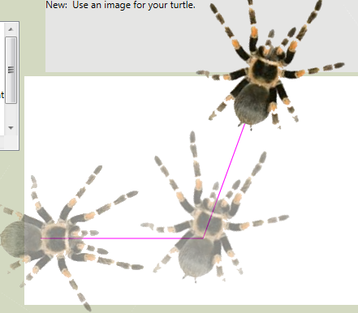
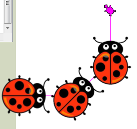

..  Copyright (C) Peter Wentworth under a Creative Commons BY-NC-SA Licence.
    See the fine print at http://creativecommons.org/licenses/by-nc-sa/3.0/ 

ThinkLib.Turtle Documentation
=============================
   
This class allows you to create instances of Turtle which can move and draw lines on a Canvas control.
So before you can start, you need to have a Canvas control in your WPF application.  

**Constructor method:** 
-----------------------       

.. sourcecode:: csharp

    Turtle(Canvas playground, [double homeX = 20], [double homeY = 200]) 

Initialize a new turtle to use given Canvas, and to set an (optional) Home position.   

Turtle Methods
-------------- 
    
.. sourcecode:: csharp

    public void Forward(double distance);  // Move forward by distance.  If BrushDown, a line is drawn.
    public void Left(double degrees);      // Turn the turtle to its right by this many degrees.
    public void Right(double degrees);     // Turn the turtle to its right by this many degrees.
    public Footprint Stamp();              // Stamp a footprint at the current position.
                                           // There are more overloadings for Stamp() under the Experimental features.
    
    public void WarpTo(double x, double y); // Go to absolute position (x,y) without drawing. 
    public void WarpTo(Point pos);         // Go to absolute position pos without drawing.  
    public void Goto(double x, double y);  // Go to absolute position (x,y). Draw if the brush is down.  
    public void Goto(Point pos);           // Go to absolute position Pos. Draw if the brush is down.  
                                           // Equivalent to setting the Position property.

    public Footprint Stamp(string str, [double offsetX=0.0], [double offsetY=0.0], [bool useRotation=false]);
                   //  Stamp a string at the current turtle position.
                   //  offsetX and offsetY arguments will offset the text from the turtle.
                   //  If useRotation is true, the text will be rotated to the turtle's heading.
                   
    public Footprint Stamp(ImageSource imgSrc,[double hotspotX=0.0],[double hotspotY=0.0],[bool useRotation=false]);
                  // Stamp an image at the current turtle position.   
                  // If the hotspot offsets are zero, the top left corner of the image will be placed 
                  //    at the turtle's position. 
                  // If useRotation is true, the image will be rotated to the turtle's heading.
                   
    public void FlushToPlayground();       // Immediately render any drawing that might otherwise not
                                           // appear until later during long-running computations.
                                           
    public void Clear();                   // Erase all this turtle's drawing, footprints and text  
                                           //    without changing position or heading, or any properties.
    public void Reset();                   // Clear all this turtle's drawing, footprints, and text. 
                                           //    Set Position to Home, Heading to 0, make turtle visible, 
                                           //    and set properties such as the BrushDown, textFonts 
                                           //    and colours to their defaults.
                                           
    public void Dispose();                 // Remove all traces of the turtle, and get rid of the turtle.
                                           //   This is called automatically if C# garbage collects the 
                                           //   turtle object.        
 
    public void SetAppearance(ImageSource imgSrc, double hotspotX, double hotspotY);
      // Change the appearance of this turtle to the image. 
      // The hotspot offsets in the image determine the turtle's hotspot, or position.
       
    public void SetAppearance(Geometry outlineShape, Brush outlineBrush, Brush bodyBrush);
      // Change the appearance of this turtle.  

    public void ResetAppearance();
      // Reset the turtle's appearance to its default shape, default OutlineBrush, and default BodyBrush.

    public void SetFootprintOpacity(double outlineOpacity = 0.7, double bodyOpacity = 0.3);
      // Change the opacity of the footprint outline and body.  Future Stamp() calls will use these values.

      
All the overloadings of Stamp return a Footprint which is also stored in the Turtle's list of Footprints.
 
Turtle Properties
----------------- 
 
.. sourcecode:: csharp
   
    public Point Home { get; set; }
      // The turtle's home position. 
 
    public Point Position { get; set; }
      // Directly setting the Position is equivalent to Goto(x, y) 
 
    public double Heading { get; set; }
      // Heading, in degrees. 0 is facing East.  Positive angles rotate clockwise.

    public bool Visible { get; set; }
      // The visibility of the turtle. 
      // Visibility does not affect drawing, text, footprints or movement.

    public Brush LineBrush { get; set; }
      // The brush used for drawing the turtle's lines.

    public double BrushWidth { get; set; }
      // The width of the LineBrush strokes that the turtle leaves behind.
      
    public bool BrushDown { get; set; }
      // The state of the LineBrush, up or down, which controls whether the 
      // turtle draws when it moves. Even when the brush is up, we can stamp 
      // footprints and write text.

    public Brush OutlineBrush { get; set; }
      // The brush used for drawing the turtle's outline shape.  Black by default.
      
    public Brush BodyBrush { get; set; }
      // The brush used for drawing the interior of the turtle.
      
    public bool Filling { get; set; }
      // Determines whether filling is turned on. What filling actually means depends
      // on the fill algorithm of Microsoft's PolyLineSegment. This can be fun.

    public Brush FillBrush { get; set; }
      // The brush the turtle uses to fill shapes.
      // If this has not been set, LineBrush is used for filling.

    public FontFamily TextFontFamily  { get; set; }
      // The font family used for write().
      
    public double TextFontSize { get; set; } 
      // The font size used for write().
 
    public FontStyle TextFontStyle { get; set; }
      // The font style used for write().

    public FontWeight TextFontWeight { get; set; } 
      // The font weight used for write().

    public Brush TextBrush { get; set; }
      // The brush used for write().
      
    public Color ColorUnderTurtle ( get; }
      // The colour of the pixel in the bitmap under the turtle. This uses and
      // has the same restrictions as ColorOfBackgroundAt().
     
    public FootprintCollection Footprints { get; private set; } 
      // A collection of all the footprints the turtle currently has on the canvas.
      // The collection can act as a List<Footprint>, so you can do all List operations
      // such as indexing, or enumerate the collection with a foreach loop. 
      // The element at position [0] is the oldest footprint.  
      // This is a reference type, so the user can remove (or add)
      // footprints, or clear all or part of the collection.  
      // Footprints are automatically added when any of the Stamp methods are called.
          
    public int DelayMillisecs { get; set; }  
      // Delay this number of milliseconds between each turtle drawing step.  
      // The default value 0 is fastest.
      // Use this property to slow the turtle down if you want to watch the 
      // drawing pattern appear gradually on the canvas.
      
    public int BatchSize { get; set; }
      // This controls the maximum number of turtle moves
      // before we force the playground to render.  When set to a large number you 
      // will get good speed, but your rendering will be done in jerky bursts.
      // A value of 0 means "never flush --- fastest speed."  But the canvas will 
      // only update when when the whole computation completes and the application 
      // becomes idle.   
      // When set to 1, (the default) you will flush the partial work after 
      // every drawing command. 
      
Experimental Properties and Methods
-----------------------------------

These allow you to add your own UIElements to those managed by the Turtle.  If you find
yourself using these a lot, it is probably time you stopped using the Turtle module
and just worked directly in WPF.

.. sourcecode:: csharp

    public Color ColorOfBackgroundAt(Point pt);
      // Returns a Color of the pixel at point pt in the playground.  This only works
      // if the background of the parent Canvas is a bitmap image.  In all other cases
      // (solid color canvas, gradient fills, etc.) the method will return Color.Transparent. 

    public Path TurtleUI { get; }
      // Get the Path that defines the turtle. We expose this because perhaps
      // you'll be able to apply WPF effects like DropShadows or Blurs, and 
      // apply animations to the dependency properties like the Opacity. 
      
    public Geometry TurtleGeometry { get; set; }
      // Get or set the Geometry that defines the shape of the turtle. This is 
      // for those who might want to create a turtle with a different look! 
      // It is experimental --- treat with caution.
      
    public static PathGeometry GeometryFromPoints(Point[] points);
      // Given a list of points, return a PathGeometry.  This is a helper method
      // that can be used to create a simple Geometry composed of straight lines.
      // This Geometry can then be assigned to the TurtleGeometry, or used with DrawGeometry.
      // This is a static method, so the call is  Turtle.GeometryFromPoints(...)
      
    public static PathGeometry DefaultTurtleGeometry { get; }
      // A (static) property that returns the turtle shape we know and love.
       
    public Footprint Stamp(Geometry geom);
      // Stamp a user-defined geometry at the current turtle's position and heading, 
      // using the current turtle properties for OutlineBrush, BrushWidth, Filling, etc.
      
    public virtual Footprint Stamp(UIElement theUIE);
      // Stamp a UIElement at the current position, as a footprint.   
      // The opacity settings for footprints are not applied here.        
    
Sample fragments
----------------    
Here are some sample fragments of code that you can copy and paste
to get started on playing with the experimental features ...

Use an image for the turtle
~~~~~~~~~~~~~~~~~~~~~~~~~~~

In this example, we use an image of a spider :download:`spider2.png <spider2.png>` 
for tess.  So the footprints also look like the image.    

.. sourcecode:: csharp

    ImageSource imgSrc = new BitmapImage(new Uri("pack://application:,,,/spider2.png"));
    tess.SetAppearance(imgSrc, 60, 90);  // (60,90) is where the spider's body segments join.
    tess.SetFootprintOpacity(0, 0.5);    // Make footprints a bit bolder than the default.
     
    tess.Stamp();
    tess.Forward(200);
    tess.Left(60);
    tess.Stamp();
    tess.Forward(200);
    

Stamp an image
~~~~~~~~~~~~~~

Here is an example where tess stamps an image :download:`landybug.png <ladybug.png>` on her playground: 

.. sourcecode:: csharp

    ImageSource imgSrc = new BitmapImage(new Uri("pack://application:,,,/ladybug.png"));
    for (int i = 0; i < 3; i++)
    {
        tess.Stamp(imgSrc, imgSrc.Width/2, imgSrc.Height/2, true);
        tess.Forward(100);
        tess.Left(45);
    }    

Stamp a WFP geometry
~~~~~~~~~~~~~~~~~~~~

This is a more complex example that stamps a WPF geometry

.. sourcecode:: csharp

    tess.Reset();

    Geometry g = new RectangleGeometry(new Rect(-20, -8, 40, 16));
    tess.WarpTo(200, 400);
    tess.BrushWidth = 3;
    tess.BodyBrush = new RadialGradientBrush(Colors.Red, Colors.Blue);
    for (int i = 0; i < 10; i++)
    {
        tess.Left(18);
        tess.Stamp(g);      // Stamp the rectangle filled with the body brush
        tess.Left(18);
        tess.Forward(80);    
        tess.SetFootprintOpacity(i / 10.0, (10 - i) / 10.0); // fiddle opacity each time
    }
       
       
Stamp a UIElement
~~~~~~~~~~~~~~~~~

Let's create a full-blown UIElement that won't depend on tess' brushes, and we'll
attach some scale and rotation transforms too.  You'll need to run this to
appreciate it! 

.. sourcecode:: csharp

    Tess.Reset();
    Geometry geom = new RectangleGeometry(new Rect(0, 0, 10, 5));
    double scalingFactor = 1;
    for (int i = 0; i <= 18; i++)
    {
        Path p = new Path()  { Stroke = Brushes.Black,  StrokeThickness = 3, Data = geom,  
                           Fill = Brushes.Red,  StrokeEndLineCap = PenLineCap.Round  };
        TransformGroup tg = new TransformGroup();              
        tg.Children.Add(new RotateTransform(i*20));  // i * 20 degrees of rotation
        scalingFactor += 0.2;
        tg.Children.Add(new ScaleTransform(scalingFactor, scalingFactor));  // grow it bigger
        p.RenderTransform = tg;
        tess.Stamp(p);
        tess.Forward(50);
    }
    
    

